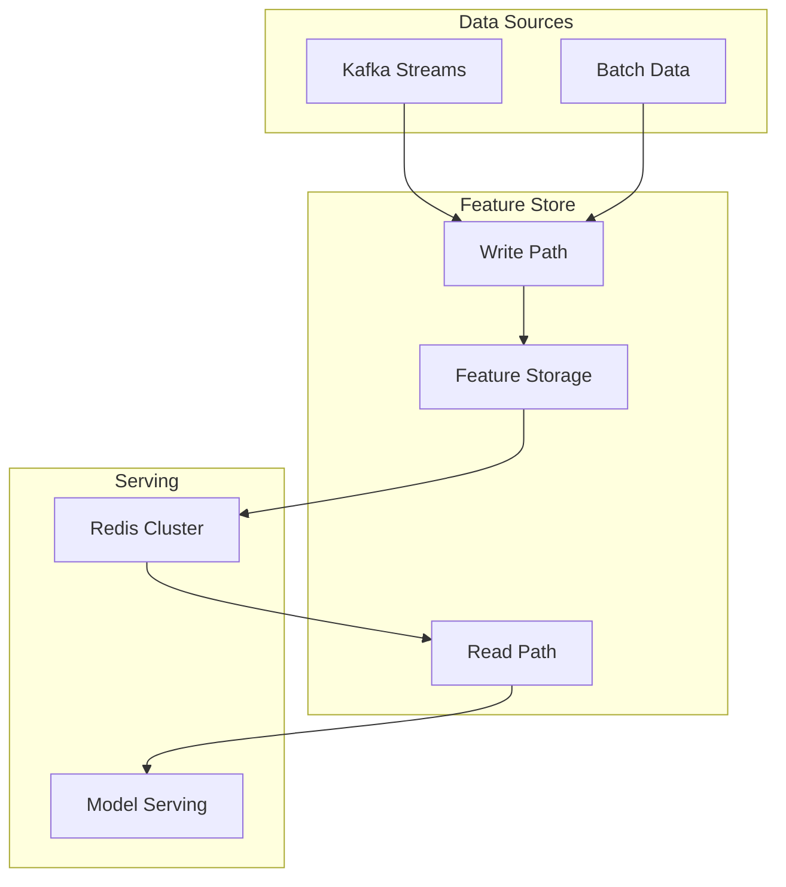

# Case Study 06: DoorDash Gigascale Feature Store

## Overview

DoorDash's feature store serves **10 billion feature requests daily** with sub-millisecond latency. This case study covers their architecture evolution from batch to real-time.

---

## Architecture



---

## Key Innovations

### 1. Read/Write Path Separation

| Path | Latency | Throughput | Use Case |
|------|---------|------------|----------|
| Write | 100ms | High | Feature ingestion |
| Read | <1ms | Very High | Inference time |

### 2. Serialization Optimization

```python
# Before: JSON (slow)
feature_json = json.dumps(feature_dict)  # 100μs

# After: Protobuf (3x faster)
feature_proto = feature.SerializeToString()  # 30μs
```

**Impact:** 3x serialization speedup, 2x storage reduction

### 3. Feature Freshness SLA

```python
class FeatureFreshnessTracker:
    """Ensure features meet real-time SLAs."""
    
    def check_freshness(self, feature_name: str, max_staleness_seconds: float):
        staleness = self.get_staleness(feature_name)
        return staleness <= max_staleness_seconds
```

---

## Results

| Metric | Before | After |
|--------|--------|-------|
| Daily requests | 1B | 10B |
| Read latency | 5ms | <1ms |
| Feature freshness | Hours | Minutes |
| Storage cost | $X | $X/2 |

---

## Implementation

See [feature_store.py](file:///k:/learning/technical/ai-ml/AI-Mastery-2026/src/production/feature_store.py):
- `GigascaleStreamingPipeline` - Kafka-style event processing
- `FeatureFreshnessTracker` - Real-time staleness monitoring
- `SerializationFormat` - Configurable serialization (JSON/MsgPack/Protobuf)

---

## Key Lessons

1. **Separate read/write paths** for optimal performance
2. **Binary serialization** (Protobuf) essential at scale
3. **Feature freshness SLAs** critical for real-time ML
4. **Window-based aggregations** reduce storage while maintaining accuracy

---

## References

- DoorDash Engineering: "Building a Gigascale ML Feature Store"
- [feature_store.py](file:///k:/learning/technical/ai-ml/AI-Mastery-2026/src/production/feature_store.py)
