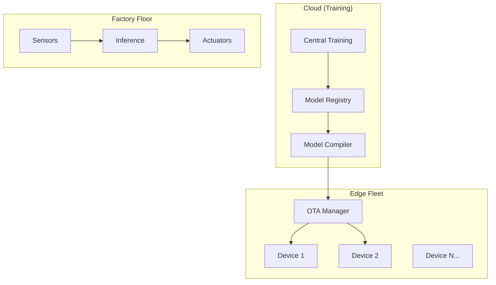

# Case Study 07: Siemens Industrial Edge AI

## Overview

Siemens Industrial Edge deploys ML models to **thousands of factory floor devices** for real-time quality inspection, predictive maintenance, and anomaly detection with strict data residency requirements.

---

## Architecture



---

## Key Patterns

### 1. Cloud-to-Edge Lifecycle

```python
class EdgeFleetManager:
    """Manage training in cloud, deployment to edge."""
    
    def compile_and_deploy(self, model_weights, quantization, staged_rollout=True):
        # 1. Compile for edge (INT8 quantization)
        compiled = self.compiler.compile(model_weights, quantization)
        
        # 2. Deploy with canary rollout
        result = self.ota_manager.deploy_to_fleet(devices, compiled, staged=staged_rollout)
        
        return result
```

### 2. Model Optimization

| Technique | Size Reduction | Accuracy Loss | Speedup |
|-----------|---------------|---------------|---------|
| FP16 | 2x | <0.1% | 2x |
| INT8 | 4x | <2% | 4x |
| Pruning | 1.5x | <1% | 1.5x |

### 3. OTA Updates with Rollback

```python
class OTAUpdateManager:
    """Safe model deployment with automatic rollback."""
    
    def deploy_to_fleet(self, devices, model, staged=True):
        if staged:
            # Canary: Deploy to 10% first
            canary_result = self._deploy_canary(devices[:10%], model)
            
            if canary_result.success_rate < 80%:
                return self._abort_deployment()
        
        # Full rollout
        return self._deploy_remaining(devices)
```

### 4. Data Residency Compliance

```python
class EdgeInferenceEngine:
    """Data never leaves the device."""
    
    def predict(self, input_data):
        # Run inference locally
        result = self.model.predict(input_data)
        
        # Only send metadata to cloud (not actual data)
        self.telemetry.append({
            "latency_ms": result.latency_ms,
            "input_shape": input_data.shape,
            # NO actual input data or predictions
        })
```

---

## Deployment Metrics

| Metric | Value |
|--------|-------|
| Devices managed | 5,000+ |
| Model update time | <5 minutes |
| Inference latency | <10ms |
| Rollback time | <30 seconds |
| Data leaving device | Metadata only |

---

## Implementation

See [edge_ai.py](file:///k:/learning/technical/ai-ml/AI-Mastery-2026/src/production/edge_ai.py):
- `EdgeDevice` - Device representation with capabilities
- `ModelCompiler` - INT8/FP16 quantization, pruning
- `OTAUpdateManager` - Fleet deployment with canary
- `EdgeInferenceEngine` - Local inference with telemetry
- `EdgeFleetManager` - Unified management interface

---

## Key Lessons

1. **Quantization is essential** - 4x compression with INT8, minimal accuracy loss
2. **Staged rollouts prevent disasters** - Always deploy to subset first
3. **Data residency is non-negotiable** - Only metadata leaves the device
4. **Automatic rollback saves production** - Track metrics and revert on failure

---

## References

- Siemens Industrial Edge Platform
- AWS SageMaker Edge Manager
- [edge_ai.py](file:///k:/learning/technical/ai-ml/AI-Mastery-2026/src/production/edge_ai.py)
