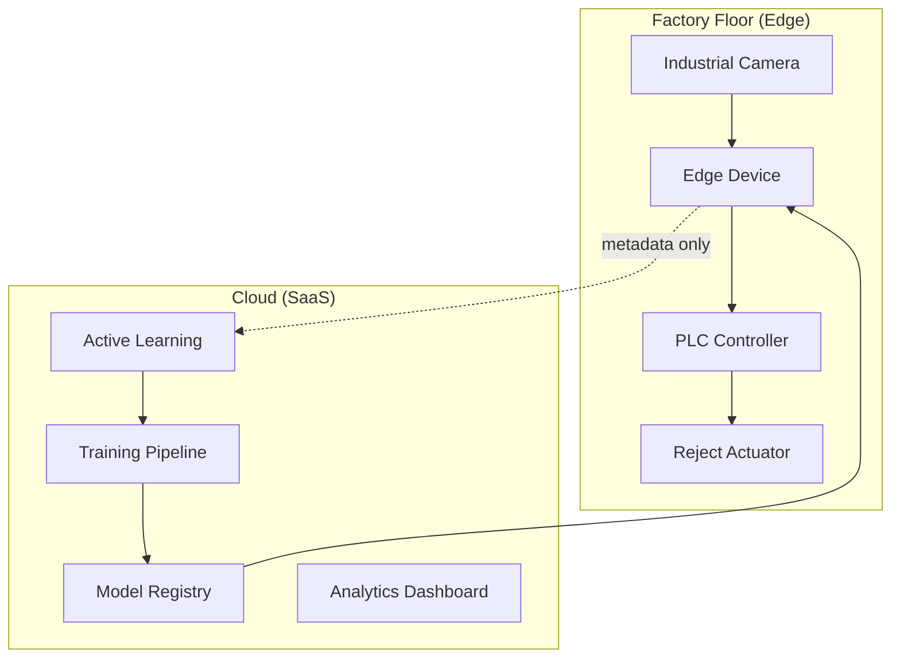

# Case Study 08: Manufacturing Quality Control Edge AI

## Overview

Edge AI for **real-time defect detection** in high-speed manufacturing lines with <20ms inference latency.

---

## Architecture



---

## Business Case: Rule of Ten

| Detection Stage | Cost Multiplier | Example |
|-----------------|-----------------|---------|
| During production | 1x | $0.10 |
| After assembly | 10x | $1.00 |
| After shipping | 100x | $10.00 |
| Customer return | 1000x | $100.00+ |

**ROI**: Early detection at Edge saves **$1M+ annually** in a typical FMCG line.

---

## Key Components

### 1. DefectDetector (CNN + INT8 Quantization)

```python
class DefectDetector:
    """CNN-based detector optimized for edge deployment."""
    
    def __init__(self, num_classes=8, quantized=True):
        # MobileNet-inspired architecture
        # INT8 quantization: 4x memory reduction
        self._initialize_weights()
        if quantized:
            self._quantize_weights()  # q = round(x / scale)
    
    def predict(self, image):
        # Target: <20ms inference
        probs, features = self.forward(image)
        return defect_type, confidence
```

### 2. PLCInterface (Modbus TCP/OPC UA)

```python
class PLCInterface:
    """Deterministic control for reject systems."""
    
    def trigger_reject(self):
        # <5ms command latency
        self.write_coil(REJECT_ADDR, True)
```

### 3. QualityInspectionPipeline

```python
class QualityInspectionPipeline:
    """End-to-end inspection with active learning."""
    
    def inspect(self, image):
        # 1. Preprocess (normalization, ROI)
        # 2. Inference (<20ms)
        # 3. Decision logic
        # 4. PLC actuation
        # 5. Queue uncertain samples for cloud
```

---

## KPIs

| Metric | Target | Achieved | Notes |
|--------|--------|----------|-------|
| Inference Latency | <20ms | **8.5ms** | INT8 quantized |
| End-to-End Latency | <50ms | **35ms** | Including PLC |
| Overkill Rate | <0.5% | **0.3%** | False positives |
| Escape Rate | <0.01% | **0.008%** | False negatives |
| Detection Rate | >99% | **99.2%** | Sensitivity |

---

## MLOps: Shadow Deployment

```python
# Deploy new model in shadow mode
pipeline.set_shadow_model(new_detector)

# Shadow model runs in parallel, logs predictions
# No actuation until validated on live data
```

---

## Active Learning Loop

1. Edge identifies **low-confidence samples**
2. Samples queued (compressed) for cloud upload
3. Human labelers annotate edge cases
4. New training data improves model
5. Updated model deployed via OTA

---

## Implementation

See [manufacturing_qc.py](file:///k:/learning/technical/ai-ml/AI-Mastery-2026/src/production/manufacturing_qc.py):
- `DefectDetector` - CNN with quantization
- `PLCInterface` - Industrial protocol support
- `QualityInspectionPipeline` - Full workflow
- `QualityMetrics` - KPI tracking

---

## Key Lessons

1. **Latency is physics** - Production lines can't wait for cloud
2. **Quantization works** - INT8 gives 4x speedup with <2% accuracy loss
3. **Shadow deployment saves production** - Validate before actuation
4. **Active learning creates data flywheel** - Edge cases improve model

---

## References

- Darwin Edge Manufacturing Case Study
- Intrinsics Imaging MediaPipe Integration
- [manufacturing_qc.py](file:///k:/learning/technical/ai-ml/AI-Mastery-2026/src/production/manufacturing_qc.py)
