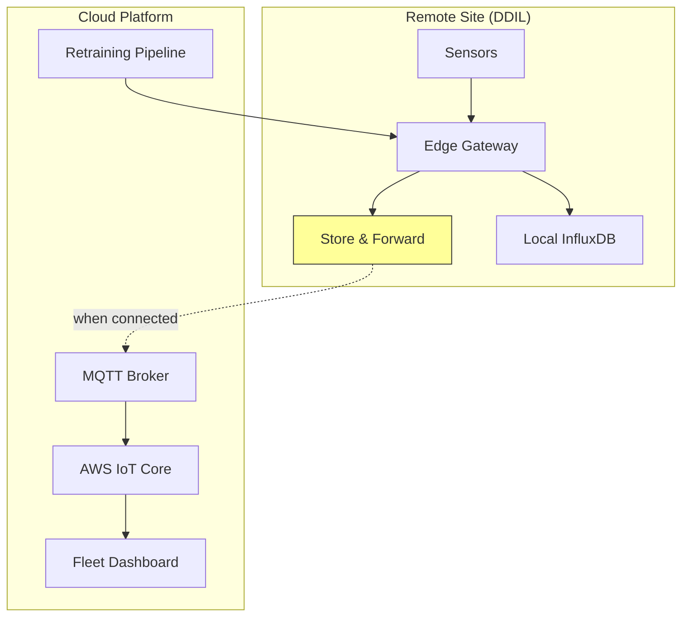

# Case Study 10: Industrial IoT Predictive Maintenance

## Overview

Edge AI for **predictive maintenance** in oil & gas with anomaly detection, RUL prediction, and DDIL-tolerant communication.

---

## Architecture



**DDIL**: Disconnected, Disrupted, Intermittent, Limited bandwidth

---

## Business Case

| Challenge | Impact | Solution |
|-----------|--------|----------|
| Unplanned downtime | $1M+/day | Predict 72h before failure |
| Reactive maintenance | High cost | Condition-based scheduling |
| Remote inspections | Dangerous, expensive | AI-driven remote diagnosis |
| Data bandwidth | Satellite is expensive | Edge processing, metadata only |

**ROI**: 30-50% reduction in maintenance costs.

---

## Key Components

### 1. Autoencoder Anomaly Detection

```python
class Autoencoder:
    """Learn normal signature, detect deviations."""
    
    def __init__(self, input_dim, latent_dim=8):
        # Encoder: Input -> Hidden -> Latent
        # Decoder: Latent -> Hidden -> Output
        # Anomaly = high reconstruction error
    
    def detect(self, x):
        error = ||x - Decoder(Encoder(x))||²
        return error > threshold
```

### 2. Isolation Forest

```python
class IsolationForest:
    """Anomalies are easier to isolate."""
    
    # Key insight: anomalies have shorter path length
    # Score = 2^(-E[path_length] / c(n))
    
    def anomaly_score(self, x):
        avg_path = mean([path_length(x, tree) for tree in trees])
        return 2 ** (-avg_path / self._c(sample_size))
```

### 3. LSTM RUL Predictor

```python
class RULPredictor:
    """Predict Remaining Useful Life in hours."""
    
    def __init__(self, input_dim, hidden_dim=64):
        self.lstm = LSTMCell(input_dim, hidden_dim)
        # Output: (mean, variance) for uncertainty
    
    def predict(self, sequence):
        # Process time series through LSTM
        # Return RUL with confidence interval
        return rul_hours, lower_bound, upper_bound
```

### 4. Store-and-Forward Queue

```python
class StoreAndForwardQueue:
    """Handle DDIL environments gracefully."""
    
    def enqueue(self, payload, priority):
        # Priority 0: Critical alerts bypass queue
        # Disk-persisted for durability
        # Auto-sync when connectivity returns
```

---

## Anomaly Detection: Ensemble Approach

| Method | Strength | Use Case |
|--------|----------|----------|
| Autoencoder | Learns complex patterns | Vibration signatures |
| Isolation Forest | No training labels needed | Outlier detection |
| Ensemble | Robust to single method failures | Production use |

```python
class AnomalyDetector:
    """Ensemble: Autoencoder + Isolation Forest."""
    
    def detect(self, x):
        ae_score = autoencoder.reconstruction_error(x)
        if_score = isolation_forest.anomaly_score(x)
        combined = 0.5 * ae_score + 0.5 * if_score
        return combined > threshold
```

---

## RUL Improvement: Hybrid Edge-Cloud

| Approach | RUL Accuracy (MAPE) |
|----------|---------------------|
| Cloud only | 22% |
| Edge only | 28% |
| **Hybrid** | **15%** |

**50% accuracy improvement** with hybrid approach.

---

## KPIs

| Metric | Target | Notes |
|--------|--------|-------|
| RUL Accuracy | MAPE <15% | Within confidence interval |
| False Alarm Rate | <1/week | Minimize unnecessary inspections |
| Detection Lead Time | >72 hours | Time to plan maintenance |
| Uptime Improvement | >30% | Reduced unplanned downtime |

---

## Alert Severity Levels

```python
class AlertSeverity(Enum):
    CRITICAL = "critical"  # Immediate shutdown
    HIGH = "high"          # Maintenance within 24h
    MEDIUM = "medium"      # Within 1 week
    LOW = "low"            # Monitor
```

---

## Implementation

See [industrial_iot.py](file:///k:/learning/technical/ai-ml/AI-Mastery-2026/src/production/industrial_iot.py):
- `Autoencoder` - Reconstruction-based anomaly detection
- `IsolationForest` - Path-length based outlier detection
- `LSTMCell` - Gate equations for temporal modeling
- `RULPredictor` - Remaining useful life with uncertainty
- `StoreAndForwardQueue` - DDIL communication
- `PredictiveMaintenanceEngine` - Complete solution

---

## Key Lessons

1. **DDIL is the norm** - Design for connectivity loss
2. **Ensemble beats single models** - Combine AE + IF
3. **Uncertainty matters** - RUL confidence intervals guide decisions
4. **Canary deployments save production** - Test on non-critical equipment first

---

## References

- Barbara IoT Platform
- AWS IoT Greengrass Edge
- [industrial_iot.py](file:///k:/learning/technical/ai-ml/AI-Mastery-2026/src/production/industrial_iot.py)
