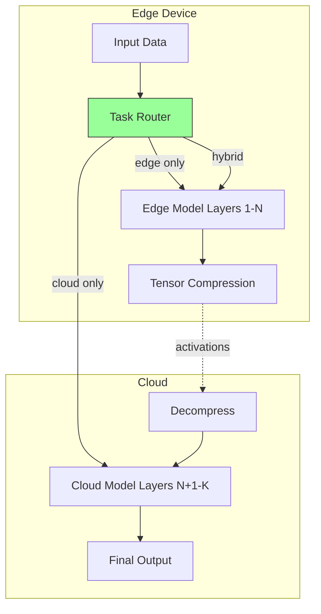

# Case Study 11: Hybrid Edge-Cloud Architecture

## Overview

**Dynamic workload distribution** between edge and cloud based on privacy, latency, cost, and complexity.

---

## Architecture: Split Brain



---

## Business Case

| Approach | Latency | Cost | Privacy |
|----------|---------|------|---------|
| Cloud Only | 100ms+ | $$$ | Low |
| Edge Only | 10ms | Free | High |
| **Hybrid** | **40ms** | **$** | **High** |

**Benefits**:
- 30% latency reduction vs cloud-only
- 50% cost reduction vs full cloud
- Privacy preservation for sensitive data

---

## Key Components

### 1. Task Router (Multi-Factor)

```python
class TaskRouter:
    """Multi-factor routing decision engine."""
    
    def route(self, request):
        # Calculate factor scores (0-1, higher = prefer edge)
        privacy_score = self._privacy_score(request)
        latency_score = self._latency_score(request)
        cost_score = self._cost_score(request)
        complexity_score = self._complexity_score(request)
        
        # Weighted combination
        edge_preference = (
            policy.privacy_weight * privacy_score +
            policy.latency_weight * latency_score +
            policy.cost_weight * cost_score +
            policy.complexity_weight * complexity_score
        )
        
        # Route based on preference
        if edge_preference > 0.7:
            return EDGE_ONLY
        elif edge_preference < 0.3:
            return CLOUD_ONLY
        else:
            return HYBRID_SPLIT
```

### 2. Split Model Executor

```python
class SplitModelExecutor:
    """Execute with layer partitioning."""
    
    def execute_split(self, input_data):
        # 1. Edge runs first N layers
        activations = self.execute_edge(input_data)
        
        # 2. Compress activations (quantization)
        compressed = self.compress_activations(activations)
        
        # 3. Transfer to cloud (smaller than raw input)
        # 4. Cloud runs remaining layers
        output = self.execute_cloud(compressed)
        
        return output
```

### 3. Confidence-Based Escalation

```python
class EdgeCloudOrchestrator:
    """Escalate to cloud if edge confidence is low."""
    
    def infer(self, request):
        result = execute_based_on_routing(request)
        
        # Low confidence? Escalate to cloud
        if result.confidence < 0.85 and cloud_available:
            cloud_result = execute_cloud(request)
            if cloud_result.confidence > result.confidence:
                return cloud_result
        
        return result
```

### 4. Model Co-Versioning

```python
class ModelVersionManager:
    """Edge and cloud models must be compatible."""
    
    def coordinated_update(self, model_name, edge_v, cloud_v):
        # Major.minor must match for split inference
        if not self._check_compatibility(edge_v, cloud_v):
            return False, "Versions incompatible"
        
        # Update both atomically
        self.update_edge(model_name, edge_v)
        self.update_cloud(model_name, cloud_v)
```

---

## Routing Policy Configuration

```python
@dataclass
class TaskRoutingPolicy:
    privacy_weight: float = 0.3
    latency_weight: float = 0.3
    cost_weight: float = 0.2
    complexity_weight: float = 0.2
    
    latency_threshold_ms: float = 50.0
    confidence_threshold: float = 0.85
    edge_model_max_mb: float = 100.0
```

---

## Split Point Optimization

| Split Point | Data Transfer | Edge Compute | Cloud Compute |
|-------------|---------------|--------------|---------------|
| Early (layer 2) | Large | Fast | Slow |
| Middle (layer 5) | Medium | Medium | Medium |
| Late (layer 8) | Small | Slow | Fast |

**Optimal**: Split after feature extraction (activations < raw input).

---

## Activation Compression

```python
def compress_activations(self, activations):
    # Quantize to uint8 (256 levels)
    min_val, max_val = activations.min(), activations.max()
    normalized = (activations - min_val) / (max_val - min_val)
    quantized = (normalized * 255).astype(np.uint8)
    
    # 4x compression vs float32
    return quantized, min_val, max_val
```

---

## KPIs

| Metric | Edge Only | Cloud Only | Hybrid |
|--------|-----------|------------|--------|
| Latency (p50) | 10ms | 100ms | 40ms |
| Cost/request | $0 | $0.002 | $0.001 |
| Privacy | ✅ High | ❌ Low | ✅ High |
| Accuracy | 85% | 92% | 91% |

---

## Implementation

See [hybrid_inference.py](file:///k:/learning/technical/ai-ml/AI-Mastery-2026/src/production/hybrid_inference.py):
- `TaskRouter` - Multi-factor routing logic
- `SplitModelExecutor` - Layer partitioning with compression
- `EdgeCloudOrchestrator` - Full lifecycle management
- `ModelVersionManager` - Co-versioning enforcement

---

## Key Lessons

1. **Routing is optimization** - Balance privacy, latency, cost, complexity
2. **Split reduces transfer** - Activations often smaller than inputs
3. **Confidence escalation is safe** - Better accuracy when uncertain
4. **Version compatibility is critical** - Mismatch = garbage output

---

## References

- Battery Inspection Hybrid Case Study
- [hybrid_inference.py](file:///k:/learning/technical/ai-ml/AI-Mastery-2026/src/production/hybrid_inference.py)
