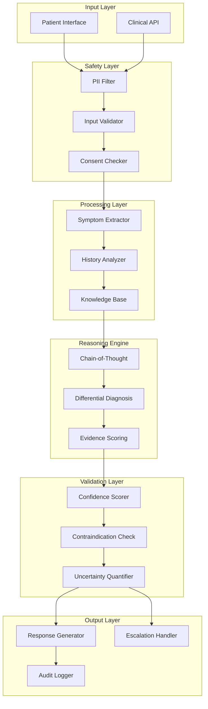

# Medical Diagnosis Agent - Architecture

## Overview

Production-grade AI agent for medical diagnosis assistance with safety validation, PII protection, and evidence-based reasoning.

> [!CAUTION]
> This is an educational implementation. Real medical AI systems require extensive validation, regulatory approval, and clinical oversight.

## System Architecture

## Key Components

### 1. Safety Layer
- **PII Filter**: Remove/mask patient identifiable information
- **Input Validator**: Sanitize and validate inputs
- **Consent Checker**: Ensure proper consent and disclaimers

### 2. Diagnostic Engine
- **Symptom Extraction**: NER for medical symptoms
- **Differential Diagnosis**: Ranked list of possible conditions
- **Evidence Scoring**: Weight evidence for each diagnosis

### 3. Validation Layer
- **Confidence Scoring**: Calibrated probability estimates
- **Contraindication Check**: Flag dangerous interactions
- **Uncertainty Quantification**: Explicit uncertainty bounds

## Safety Requirements

| Requirement | Implementation |
|-------------|---------------|
| No direct diagnosis | Always recommend professional consultation |
| Uncertainty bounds | Provide confidence intervals |
| Audit trail | Log all interactions |
| PII protection | Filter before processing |
| Escalation | Automatic escalation for serious conditions |

## Disclaimer

This system provides informational support only. It does not replace professional medical advice, diagnosis, or treatment.
