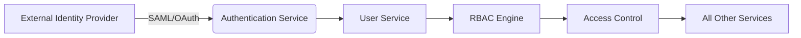

# Learning Management Systems: Fundamentals and Architecture

This document provides a comprehensive introduction to Learning Management Systems (LMS), covering their core purpose, architectural foundations, and essential components. Understanding LMS fundamentals is crucial for AI/ML engineers building educational technology platforms and scalable learning infrastructure.

## What is a Learning Management System?

A Learning Management System (LMS) is a software application designed to manage, deliver, and track educational content and learning activities. Modern LMS platforms serve as the digital backbone for educational institutions, corporate training programs, and online learning platforms.

### Core Functions of an LMS

1. **Content Delivery**: Hosting and distributing learning materials (videos, documents, interactive content)
2. **User Management**: Managing learners, instructors, administrators, and their roles/permissions
3. **Course Management**: Creating, organizing, and delivering structured learning experiences
4. **Assessment and Evaluation**: Quizzes, assignments, exams, and grading systems
5. **Progress Tracking**: Monitoring learner engagement, completion status, and performance
6. **Reporting and Analytics**: Generating insights on learning outcomes and system usage

### Evolution of LMS Architecture

**First Generation (2000-2010)**: Monolithic applications with limited scalability
**Second Generation (2010-2020)**: Web-based platforms with basic APIs and integrations
**Third Generation (2020-2025)**: Cloud-native, microservices architecture with AI integration
**Fourth Generation (2025+)**: AI-native platforms with real-time collaboration and adaptive learning

## Core Architectural Components

### 1. User Management System

The foundation of any LMS is robust user management that handles:

- **Authentication**: OAuth 2.0, SAML, OpenID Connect, JWT tokens
- **Authorization**: RBAC (Role-Based Access Control), ABAC (Attribute-Based Access Control)
- **Identity Federation**: Single Sign-On (SSO) integration with institutional systems
- **Profile Management**: Extensible user profiles with custom attributes



### 2. Course Management System

Manages the structure and delivery of learning content:

- **Course Creation**: Template-based authoring, SCORM/xAPI compliance
- **Enrollment Management**: Self-service, admin-assigned, cohort-based enrollment
- **Progress Tracking**: Completion status, time spent, assessment results
- **Version Control**: Course versioning and rollback capabilities

### 3. Content Delivery System

Handles the storage and distribution of learning materials:

- **Media Storage**: Object storage (S3, Azure Blob) with CDN integration
- **Adaptive Streaming**: HLS/DASH for video, progressive download for documents
- **DRM**: Content protection, license management, watermarking
- **Accessibility**: WCAG-compliant rendering, alternative formats

## Fundamental Design Principles

### 1. Scalability by Design

Modern LMS must be designed for scale from day one:
- **Stateless Services**: Application services should be horizontally scalable
- **Database Optimization**: Connection pooling, read replicas, partitioning
- **Caching Strategy**: Multi-level caching (Redis, CDN, browser cache)
- **Asynchronous Processing**: Background jobs for non-critical operations

### 2. Security First

Educational data requires stringent security measures:
- **Zero Trust Architecture**: Verify every request, never trust the network
- **Data Encryption**: TLS 1.3+ for transit, AES-256 for at rest
- **Compliance**: FERPA, GDPR, HIPAA (for healthcare training), WCAG 2.2 AA
- **Audit Trails**: Comprehensive logging of all user actions and data access

### 3. Extensibility and Integration

LMS platforms must integrate with existing ecosystems:
- **Standard Protocols**: LTI 1.3, IMS Global standards, xAPI
- **API-First Design**: RESTful APIs for all core functionality
- **Plugin Architecture**: Modular design for custom features and extensions
- **Webhooks**: Event-driven integration with external systems

## Key Technical Considerations

### Database Design Patterns

**Relational Database (PostgreSQL)**:
- Users table: `id, email, name, role, created_at, updated_at`
- Courses table: `id, title, description, instructor_id, created_by, status`
- Enrollments table: `id, user_id, course_id, progress, completed_at, status`
- Activities table: `id, user_id, course_id, activity_type, timestamp, metadata`

**NoSQL Considerations**:
- Redis: Session store, real-time counters, leaderboards
- Elasticsearch: Full-text search, course discovery
- MongoDB: Flexible content metadata, user preferences

### API Design Best Practices

```http
GET /api/v1/courses?status=active&limit=50&offset=0
Authorization: Bearer <jwt_token>

Response:
{
  "courses": [
    {
      "id": "course_123",
      "title": "Introduction to AI",
      "description": "Foundational concepts in artificial intelligence",
      "instructor": "Dr. Smith",
      "enrollment_count": 1247,
      "completion_rate": 87.5,
      "created_at": "2026-01-15T10:30:00Z"
    }
  ],
  "pagination": {
    "total": 127,
    "page": 1,
    "per_page": 50,
    "has_next": true
  }
}
```

### Performance Optimization Strategies

1. **Caching Layers**:
   - L1: In-memory (Redis) for hot data (sessions, user profiles)
   - L2: CDN for static assets (videos, images, CSS/JS)
   - L3: Database query caching (materialized views)

2. **Load Balancing**:
   - Session affinity for stateful operations
   - Geographic routing for global deployments
   - Health checks with circuit breaker patterns

3. **Asynchronous Processing**:
   - Background jobs: Email notifications, certificate generation
   - Event-driven architecture: Kafka/RabbitMQ for decoupled services
   - Retry mechanisms: Exponential backoff for failed operations

## AI/ML Engineering Considerations

For AI/ML applications, LMS architecture considerations include:

### Data Pipeline Requirements
- **Real-time telemetry**: Student engagement metrics, interaction logs
- **Feature engineering**: Time-series features for predictive analytics
- **Model serving**: Low-latency endpoints for personalized recommendations
- **Feedback loops**: Continuous learning from student performance data

### Scalability Challenges
- **High-concurrency scenarios**: Live classroom sessions, exam periods
- **Large file processing**: Video transcoding, document parsing
- **Personalization at scale**: Real-time recommendation engines
- **Multi-tenant isolation**: Secure data separation for different institutions

## Related Resources

- [LMS Architecture Patterns] - Advanced architectural approaches
- [User Management Fundamentals] - Deep dive into authentication and authorization
- [Content Delivery Systems] - Media storage and streaming optimization
- [Assessment Systems] - Quiz, assignment, and grading architecture

This foundational document establishes the core concepts needed to understand modern LMS architecture. The following sections will explore each component in greater detail, from basic implementation to production-scale deployment.