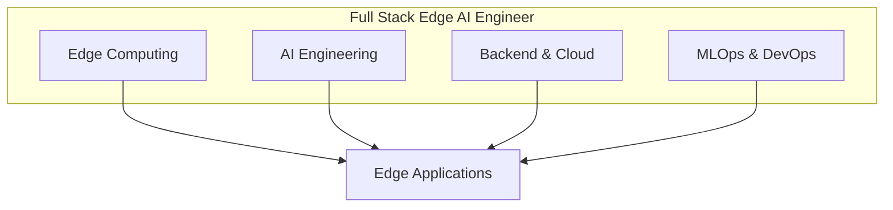
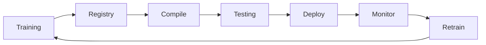

# Full Stack Edge AI Engineer Roadmap 2025-2026

A comprehensive skills roadmap for engineers building Edge AI SaaS systems.

---

## Overview

The modern Edge AI engineer combines skills from embedded systems, machine learning, cloud infrastructure, and MLOps. This roadmap organizes required competencies into four pillars.



---

## Pillar 1: Edge Computing & Hardware

### Core Languages

| Language | Skill Level | Use Case |
|----------|-------------|----------|
| **C/C++** | Advanced | Inference engines, driver integration |
| **Rust** | Intermediate | Memory-safe embedded systems |
| **Python** | Expert | Model development, orchestration |

### Hardware Platforms

| Platform | Processor | Memory | Use Case |
|----------|-----------|--------|----------|
| NVIDIA Jetson | CUDA cores | 4-32GB | Vision, robotics |
| Google Coral | Edge TPU | 1-4GB | Low-power inference |
| NXP i.MX | Neural Processing Unit | 1-8GB | Industrial, automotive |
| Raspberry Pi | ARM | 1-8GB | Prototyping |
| MCU (STM32, ESP32) | ARM Cortex-M | 256KB-2MB | TinyML |

### Key Skills

- **TensorRT / CUDA** - NVIDIA GPU optimization
- **Edge TPU Compiler** - Google Coral models
- **OpenVINO** - Intel hardware optimization
- **TFLite / ONNX Runtime** - Cross-platform inference
- **im2col optimization** - Efficient convolution
- **Memory management** - C/C++ allocation, fragmentation

### Protocols

| Protocol | Layer | Use Case |
|----------|-------|----------|
| MQTT | Application | IoT messaging |
| Modbus TCP/RTU | Application | Industrial control |
| OPC UA | Application | Factory automation |
| gRPC | Application | High-performance RPC |
| CAN Bus | Data Link | Automotive, industrial |
| I2C/SPI/UART | Physical | Sensor interfaces |

---

## Pillar 2: AI Engineering & Optimization

### Model Architectures

| Architecture | Size | Use Case |
|--------------|------|----------|
| MobileNetV3 | 5-20MB | Image classification |
| EfficientNet-Lite | 10-50MB | Accuracy/efficiency balance |
| YOLO (Tiny) | 20-50MB | Object detection |
| DistilBERT | 250MB | NLP on edge |
| Wav2Vec2 (Small) | 100MB | Audio processing |

### Optimization Techniques

```
┌─────────────────────────────────────────────────────────────┐
│                    Model Optimization Stack                  │
├─────────────────────────────────────────────────────────────┤
│  Quantization (INT8/INT4)     │  4-8x memory reduction      │
│  Pruning (unstructured)       │  50-90% sparsity            │
│  Knowledge Distillation       │  Teacher → Student          │
│  Layer Fusion (Conv+BN+ReLU)  │  Reduced memory access      │
│  Weight Sharing               │  Reduced model size         │
└─────────────────────────────────────────────────────────────┘
```

### Mathematical Foundations

| Topic | Key Concepts |
|-------|--------------|
| Linear Algebra | Matrix decomposition, SVD, eigenvalues |
| Calculus | Backpropagation, gradient descent |
| Probability | Bayesian inference, Monte Carlo |
| Optimization | Convex optimization, constraints |
| Information Theory | Entropy, KL divergence |

### Privacy-Preserving ML

| Technique | Guarantee | Use Case |
|-----------|-----------|----------|
| Differential Privacy | ε-δ bounds | Medical, financial |
| Federated Learning | Data locality | Distributed training |
| Secure Aggregation | No single point sees data | Multi-party learning |
| Homomorphic Encryption | Compute on encrypted data | Cloud inference |

---

## Pillar 3: Backend & Cloud

### Cloud Platforms

| Service | Platform | Purpose |
|---------|----------|---------|
| AWS IoT Core | AWS | Device management |
| AWS Greengrass | AWS | Edge runtime |
| Azure IoT Edge | Azure | Edge modules |
| Google Cloud IoT | GCP | Device registry |

### Data Infrastructure

| Component | Technologies | Purpose |
|-----------|--------------|---------|
| Time-Series DB | InfluxDB, TimescaleDB | Sensor data |
| Vector DB | Qdrant, Pinecone, FAISS | Embeddings |
| Stream Processing | Kafka, RabbitMQ | Event streaming |
| Object Storage | S3, GCS, Blob | Model artifacts |

### API Development

```python
# Key FastAPI patterns for Edge AI

@app.post("/infer")
async def inference(request: InferenceRequest):
    # Async inference with timeout
    result = await asyncio.wait_for(
        model.predict(request.data),
        timeout=5.0
    )
    return result

@app.get("/health")
def health():
    return {"status": "healthy", "model_loaded": True}

@app.get("/metrics")
def metrics():
    return prometheus_client.generate_latest()
```

---

## Pillar 4: MLOps & DevOps

### Model Lifecycle



### Key Tools

| Category | Tools |
|----------|-------|
| Version Control | Git, DVC, MLflow |
| CI/CD | GitHub Actions, Jenkins |
| Containerization | Docker, K3s |
| Orchestration | Kubernetes, AWS IoT Greengrass |
| Monitoring | Prometheus, Grafana |
| Logging | ELK Stack, CloudWatch |

### OTA Update Strategies

| Strategy | Risk | Rollout Speed |
|----------|------|---------------|
| Canary | Low | Slow (10% → 100%) |
| Blue-Green | Medium | Fast (switch) |
| Rolling | Low | Medium |
| A/B Testing | Low | Parallel |

### Hardware-in-the-Loop Testing

```yaml
# CI pipeline with QEMU emulation
test_edge:
  runs-on: ubuntu-latest
  steps:
    - uses: actions/checkout@v4
    - name: Setup QEMU
      run: docker run --rm --privileged qemu-user-static --reset
    - name: Test on ARM
      run: docker run --platform linux/arm64 test-image pytest
```

---

## Learning Path

### Phase 1: Foundations (Weeks 1-4)

- [ ] Complete Python for ML course
- [ ] Learn C++ basics for embedded
- [ ] Understand CNN/RNN architectures
- [ ] Set up Jetson Nano or Coral dev kit

### Phase 2: Edge ML (Weeks 5-8)

- [ ] Implement model quantization
- [ ] Deploy TFLite model on mobile
- [ ] Write MQTT client/server
- [ ] Build simple anomaly detector

### Phase 3: Production (Weeks 9-12)

- [ ] Set up CI/CD for edge models
- [ ] Implement OTA update system
- [ ] Build monitoring dashboard
- [ ] Deploy to device fleet (3+ devices)

### Phase 4: Advanced (Weeks 13-16)

- [ ] Implement federated learning
- [ ] Build hybrid edge-cloud system
- [ ] Add differential privacy
- [ ] Create full Edge AI SaaS

---

## Certifications

| Certification | Focus | Difficulty |
|---------------|-------|------------|
| AWS ML Specialty | Cloud ML | Hard |
| NVIDIA DLI | GPU, Jetson | Medium |
| TensorFlow Developer | TFLite | Medium |
| Azure AI Engineer | Azure ML | Medium |

---

## Resources

### Books
- "TinyML" by Pete Warden
- "Designing Machine Learning Systems" by Chip Huyen
- "Machine Learning Systems Design" (Free online)

### Courses
- DeepLearning.AI MLOps Specialization
- FastAI Practical Deep Learning
- NVIDIA DLI Edge AI courses

### Communities
- Edge AI Foundation
- TinyML Foundation
- MLOps Community Slack

---

## Project Ideas

1. **Smart Camera** - Object detection on Jetson Nano
2. **Predictive Maintenance** - Vibration analysis on ESP32
3. **Voice Assistant** - Keyword spotting on Coral
4. **Fall Detection** - IMU + MCU wearable
5. **Hybrid Inference** - Split ResNet edge/cloud

---

*Built for engineers who want to master the full stack of Edge AI.*
