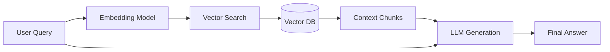

# Chapter 2: Scaling Knowledge - Enterprise RAG

While LLMs are powerful, they are limited by their training data cutoff. **Retrieval-Augmented Generation (RAG)** provides the model with a "dynamic brain" by connecting it to your own data.

## 1. The RAG Pipeline

A production RAG pipeline consists of:
1.  **Ingestion**: Loading, Cleaning, and Chunking data.
2.  **Indexing**: Converting chunks to vectors and storing in a Vector DB.
3.  **Retrieval**: Finding the most relevant chunks for a user query.
4.  **Generation**: Passing the chunks + query to an LLM.



---

## 2. Advanced Retrieval Strategies

Simple vector search often fails on technical jargon or specific keywords. We use **Hybrid Retrieval** to solve this.

### 2.1 Dense vs Sparse
-   **Dense (Vector)**: Finds "meaning". Good for: "Tell me about cars." -> Finds "Automobiles".
-   **Sparse (Keyword/BM25)**: Finds "exact matches". Good for: "Part ID #9921-X".

### 2.2 Semantic Chunking
Don't just split by character count! Our `SemanticChunker` in `src/llm/advanced_rag.py` splits by:
-   Markdown Headers
-   Paragraphs
-   Code Blocks

This ensures that a single code function isn't cut in half, which would confuse the LLM.

---

## 3. Hands-on: Building a Hybrid RAG

Let's use the code in `src/llm/advanced_rag.py` to index this tutorial itself!

```python
import numpy as np
from src.llm.advanced_rag import EnterpriseRAG, Document, ChunkingStrategy

# 1. Initialize System
rag = EnterpriseRAG(chunking_strategy=ChunkingStrategy.SEMANTIC)

# 2. Add this tutorial as a document
doc = Document(id="tutorial_2", content="""
RAG is the key to enterprise AI.
Semantic chunking preserves context.
Hybrid retrieval combines BM25 and Vector search.
""")
rag.add_documents([doc])

# 3. Query with dummy embedding (simulate encoder)
query = "What does semantic chunking do?"
dummy_emb = np.random.randn(384)
result = rag.query(query, dummy_emb)

print(f"Answer: {result.answer}")
print(f"Confidence: {result.confidence}")
```

---

## 4. Evaluation: LLM-as-Judge

How do you know if your RAG is working? You use another (usually larger) LLM to grade it.
Our `LLMJudge` grades based on:
-   **Relevance**: Is the answer related to the question?
-   **Accuracy**: Is it factually correct?
-   **Grounding**: Is the info actually in the provided context?

**Exercise**: Run `src/llm/advanced_rag.py` directly to see the judge in action with simulated data.

---
[Next Chapter: AI Agents](./03_ai_agents.md)
