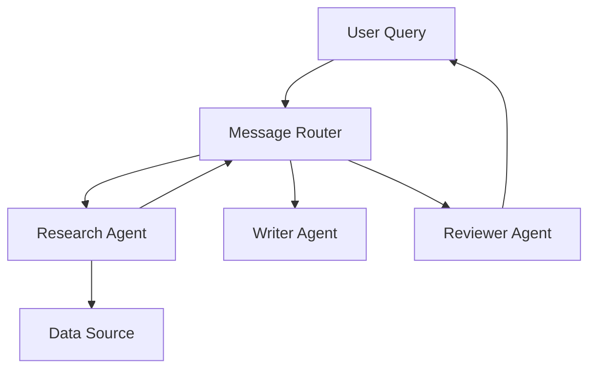

# Chapter 3: The Reasoning Engine - AI Agents

In this chapter, we move beyond simple generation. We will learn how to build **Agents** that can reason about a problem, create a plan, and use tools to execute that plan.

## 1. What is an AI Agent?

An agent is an LLM wrapped in a **loop**. Unlike a simple RAG system, an agent can:
1.  **Observe**: See the current state of the environment.
2.  **Think**: Reason about what to do next.
3.  **Act**: Use a tool (e.g., Search, Calculator, Database).
4.  **Repeat**: Evaluate the result and continue until the goal is met.

---

## 2. Agent Architectures

In `src/llm/agents.py`, we implement three main types of agents:

### 2.1 Reactive Agents
These agents respond instantly to triggers using predefined rules. They are fast but lack "depth."
*   *Use case*: Automated chatbots that route to specific departments.

### 2.2 Deliberative Agents
These agents use an LLM to generate a sequence of actions (a plan) before acting.
*   *Use case*: A research bot that needs to find multiple pieces of information.

### 2.3 Function Calling Agents
These agents leverage the LLM's ability to output structured JSON to call specific Python functions.

---

## 3. Hands-on: The ReAct Loop

The most popular agent pattern is **ReAct** (Reason + Act). Let's see how it looks in code:

```python
from src.llm.agents import create_function_calling_agent, CalculatorTool

# 1. Setup Agent with Tools
agent = create_function_calling_agent("math_bot", "Mathematician")
agent.state.goals = ["Calculate (123 * 45) + 678"]

# 2. Perception & Decision
# The agent will:
# Thought: I need to multiply 123 by 45 first.
# Action: call calculator(123 * 45)
# Observation: 5535
# Thought: Now I add 678 to 5535.
# Action: call calculator(5535 + 678)
# Final Answer: 6213
```

---

## 4. Multi-Agent Systems (MAS)

Sometimes, one agent isn't enough. In `MultiAgentSystem`, we coordinate multiple specialized agents.



**Exercise**: Try adding a new tool to `src/llm/agents.py` (e.g., a `WeatherTool`) and see if the `FunctionBot` can use it correctly.

---
[Next Chapter: Production Guardrails](./04_production_guardrails.md)
