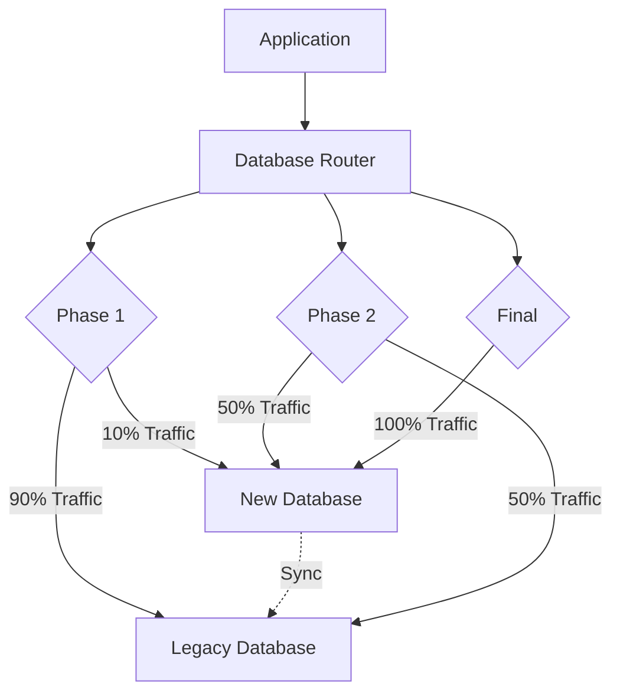
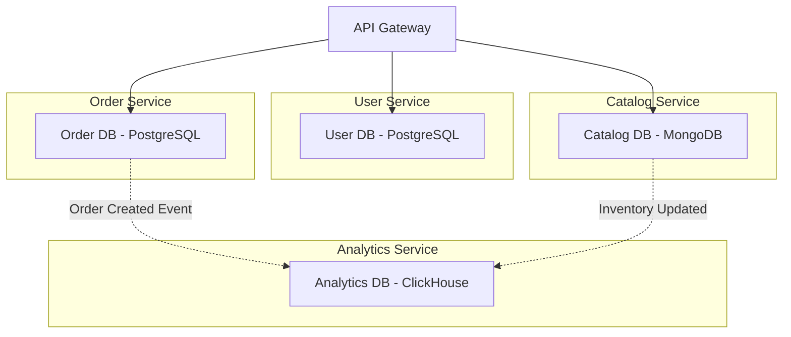

# Database Comparison Guide

Selecting the right database technology is one of the most consequential architectural decisions in software development. This guide provides comprehensive frameworks for evaluating database options, understanding the trade-offs between different paradigms, and designing robust multi-database architectures that leverage the strengths of each technology.

## SQL vs NoSQL Decision Matrix

The choice between SQL and NoSQL databases fundamentally shapes application architecture, development velocity, and operational characteristics. Rather than viewing this as a binary decision, understanding the specific trade-offs enables informed choices that align with application requirements.

### Transactional Requirements and Data Integrity

Relational databases excel in scenarios requiring strong transactional guarantees, complex joins, and rigid schema enforcement. ACID (Atomicity, Consistency, Isolation, Durability) compliance ensures that financial transactions, inventory management, and other mission-critical operations maintain data integrity even under concurrent access and system failures. The guarantee that a transfer between accounts either completes entirely or not at all provides confidence that NoSQL systems often sacrifice for scalability.

```sql
-- SQL: Strong transactional guarantees with rollback capability
BEGIN TRANSACTION;

UPDATE accounts SET balance = balance - 100 WHERE account_id = 1;
UPDATE accounts SET balance = balance + 100 WHERE account_id = 2;

-- If any constraint fails, entire transaction rolls back
INSERT INTO transactions (from_account, to_account, amount) VALUES (1, 2, 100);

COMMIT;
```

NoSQL databases typically offer eventual consistency, where updates propagate asynchronously across replicas. This model accepts temporary inconsistencies in exchange for higher availability and partition tolerance. For applications like social media feeds or analytics dashboards where slight staleness is acceptable, this trade-off enables dramatic performance improvements.

```javascript
// NoSQL (MongoDB): Document-based with relaxed consistency
// Single document operation is atomic
db.accounts.updateOne(
    { account_id: 1 },
    { $inc: { balance: -100 } }
);
db.accounts.updateOne(
    { account_id: 2 },
    { $inc: { balance: 100 } }
);

// Use sessions for multi-document transactions (MongoDB 4.0+)
const session = db.getMongo().startSession();
session.startTransaction();
try {
    session.getDatabase('bank').accounts.updateOne(
        { account_id: 1 },
        { $inc: { balance: -100 } }
    );
    session.getDatabase('bank').accounts.updateOne(
        { account_id: 2 },
        { $inc: { balance: 100 } }
    );
    session.commitTransaction();
} catch (e) {
    session.abortTransaction();
}
```

### Schema Flexibility and Evolution

NoSQL databases accommodate evolving data models without migrations, enabling rapid development when requirements remain unstable. Adding new fields to documents requires no schema changes, unlike ALTER TABLE operations that can lock large tables in production. This flexibility proves invaluable for early-stage products, prototyping, and handling diverse data types like user-generated content with varying structures.

```javascript
// NoSQL: Schema-less documents - each document can have different fields
db.users.insertMany([
    { name: "Alice", email: "alice@example.com", preferences: { theme: "dark" } },
    { name: "Bob", email: "bob@example.com", phone: "555-1234", role: "admin" },
    { name: "Carol", email: "carol@example.com", tags: ["vip", "beta"] }
]);
```

SQL databases enforce schema at write time, catching data quality issues immediately. This proactive validation prevents invalid data from entering the system and ensures downstream consumers can rely on consistent field types. For systems where data quality directly impacts business outcomes, this enforcement provides valuable protection.

```sql
-- SQL: Enforced schema ensures data consistency
CREATE TABLE users (
    user_id SERIAL PRIMARY KEY,
    email VARCHAR(255) NOT NULL,
    role VARCHAR(50) DEFAULT 'user',
    created_at TIMESTAMP DEFAULT CURRENT_TIMESTAMP,
    CONSTRAINT unique_email UNIQUE (email),
    CONSTRAINT valid_role CHECK (role IN ('user', 'admin', 'moderator'))
);

-- Attempting to insert invalid data fails immediately
INSERT INTO users (email, role) VALUES ('invalid-email', 'superuser');
-- ERROR: constraint valid_role violated
```

### Query Complexity and Data Relationships

SQL databases excel at expressing complex relationships through JOINs, enabling denormalized storage with normalized relationships. A query joining users, orders, products, and categories can filter and aggregate across all tables efficiently, with the query optimizer determining the optimal execution plan.

```sql
-- SQL: Complex multi-table joins with aggregation
SELECT 
    u.region,
    c.category_name,
    COUNT(DISTINCT o.order_id) AS order_count,
    SUM(oi.quantity * oi.unit_price) AS total_revenue
FROM users u
JOIN orders o ON u.user_id = o.user_id
JOIN order_items oi ON o.order_id = oi.order_id
JOIN products p ON oi.product_id = p.product_id
JOIN categories c ON p.category_id = c.category_id
WHERE o.order_date >= '2024-01-01'
GROUP BY u.region, c.category_name
ORDER BY total_revenue DESC;
```

NoSQL databases typically avoid JOINs, favoring denormalization where related data nests within documents. This approach requires careful data modeling but eliminates join overhead and enables horizontal scaling.

```javascript
// NoSQL: Denormalized document with embedded data
{
    "user_id": 1,
    "name": "Alice",
    "region": "North America",
    "orders": [
        {
            "order_id": 1001,
            "date": "2024-01-15",
            "items": [
                {
                    "product_id": 50,
                    "product_name": "Widget Pro",
                    "category": "Widgets",
                    "quantity": 2,
                    "unit_price": 29.99
                }
            ]
        }
    ]
}
```

### Performance and Scalability Characteristics

| Characteristic | SQL (Traditional) | NoSQL |
|---------------|-------------------|-------|
| Horizontal Scaling | Limited (sharding complexity) | Designed for distribution |
| Query Flexibility | Ad-hoc queries with optimizer | Key-based or limited patterns |
| Storage Efficiency | Normalized, smaller storage | Denormalized, larger storage |
| Latency | Higher for complex queries | Lower for simple operations |
| Consistency | Strong (ACID) | Eventual (BASE) |

NoSQL databases scale horizontally by adding commodity servers, distributing data across nodes automatically. This approach handles massive data volumes and request rates that would overwhelm single-server relational databases. However, the CAP theorem establishes that distributed systems must trade consistency against availability during network partitions.

## NewSQL vs Traditional SQL

NewSQL databases emerged to combine the ACID guarantees and SQL interface of traditional relational databases with the horizontal scalability of NoSQL systems. Understanding when NewSQL provides meaningful advantages requires examining specific use cases and operational requirements.

### When NewSQL Makes Sense

NewSQL excels for applications requiring transactional consistency with high throughput and large data volumes. Financial systems processing high-frequency trading, real-time fraud detection, and global inventory management benefit from NewSQL's combination of strong consistency and horizontal scaling.

```sql
-- CockroachDB: Distributed SQL with global presence
-- Automatic sharding and replication
CREATE TABLE accounts (
    id UUID PRIMARY KEY DEFAULT gen_random_uuid(),
    balance DECIMAL(19, 4) NOT NULL,
    region STRING,
    updated_at TIMESTAMPTZ DEFAULT NOW()
) WITH (ttl_expiration_after = 'INTERVAL 2 years');

-- Geo-partitioning for data locality
ALTER TABLE accounts 
    PARTITION BY LIST (region) (
        PARTITION na VALUES IN ('us-east', 'us-west', 'ca'),
        PARTITION eu VALUES IN ('uk', 'de', 'fr'),
        PARTITION ap VALUES IN ('jp', 'sg', 'au')
    );
```

Traditional SQL databases remain superior for moderate data volumes with complex analytical requirements, well-understood query patterns, and teams with strong SQL expertise. The operational simplicity of single-node or primary-replica setups often outweighs scalability benefits for many applications.

| Use Case | Recommended Database |
|----------|---------------------|
| < 1TB, complex joins | PostgreSQL, MySQL |
| > 10TB, strong ACID | CockroachDB, TiDB |
| Analytics, moderate scale | ClickHouse, DuckDB |
| Geographically distributed | CockroachDB, Spanner |
| High-throughput OLTP | YugabyteDB, CockroachDB |

### NewSQL Implementation Considerations

NewSQL databases impose specific architectural requirements that differ from traditional deployments. Understanding these requirements prevents misconfiguration and performance issues.

Network latency between nodes directly impacts transactional performance. NewSQL databases typically require low-latency networking (under 10ms between nodes) to maintain transaction throughput. Deploying across availability zones within a region works well, but cross-region deployments require careful consideration of consistency trade-offs.

```yaml
# CockroachDB production configuration example
# cockroach.yml
cluster:
  name: production
  region: us-east-1
  
nodes:
  - name: node1
    address: 10.0.1.10
    attrs:
      region: us-east-1
      zone: a
  - name: node2
    address: 10.0.1.11
    attrs:
      region: us-east-1
      zone: b
  - name: node3
    address: 10.0.1.12
    attrs:
      region: us-east-1
      zone: c
      
settings:
  # Optimize for latency over throughput
  locality: 
    optimal: 1ms
    acceptable: 10ms
```

The learning curve for NewSQL databases exceeds traditional SQL due to concepts like distributed transactions, consensus protocols, and topology-aware query routing. Operational complexity increases, requiring monitoring of cluster health, zone awareness, and network topology.

## Database Selection Frameworks

Systematic database selection requires evaluating technical requirements, operational constraints, and team capabilities against database characteristics. The following frameworks provide structured approaches for making informed decisions.

### Requirements Gathering Checklist

Before evaluating databases, document comprehensive requirements across multiple dimensions. Technical requirements include expected data volume and growth rate, query patterns and complexity, consistency requirements, and latency SLAs. Operational requirements encompass availability goals, disaster recovery needs, and team expertise. Business considerations include budget constraints, vendor relationships, and long-term maintenance expectations.

```markdown
# Database Selection Criteria

## Data Characteristics
- Expected initial data volume: ____ TB
- Expected growth rate: ____ TB/month
- Data retention requirements: ____ years
- Schema stability: Stable / Evolving / Unknown

## Query Patterns
- Read/write ratio: ____% / ____%
- Average query complexity: Simple / Moderate / Complex
- JOIN requirements: None / Moderate / Heavy
- Aggregation needs: None / Basic / Advanced

## Consistency Requirements
- Transactional needs: ACID / Eventual / None
- Tolerance for stale reads: ____ seconds
- Data integrity criticality: Critical / Important / Nice-to-have

## Performance Targets
- P99 latency target: ____ ms
- Throughput target: ____ ops/sec
- Availability target: ____%

## Operational Constraints
- Team SQL expertise: Expert / Intermediate / Beginner
- DevOps capacity: Full / Limited / None
- Cloud vs on-prem: ____
- Budget constraints: ____
```

### Decision Matrix

Create a weighted scoring matrix evaluating candidate databases against prioritized requirements. Assign weights reflecting requirement importance, then score each database on each requirement. The highest-scoring database best meets the weighted requirements.

```python
# Example decision matrix calculation
requirements = [
    ("ACID Compliance", 10),
    ("Horizontal Scaling", 8),
    ("Query Flexibility", 7),
    ("Latency", 6),
    ("Team Expertise", 5),
    ("Cost", 4),
    ("Cloud Managed", 3)
]

databases = {
    "PostgreSQL": {
        "ACID Compliance": 10,
        "Horizontal Scaling": 3,
        "Query Flexibility": 10,
        "Latency": 7,
        "Team Expertise": 8,
        "Cost": 8,
        "Cloud Managed": 7
    },
    "MongoDB": {
        "ACID Compliance": 6,
        "Horizontal Scaling": 10,
        "Query Flexibility": 7,
        "Latency": 8,
        "Team Expertise": 7,
        "Cost": 7,
        "Cloud Managed": 9
    },
    "CockroachDB": {
        "ACID Compliance": 10,
        "Horizontal Scaling": 9,
        "Query Flexibility": 9,
        "Latency": 6,
        "Team Expertise": 5,
        "Cost": 4,
        "Cloud Managed": 8
    }
}

# Calculate weighted scores
for db_name, scores in databases.items():
    total_score = sum(
        scores[req] * weight 
        for req, weight in requirements
    )
    print(f"{db_name}: {total_score}")
```

### Common Selection Patterns

Several well-established patterns address common application architectures. Reference architectures provide starting points that require validation against specific requirements.

Web applications with user-generated content typically benefit from document databases for content storage, relational databases for user and billing data, and caches for session management. E-commerce platforms require transactional integrity for orders and payments (relational), flexible product catalogs (document or search), and real-time inventory tracking (time-series or distributed SQL). Analytics platforms optimize for scan-heavy workloads (columnar), complex aggregations (OLAP databases), and data lake integration.

## Migration Considerations

Database migrations involve significant risk and require careful planning, thorough testing, and rollback strategies. Whether migrating between database types or upgrading within the same family, following established patterns reduces risk.

### Migration Strategies

The phased migration pattern involves gradual transition where a portion of traffic moves to the new database while the original remains the system of record. This approach limits blast radius of issues and enables validation before full cutover.



The dual-write pattern writes to both databases simultaneously during migration, using the new database for reads while maintaining the legacy database as backup. This approach requires conflict resolution logic and careful ordering of operations.

```python
# Dual-write implementation example
class DualWriteRepository:
    def __init__(self, legacy_db, new_db):
        self.legacy_db = legacy_db
        self.new_db = new_db
    
    def save(self, entity):
        # Write to both databases
        legacy_id = self.legacy_db.save(entity)
        
        # New database may use different ID format
        new_id = self.new_db.save({
            **entity.to_dict(),
            'legacy_id': legacy_id
        })
        
        return legacy_id
    
    def find_by_id(self, id):
        # Read from new database
        return self.new_db.find_by_id(id)
    
    def find_legacy_by_id(self, id):
        # Access legacy for rollback
        return self.legacy_db.find_by_id(id)
```

The strangler fig pattern gradually replaces functionality by creating new services using the target database while retiring old functionality incrementally. This approach suits large monolithic applications where complete rewrite is impractical.

### Data Migration Techniques

Bulk migration transfers large datasets efficiently but requires managing application downtime or dual-write periods. Streaming migration using change data capture replicates changes in real-time, minimizing cutover windows.

```sql
-- PostgreSQL: Bulk export to file
COPY (SELECT * FROM large_table WHERE created_at < '2024-01-01') 
TO '/tmp/legacy_data.csv' 
WITH (FORMAT CSV, HEADER);

-- PostgreSQL: Parallel export for large tables
\parallel on 4
COPY (SELECT * FROM large_table) TO '/tmp/part_1.csv';
\parallel on 4
COPY (SELECT * FROM large_table OFFSET 1000000 LIMIT 1000000) TO '/tmp/part_2.csv';

-- Streaming with pglogical (PostgreSQL replication)
SELECT * FROM pg_create_logical_replication_slot('migration', 'pgoutput');
```

Validation compares data between source and target to identify discrepancies. Hash-based validation efficiently identifies differences without requiring exact row matching.

```sql
-- Generate checksums for validation
-- Source database
CREATE TABLE source_checksums AS
SELECT 
    id,
    md5(col1 || col2 || col3) AS row_hash,
    COUNT(*) OVER() AS total_rows
FROM source_table;

-- Target database
CREATE TABLE target_checksums AS
SELECT 
    legacy_id AS id,
    md5(col1 || col2 || col3) AS row_hash
FROM target_table;

-- Find discrepancies
SELECT 'Missing in target' AS issue, s.*
FROM source_checksums s
LEFT JOIN target_checksums t ON s.id = t.id
WHERE t.id IS NULL

UNION ALL

SELECT 'Missing in source' AS issue, t.*
FROM target_checksums t
LEFT JOIN source_checksums s ON t.id = s.id
WHERE s.id IS NULL

UNION ALL

SELECT 'Hash mismatch' AS issue, s.*
FROM source_checksums s
JOIN target_checksums t ON s.id = t.id
WHERE s.row_hash != t.row_hash;
```

### Rollback Planning

Every migration requires tested rollback procedures. Define clear triggers for rollback, document rollback procedures explicitly, and practice rollback execution before production migration.

| Rollback Trigger | Rollback Procedure |
|-----------------|-------------------|
| > 1% error rate | Stop traffic to new DB, resume writes to legacy |
| P99 latency > 500ms | Switch read traffic back to legacy |
| Data corruption detected | Restore from backup, re-sync |
| Business logic bugs | Deploy fix to new DB, or revert to legacy |

## Multi-Database Architectures

Modern applications often combine multiple database technologies to leverage strengths of each. Polyglot persistence architecture selects the optimal database for each data type and access pattern within a single application.

### Architecture Patterns

The CQRS (Command Query Responsibility Segregation) pattern separates read and write models, typically using different databases optimized for each operation.

```python
# CQRS implementation overview
class OrderCommandHandler:
    """Handles write operations - relational database"""
    def __init__(self, db_pool):
        self.db = db_pool
    
    def create_order(self, order_data):
        # Validate and persist to transactional DB
        order_id = self.db.execute("""
            INSERT INTO orders (customer_id, total) 
            VALUES (%s, %s) RETURNING id
        """, [order_data.customer_id, order_data.total])
        
        # Publish event for read models
        event_bus.publish(OrderCreated(order_id, order_data))
        
        return order_id

class OrderQueryHandler:
    """Handles read operations - optimized read model"""
    def __init__(self, read_replica):
        self.db = read_replica
    
    def get_order_with_details(self, order_id):
        # Denormalized view with all details joined
        return self.db.query("""
            SELECT o.*, c.name as customer_name, 
                   array_agg(oi.product_name) as products
            FROM orders o
            JOIN customers c ON o.customer_id = c.id
            JOIN order_items oi ON o.id = oi.order_id
            WHERE o.id = %s
            GROUP BY o.id, c.name
        """, [order_id])
```

The database-per-service pattern in microservices isolates each service's data store, enabling independent scaling and technology selection. Event sourcing extends this by storing state changes as events, enabling reconstruction of current state and rich audit trails.



### Data Synchronization Strategies

Maintaining consistency across databases requires explicit synchronization mechanisms. Change data capture provides near-real-time propagation without application changes.

```java
// Debezium CDC configuration example
{
  "name": "mysql-orders-connector",
  "config": {
    "connector.class": "io.debezium.connector.mysql.MySqlConnector",
    "database.hostname": "mysql-primary",
    "database.port": "3306",
    "database.user": "debezium",
    "database.password": "password",
    "database.server.id": "184054",
    "database.include.list": "orders",
    "table.include.list": "orders.orders,orders.order_items",
    "database.history.kafka.bootstrap.servers": "kafka:9092",
    "database.history.kafka.topic": "schema-changes.orders",
    "include.schema.changes": "false",
    "transforms": "unwrap",
    "transforms.unwrap.type": "io.debezium.transforms.ExtractNewRecordState"
  }
}
```

Event-driven synchronization publishes domain events that downstream services consume to update their local data stores.

```python
# Event publishing
class OrderService:
    def create_order(self, order_data):
        order_id = self.db.save(order_data)
        
        event = {
            "event_type": "ORDER_CREATED",
            "order_id": order_id,
            "customer_id": order_data.customer_id,
            "total": order_data.total,
            "items": order_data.items,
            "timestamp": datetime.utcnow().isoformat()
        }
        
        # Publish to message bus
        self.message_bus.publish("orders.events", event)
        
        return order_id

# Event handler in analytics service
class AnalyticsEventHandler:
    def handle_order_created(self, event):
        # Update analytics denormalized views
        self.analytics_db.execute("""
            INSERT INTO order_summaries (customer_id, order_count, total_spent)
            VALUES (%s, 1, %s)
            ON CONFLICT (customer_id) DO UPDATE SET
                order_count = order_summaries.order_count + 1,
                total_spent = order_summaries.total_spent + %s
        """, [event['customer_id'], event['total'], event['total']])
```

### Integration Considerations

Multi-database architectures increase operational complexity significantly. Consider validation and testing requirements, monitoring across multiple systems, backup and recovery procedures for each database, and team expertise requirements.

| Aspect | Single Database | Multi-Database |
|--------|-----------------|----------------|
| Operational complexity | Low | High |
| Data consistency | Automatic | Manual coordination |
| Monitoring | Unified | Distributed |
| Backup strategy | Single system | Multiple systems |
| Team expertise | Deep in one | Broad across many |

Implement data contracts that define the expected shape and semantics of data flowing between systems. These contracts enable independent evolution while maintaining integration integrity.

This comprehensive guide provides frameworks and patterns for database selection and architecture. Apply these principles systematically, validate decisions against actual requirements, and iterate as understanding deepens.
