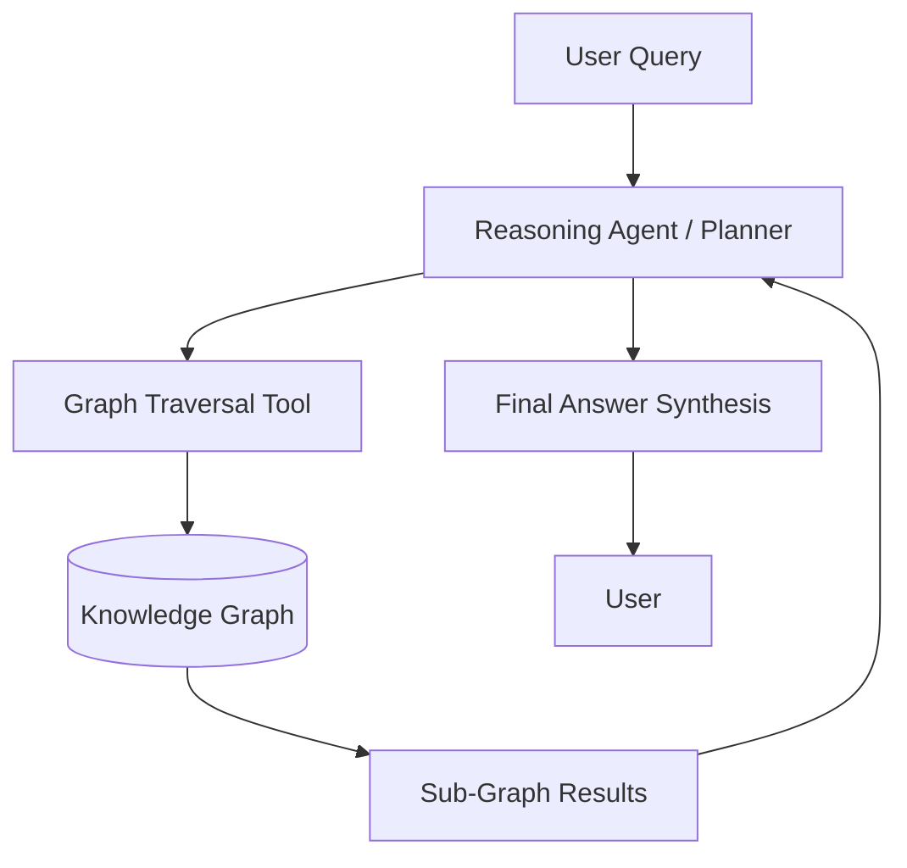

# 👑 Agentic GraphRAG: The Future of Knowledge Discovery

## 🧩 The Knowledge Gap in Standard RAG

Most RAG systems use **Vector Databases** which excel at **Local Retrieval**. They find chunks that look like your query. However, they struggle with **Global Reasoning**.

### The "Multi-Hop" Problem
If you ask: *"How does the CEO's vision from 2022 influence the marketing strategy of the 2024 product launch?"*
- **Vector RAG**: Finds chunks about "Vision 2022" OR "Marketing 2024". But it might miss the *connection*.
- **GraphRAG**: Maps the relationship `[CEO] --expressed--> [Vision] --inspired--> [Marketing Strategy]`.

---

## 🕸️ What is GraphRAG?

GraphRAG combines the power of **Knowledge Graphs (KG)** with **Large Language Models**. Instead of just flat text chunks, we extract **Entities** (People, Places, Concepts) and **Relationships** (Actions, Associations).

### Core Components:
1.  **Entity Extraction**: Identifying the "Who" and "What".
2.  **Relation Extraction**: Identifying the "How they relate".
3.  **Community Detection**: Grouping related nodes into clusters (Communities) to summarize high-level themes.
4.  **Global Search**: Using summaries of these communities to answer broad questions.

---

## 🤖 The "Agentic" Twist

Standard GraphRAG is often static. **Agentic GraphRAG** introduces an LLM Agent that can:
1.  **Inspect Nodes**: "What do we know about Entity A?"
2.  **Traverse Edges**: "Who is connected to Entity A via a 'Partner' relationship?"
3.  **Plan Paths**: "I need to find a connection between Entity A and Entity C. Let me check Entity B first."

### Architecture:

---

## 🚀 Implementation Strategies in This Project

In the final mastery notebook, we implement a **Lightweight GraphRAG**:
- **Entity Identification**: Using LLMs to extract Triplets `(Subject, Predicate, Object)`.
- **Adjacency List Storage**: Storing relationships in a structured format (Postgres or Simple Dict).
- **Reasoning Loop**: An Agent that queries the graph iteratively until a path is found.

### Key Benefits:
- **Traceability**: You can see exactly which "bridge" connected two disparate facts.
- **Context Density**: Relationships provide more meaning than raw text similarity.
- **Hallucination Control**: The graph acts as a "World Model" that constrains the LLM.

---

## 🏆 Summary for the AI Architect

Vector Sprints are for **Similarity**.
Graph Marathons are for **Complexity**.

As an AI Lead, your job is to know when to use which tool. Most enterprise-grade AI systems are eventually moving toward **Hybrid Graph+Vector RAG**.

---

## 📚 Advanced Reading
- Microsoft Research: "From Local to Global: A GraphRAG Approach to Query-Focused Summarization"
- Neo4j: "Implementing GraphRAG with LangChain"
- Pinterest: "How we use Knowledge Graphs for Recommendation"
