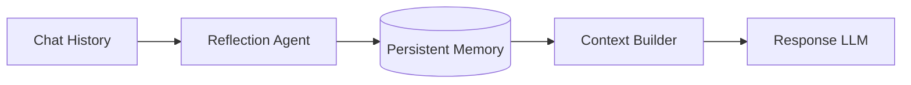

# 🧠 Long-Term Memory: Building the AI's Digital Soul

## 🌟 The Evolution of Presence

Traditional RAG is **Stateless**. The AI hears your query, searches, and answers. When the session ends, it "dies." **Long-Term Memory (LTM)** allows the AI to develop a persistent understanding of the user across days, weeks, or years.

---

## 🏗️ Memory Architectures

### 1. Semantic Memory (Facts)
The storage of general knowledge and user-specific facts.
- *\"The user prefers Python over JavaScript.\"*
- *\"The project uses PostgreSQL for its primary database.\"*

### 2. Episodic Memory (Events)
Remembering specific past interactions.
- *\"We tried the Gemini 1.5 Pro model yesterday and it was faster than GPT-4 for this task.\"*

### 3. Procedural Memory (Rules)
Remembering how the user likes things done.
- *\"Always summarize technical docs in bullet points.\"*

---

## 🤖 The "Reflection" Loop

Memory isn't just dumping chat logs into a database. It requires **Active Reflection**.

### The Process:
1.  **Extract**: An agent reads the recent chat history.
2.  **Analyze**: It identifies "New Knowledge" about the user.
3.  **Consolidate**: It merges this knowledge into a central "User Profile" or "User Graph."
4.  **Retrieve**: In the next session, this profile is loaded into the LLM's system prompt.

---

## 🛠️ Implementation in RAG Engine Mini

In our final mastery level, we implement a **lightweight persistent memory**:
- **Fact Database**: A simple structured store for user preferences.
- **Reflection Pass**: A background task that trigger after a conversation ends.
- **Dynamic Prompting**: Injecting "What I know about you" into every RAG query.

---

## 🏆 Summary for the Master Architect

Memory transforms a "Tool" into a "Partner." By implementing LTM, you are no longer just building a search engine; you are building a **Co-Pilot**.

---

## 📚 Advanced Reading
- Stanford: "Generative Agents: Interactive Simulacra of Human Behavior"
- MemGPT: "Managing Infinite Context in LLMs"
- Zep: "Long-term Memory for AI Assistants"
