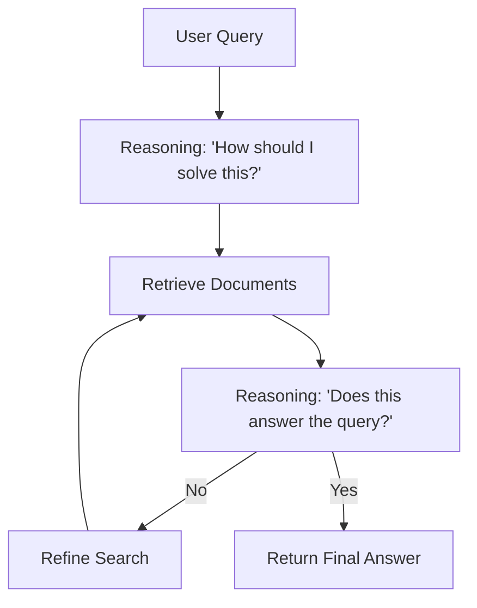

# 🧠 Reasoning Models & Thinking Loops: The Era of System 2 AI

## 🌟 The "Thinking" Paradigm (o1/R1)

Traditionally, LLMs were "System 1" thinkers—they predicted the next token instantly based on intuition/patterns. Modern **Reasoning Models** (like OpenAI o1 and DeepSeek R1) introduce "System 2" thinking, where the model explicitly plans, verifies, and corrects its own logic *before* giving the final answer.

---

## 🏗️ Core Concepts

### 1. Test-Time Compute (Scaling Inference)
Scaling used to happen only during training. Now, we scale during **Inference**. By giving the model more time (compute) to "think" through a problem, we can solve much harder math, coding, and logic puzzles.

### 2. Chain-of-Thought (CoT) Verification
Instead of a hidden internal process, the "Thinking" is often expressed as a series of steps.
- **Inner Monologue**: The model's private reasoning space.
- **Self-Correction**: Identifying a flaw in step 2 and backtracking to fix it before proceeding to step 3.

### 3. Process vs. Outcome Supervision
- **Outcome Supervision**: Rewarding the model only if the final answer is right.
- **Process Supervision**: Rewarding the model for every correct *step* in the reasoning chain. This is what makes reasoning models robust.

---

## 🔍 Implementation in RAG Systems

How does "Thinking" improve RAG?
1.  **Context Synthesis**: Instead of just summarizing Chunks 1, 2, and 3, the model "thinks" about how they contradict or support each other.
2.  **Plan-and-Execute**: The model formulates a plan: "First I will look for X, then I will verify Y in the knowledge graph."
3.  **Ambiguity Handling**: If the retrieved context is unclear, the "Thinking" block decides to trigger a second recursive search.

---

## 🛠️ The Reasoning Loop Architecture

---

## 🏆 Summary for the Reasoning Architect

A Reasoning Architect understands that **Intelligence = Compute x Time**. By implementing thinking loops and verification steps, you create AI systems that are not just fast, but **correct**.

---

## 📚 Advanced Reading
- Wei et al.: "Chain-of-Thought Prompting Elicits Reasoning in Large Language Models"
- Lightman et al.: "Let's Verify Step by Step" (Process Supervision)
- DeepSeek: "R1: Incentivizing Reasoning Capability in LLMs via RL"
