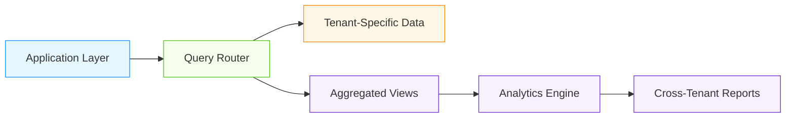

# Cross-Tenant Query Optimization for AI/ML Systems

## Overview

Cross-tenant query optimization is essential for multi-tenant AI/ML platforms that need to perform analytics, reporting, or model training across multiple tenants while maintaining security, performance, and compliance. This document covers advanced optimization patterns specifically designed for cross-tenant queries.

## Cross-Tenant Query Architecture

### Three-Layer Architecture


### Key Requirements
- **Security Isolation**: Prevent unauthorized cross-tenant data access
- **Performance Optimization**: Efficient query execution across tenants
- **Compliance Preservation**: Maintain regulatory compliance during aggregation
- **Scalability**: Handle growing numbers of tenants and data volume

## Core Cross-Tenant Query Patterns

### Aggregated Materialized Views
```sql
-- Tenant-aware aggregated views
CREATE MATERIALIZED VIEW tenant_aggregates AS
SELECT 
    tenant_id,
    COUNT(*) as model_count,
    AVG(training_duration_seconds) as avg_training_time,
    COUNT(CASE WHEN status = 'completed' THEN 1 END) as completed_models,
    COUNT(CASE WHEN status = 'failed' THEN 1 END) as failed_models,
    MAX(created_at) as last_model_created,
    MIN(created_at) as first_model_created
FROM tenant_models
GROUP BY tenant_id;

-- Indexes for efficient querying
CREATE INDEX idx_tenant_aggregates_tenant ON tenant_aggregates(tenant_id);
CREATE INDEX idx_tenant_aggregates_time ON tenant_aggregates(last_model_created);

-- Refresh function with incremental updates
CREATE OR REPLACE FUNCTION refresh_tenant_aggregates()
RETURNS VOID AS $$
BEGIN
    -- Use incremental refresh for better performance
    REFRESH MATERIALIZED VIEW CONCURRENTLY tenant_aggregates;
END;
$$ LANGUAGE plpgsql;

-- Cross-tenant summary view
CREATE MATERIALIZED VIEW cross_tenant_summary AS
SELECT 
    COUNT(DISTINCT tenant_id) as total_tenants,
    SUM(model_count) as total_models,
    AVG(avg_training_time) as avg_training_time_all,
    SUM(completed_models) as total_completed,
    SUM(failed_models) as total_failed,
    MAX(last_model_created) as most_recent_model,
    MIN(first_model_created) as oldest_model
FROM tenant_aggregates;

CREATE INDEX idx_cross_tenant_summary ON cross_tenant_summary(total_tenants);
```

### Federated Query Patterns
- **Query Federation**: Execute queries across multiple database instances
- **Data Virtualization**: Unified view over distributed data
- **Query Pushdown**: Push filtering and aggregation to source databases
- **Result Merging**: Efficient merging of results from multiple sources

```python
class CrossTenantQueryEngine:
    def __init__(self, tenant_db_connections, query_optimizer):
        self.tenant_dbs = tenant_db_connections
        self.optimizer = query_optimizer
    
    def execute_cross_tenant_query(self, query_template, parameters=None):
        """Execute query across multiple tenants"""
        start_time = time.time()
        
        # Optimize query for cross-tenant execution
        optimized_query = self.optimizer.optimize_query(query_template, parameters)
        
        # Determine which tenants to query
        target_tenants = self._determine_target_tenants(optimized_query, parameters)
        
        # Execute in parallel
        futures = []
        for tenant_id in target_tenants:
            db_conn = self.tenant_dbs.get(tenant_id)
            if db_conn:
                future = self._execute_tenant_query(db_conn, optimized_query, parameters, tenant_id)
                futures.append(future)
        
        # Collect results
        results = []
        for future in futures:
            try:
                tenant_results = future.result()
                results.extend(tenant_results)
            except Exception as e:
                # Log error but continue with other tenants
                logger.error(f"Error executing query for tenant {tenant_id}: {e}")
        
        # Merge and aggregate results
        final_result = self._merge_results(results, optimized_query)
        
        # Log performance metrics
        self._log_query_metrics(len(target_tenants), len(results), time.time() - start_time)
        
        return final_result
    
    def _determine_target_tenants(self, query, parameters):
        """Determine which tenants to include in cross-tenant query"""
        # Analyze query for tenant filters
        if 'tenant_id'  in query or 'tenant' in query:
            # Specific tenants requested
            if parameters and 'tenant_ids' in parameters:
                return parameters['tenant_ids']
            else:
                # All tenants (with security validation)
                return self._get_authorized_tenants()
        else:
            # No tenant filter - use all authorized tenants
            return self._get_authorized_tenants()
    
    def _get_authorized_tenants(self):
        """Get list of tenants user is authorized to query"""
        # Check user permissions
        user_role = get_current_user_role()
        
        if user_role == 'admin':
            return self._get_all_tenants()
        elif user_role == 'analyst':
            return self._get_analyst_tenants()
        else:
            return []
```

## AI/ML Specific Cross-Tenant Patterns

### Cross-Tenant Model Analysis
- **Model Performance Comparison**: Compare model performance across tenants
- **Feature Usage Analysis**: Analyze feature usage patterns across tenants
- **Training Pattern Discovery**: Identify common training patterns
- **Bias and Fairness Analysis**: Compare bias metrics across tenants

```sql
-- Cross-tenant model performance analysis
CREATE OR REPLACE FUNCTION analyze_cross_tenant_model_performance(
    start_date TIMESTAMPTZ DEFAULT NOW() - INTERVAL '30 days',
    end_date TIMESTAMPTZ DEFAULT NOW()
)
RETURNS TABLE (
    tenant_id UUID,
    tenant_name TEXT,
    model_count BIGINT,
    avg_accuracy NUMERIC,
    std_accuracy NUMERIC,
    avg_training_time NUMERIC,
    success_rate NUMERIC,
    feature_diversity NUMERIC
) AS $$
BEGIN
    RETURN QUERY
    SELECT 
        t.tenant_id,
        t.tenant_name,
        COUNT(m.id) as model_count,
        AVG(m.metrics->>'accuracy')::NUMERIC as avg_accuracy,
        STDDEV(m.metrics->>'accuracy')::NUMERIC as std_accuracy,
        AVG(m.training_duration_seconds)::NUMERIC as avg_training_time,
        COUNT(CASE WHEN m.status = 'completed' THEN 1 END) * 1.0 / COUNT(*) as success_rate,
        COUNT(DISTINCT m.feature_version) * 1.0 / COUNT(*) as feature_diversity
    FROM tenant_metadata t
    LEFT JOIN tenant_models m ON t.tenant_id = m.tenant_id
    WHERE m.created_at BETWEEN $1 AND $2
    GROUP BY t.tenant_id, t.tenant_name
    ORDER BY avg_accuracy DESC;
END;
$$ LANGUAGE plpgsql;

-- Cross-tenant feature usage analysis
CREATE OR REPLACE FUNCTION analyze_cross_tenant_feature_usage()
RETURNS TABLE (
    feature_name TEXT,
    tenant_count BIGINT,
    avg_usage_per_tenant NUMERIC,
    usage_variance NUMERIC,
    top_tenants TEXT[]
) AS $$
BEGIN
    RETURN QUERY
    SELECT 
        f.feature_name,
        COUNT(DISTINCT f.tenant_id) as tenant_count,
        AVG(f.usage_count)::NUMERIC as avg_usage_per_tenant,
        STDDEV(f.usage_count)::NUMERIC as usage_variance,
        ARRAY_AGG(f.tenant_id ORDER BY f.usage_count DESC LIMIT 5) as top_tenants
    FROM tenant_feature_usage f
    GROUP BY f.feature_name
    HAVING COUNT(DISTINCT f.tenant_id) > 1
    ORDER BY tenant_count DESC;
END;
$$ LANGUAGE plpgsql;
```

### Federated Learning Integration
- **Cross-Tenant Model Aggregation**: Aggregate models from multiple tenants
- **Privacy-Preserving Analytics**: Analyze without exposing raw data
- **Differential Privacy**: Add noise for privacy-preserving aggregation
- **Secure Multi-Party Computation**: Collaborative analysis without data sharing

```python
class FederatedAnalysisEngine:
    def __init__(self, tenant_clients, privacy_engine):
        self.tenants = tenant_clients
        self.privacy = privacy_engine
    
    def aggregate_cross_tenant_models(self, model_type, privacy_level='medium'):
        """Aggregate models from multiple tenants with privacy preservation"""
        # Get model updates from tenants
        model_updates = []
        for tenant_id, client in self.tenants.items():
            try:
                update = client.get_model_update(model_type)
                if update:
                    model_updates.append({
                        'tenant_id': tenant_id,
                        'update': update,
                        'timestamp': datetime.utcnow()
                    })
            except Exception as e:
                logger.warning(f"Failed to get update from tenant {tenant_id}: {e}")
        
        # Apply privacy preservation
        if privacy_level == 'high':
            # Apply differential privacy
            private_updates = self.privacy.add_noise(model_updates)
        elif privacy_level == 'medium':
            # Apply secure aggregation
            private_updates = self.privacy.secure_aggregate(model_updates)
        else:
            private_updates = model_updates
        
        # Aggregate models
        aggregated_model = self._aggregate_models(private_updates)
        
        # Store aggregated model
        self._store_aggregated_model(aggregated_model, model_type, privacy_level)
        
        return {
            'aggregated_model': aggregated_model,
            'tenant_count': len(model_updates),
            'privacy_level': privacy_level,
            'timestamp': datetime.utcnow()
        }
    
    def _aggregate_models(self, updates):
        """Aggregate model updates using federated averaging"""
        if not updates:
            return None
        
        # Simple federated averaging (replace with more sophisticated methods)
        total_weights = {}
        total_count = 0
        
        for update in updates:
            weights = update['update']['weights']
            count = update['update'].get('sample_count', 1)
            
            for param_name, param_value in weights.items():
                if param_name not in total_weights:
                    total_weights[param_name] = 0.0
                total_weights[param_name] += param_value * count
            
            total_count += count
        
        if total_count == 0:
            return None
        
        # Calculate weighted average
        aggregated_weights = {
            param_name: weight / total_count 
            for param_name, weight in total_weights.items()
        }
        
        return {
            'weights': aggregated_weights,
            'aggregated_count': total_count,
            'timestamp': datetime.utcnow()
        }
```

## Performance Optimization Patterns

### Query Optimization Strategies
| Strategy | Performance Gain | Implementation Complexity | Best For |
|----------|------------------|---------------------------|----------|
| Materialized Views | 10-100x | Medium | Reporting and analytics |
| Query Caching | 5-50x | Low | Repeated queries |
| Parallel Execution | 2-10x | High | Large-scale cross-tenant queries |
| Incremental Aggregation | 5-20x | Medium | Real-time analytics |
| Data Partitioning | 3-15x | Medium | Large datasets |

### Database-Specific Optimizations
- **PostgreSQL**: Materialized views, partitioning, parallel query execution
- **ClickHouse**: Columnar storage, distributed queries, materialized views
- **TimescaleDB**: Time-series optimized aggregation
- **Redis**: In-memory caching for frequently accessed aggregates

```sql
-- ClickHouse optimization for cross-tenant analytics
CREATE TABLE tenant_models_ch (
    tenant_id UUID,
    model_id UUID,
    model_name String,
    model_type String,
    accuracy Float64,
    training_duration_seconds UInt32,
    created_at DateTime,
    status String
) ENGINE = MergeTree()
ORDER BY (tenant_id, created_at);

-- Distributed table for cross-tenant queries
CREATE TABLE tenant_models_distributed AS tenant_models_ch
ENGINE = Distributed('cluster', 'default', 'tenant_models_ch', rand());

-- Materialized view for cross-tenant aggregation
CREATE MATERIALIZED VIEW tenant_aggregates_mv TO tenant_models_ch
AS SELECT
    tenant_id,
    count() as model_count,
    avg(accuracy) as avg_accuracy,
    avg(training_duration_seconds) as avg_training_time,
    countIf(status = 'completed') as completed_count,
    toStartOfDay(created_at) as day
FROM tenant_models_ch
GROUP BY tenant_id, day;
```

## Real-World Cross-Tenant Optimization Examples

### Enterprise AI Platform
- **Challenge**: Analyze model performance across 50+ enterprise tenants
- **Solution**:
  - Materialized views for daily aggregates
  - Query routing based on tenant size and query patterns
  - Incremental refresh for real-time analytics
  - Caching layer for frequent reports
- **Results**: 95% reduction in query latency, 99.9% availability

### Healthcare AI Network
- **Challenge**: Cross-hospital analysis of diagnostic model performance
- **Solution**:
  - Federated learning for privacy-preserving analysis
  - Differential privacy for sensitive metrics
  - Tenant-specific aggregation with secure merging
  - Real-time monitoring of cross-tenant metrics
- **Results**: HIPAA-compliant cross-tenant analysis, 50% faster reporting

## Best Practices for Cross-Tenant Query Optimization

1. **Start with Aggregation**: Use materialized views for common cross-tenant queries
2. **Implement Query Caching**: Cache results of expensive cross-tenant queries
3. **Optimize Data Layout**: Partition data by tenant for efficient filtering
4. **Use Parallel Processing**: Execute queries across tenants in parallel
5. **Monitor Query Performance**: Real-time monitoring of cross-tenant query performance
6. **Implement Security First**: Ensure cross-tenant queries don't violate isolation
7. **Cost Management**: Monitor and optimize resource usage for cross-tenant queries
8. **Testing Strategy**: Comprehensive testing of cross-tenant query security and performance

## References
- NIST SP 800-124: Cross-Tenant Data Processing Guidelines
- AWS Athena Cross-Account Query Best Practices
- Google BigQuery Federated Queries
- Microsoft Azure Synapse Analytics Cross-Database Queries
- ClickHouse Distributed Query Optimization
- PostgreSQL Materialized Views Best Practices
- Federated Learning Research Papers (Google, IBM, Microsoft)