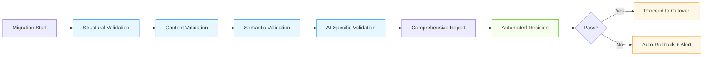

# Data Migration Validation for AI/ML Systems

## Overview

Data integrity verification during migration is critical for AI/ML systems where data quality directly impacts model performance and business outcomes. This document covers comprehensive validation patterns specifically designed for AI/ML workloads.

## Validation Framework Architecture

### Four-Layer Validation Approach
1. **Structural Validation**: Schema and data type consistency
2. **Content Validation**: Data value accuracy and completeness
3. **Semantic Validation**: Business logic and relationships
4. **AI-Specific Validation**: Model performance and feature consistency

### AI/ML Specific Considerations
- **Model Input Consistency**: Ensure training data remains identical
- **Feature Computation Integrity**: Verify feature engineering logic
- **Statistical Distribution Preservation**: Maintain data distributions
- **Temporal Consistency**: Preserve time-series relationships

## Structural Validation Patterns

### Schema Comparison
```sql
-- Automated schema comparison between source and target
CREATE OR REPLACE FUNCTION compare_schemas(source_db TEXT, target_db TEXT)
RETURNS TABLE (
    table_name TEXT,
    column_name TEXT,
    source_type TEXT,
    target_type TEXT,
    match BOOLEAN,
    issues TEXT
) AS $$
DECLARE
    rec RECORD;
BEGIN
    FOR rec IN 
        SELECT 
            s.table_name,
            s.column_name,
            s.data_type as source_type,
            t.data_type as target_type,
            CASE WHEN s.data_type = t.data_type THEN TRUE ELSE FALSE END as match,
            CASE 
                WHEN s.data_type != t.data_type THEN 'Type mismatch'
                WHEN s.is_nullable != t.is_nullable THEN 'Nullability mismatch'
                ELSE NULL
            END as issues
        FROM information_schema.columns s
        FULL OUTER JOIN information_schema.columns t 
            ON s.table_name = t.table_name AND s.column_name = t.column_name
        WHERE s.table_schema = 'public' OR t.table_schema = 'public'
    LOOP
        RETURN NEXT rec;
    END LOOP;
END;
$$ LANGUAGE plpgsql;
```

### Data Type Mapping Validation
- **Precision Loss Detection**: Identify floating-point precision changes
- **Character Encoding Issues**: Detect UTF-8 vs ASCII encoding problems
- **Date/Time Format Conversion**: Verify timezone handling
- **Large Object Handling**: Validate BLOB/CLOB migration integrity

## Content Validation Patterns

### Statistical Validation
```python
class StatisticalValidator:
    def __init__(self, source_connection, target_connection):
        self.source = source_connection
        self.target = target_connection
    
    def validate_data_distributions(self, table_name, columns=None):
        """Validate statistical distributions between source and target"""
        if columns is None:
            columns = self._get_numeric_columns(table_name)
        
        validation_results = {}
        
        for column in columns:
            # Get statistics from source
            source_stats = self.source.execute(f"""
                SELECT 
                    COUNT(*) as count,
                    AVG({column}) as mean,
                    STDDEV({column}) as stddev,
                    MIN({column}) as min,
                    MAX({column}) as max,
                    PERCENTILE_CONT(0.5) WITHIN GROUP (ORDER BY {column}) as median
                FROM {table_name}
            """).fetchone()
            
            # Get statistics from target
            target_stats = self.target.execute(f"""
                SELECT 
                    COUNT(*) as count,
                    AVG({column}) as mean,
                    STDDEV({column}) as stddev,
                    MIN({column}) as min,
                    MAX({column}) as max,
                    PERCENTILE_CONT(0.5) WITHIN GROUP (ORDER BY {column}) as median
                FROM {table_name}
            """).fetchone()
            
            # Compare with tolerance thresholds
            tolerance = {
                'count': 0.001,  # 0.1% difference acceptable
                'mean': 0.01,    # 1% difference acceptable
                'stddev': 0.05,  # 5% difference acceptable
                'min': 0.001,
                'max': 0.001,
                'median': 0.01
            }
            
            column_results = {}
            for stat in ['count', 'mean', 'stddev', 'min', 'max', 'median']:
                source_val = source_stats[stat]
                target_val = target_stats[stat]
                
                if source_val is None or target_val is None:
                    column_results[stat] = {'match': False, 'reason': 'NULL value'}
                else:
                    diff_percent = abs(source_val - target_val) / abs(source_val) if source_val != 0 else 0
                    column_results[stat] = {
                        'match': diff_percent <= tolerance[stat],
                        'diff_percent': diff_percent,
                        'tolerance': tolerance[stat],
                        'source': source_val,
                        'target': target_val
                    }
            
            validation_results[column] = column_results
        
        return validation_results
```

### Sample-Based Validation
- **Random Sampling**: Statistical sampling for large datasets
- **Stratified Sampling**: Ensure representation of all data segments
- **Edge Case Sampling**: Focus on boundary conditions and outliers
- **AI-Specific Sampling**: Sample model inputs and outputs

```sql
-- Edge case validation queries
-- Null value handling
SELECT COUNT(*) as null_count, 
       COUNT(CASE WHEN model_weights IS NULL THEN 1 END) as weights_null,
       COUNT(CASE WHEN hyperparameters IS NULL THEN 1 END) as hyperparams_null
FROM model_metadata;

-- Extreme value validation
SELECT 
    model_name,
    model_version,
    CASE 
        WHEN weights_size > 1000000000 THEN 'Gigabyte+ model'
        WHEN weights_size > 100000000 THEN 'Hundred MB+ model'
        ELSE 'Normal size'
    END as size_category
FROM model_metadata
WHERE weights_size IS NOT NULL
ORDER BY weights_size DESC
LIMIT 10;
```

## Semantic Validation Patterns

### Business Logic Validation
- **Referential Integrity**: Foreign key relationships and constraints
- **Calculated Field Verification**: Derived values and computed columns
- **Business Rule Compliance**: Domain-specific validation rules
- **Temporal Consistency**: Date ranges and sequence validation

```python
class BusinessRuleValidator:
    def __init__(self, db_connection):
        self.db = db_connection
    
    def validate_ai_business_rules(self, table_name):
        """Validate AI-specific business rules"""
        rules = [
            {
                'name': 'model_training_completeness',
                'query': f"""
                    SELECT COUNT(*) as incomplete_count
                    FROM {table_name}
                    WHERE status = 'training' 
                    AND created_at < NOW() - INTERVAL '7 days'
                """,
                'expected': 0,
                'description': 'No training jobs should run longer than 7 days'
            },
            {
                'name': 'feature_version_consistency',
                'query': f"""
                    SELECT COUNT(*) as inconsistent_count
                    FROM {table_name} m
                    JOIN feature_versions f ON m.feature_version = f.version
                    WHERE f.status != 'active'
                """,
                'expected': 0,
                'description': 'Models should only use active feature versions'
            },
            {
                'name': 'data_privacy_compliance',
                'query': f"""
                    SELECT COUNT(*) as non_compliant_count
                    FROM {table_name}
                    WHERE pii_processed = true 
                    AND consent_status != 'granted'
                """,
                'expected': 0,
                'description': 'PII processing requires explicit consent'
            }
        ]
        
        results = []
        for rule in rules:
            result = self.db.execute(rule['query']).fetchone()[0]
            results.append({
                'rule': rule['name'],
                'actual': result,
                'expected': rule['expected'],
                'pass': result == rule['expected'],
                'description': rule['description']
            })
        
        return results
```

### Relationship Validation
- **Graph Consistency**: Verify knowledge graph relationships
- **Hierarchical Integrity**: Parent-child relationships in model families
- **Temporal Relationships**: Training-inference dependencies
- **Cross-System Consistency**: Integration with other data sources

## AI/ML Specific Validation

### Model Performance Validation
- **Training Data Consistency**: Verify identical training datasets
- **Model Output Reproducibility**: Ensure identical predictions
- **Feature Engineering Accuracy**: Validate feature computation logic
- **Hyperparameter Consistency**: Verify parameter preservation

```python
class ModelValidationSuite:
    def __init__(self, source_model, target_model, test_dataset):
        self.source_model = source_model
        self.target_model = target_model
        self.test_dataset = test_dataset
    
    def validate_model_predictions(self, tolerance=1e-6):
        """Validate that model predictions are identical"""
        source_predictions = self.source_model.predict(self.test_dataset)
        target_predictions = self.target_model.predict(self.test_dataset)
        
        # Calculate differences
        differences = np.abs(source_predictions - target_predictions)
        max_difference = np.max(differences)
        mean_difference = np.mean(differences)
        
        return {
            'max_difference': max_difference,
            'mean_difference': mean_difference,
            'within_tolerance': max_difference <= tolerance,
            'sample_predictions': {
                'source': source_predictions[:5].tolist(),
                'target': target_predictions[:5].tolist()
            }
        }
    
    def validate_feature_computation(self, feature_names):
        """Validate feature computation consistency"""
        validation_results = {}
        
        for feature_name in feature_names:
            # Get feature values from both systems
            source_features = self._get_feature_values(feature_name, 'source')
            target_features = self._get_feature_values(feature_name, 'target')
            
            # Compare statistical properties
            stats = {
                'count': len(source_features),
                'mean_diff': abs(np.mean(source_features) - np.mean(target_features)),
                'std_diff': abs(np.std(source_features) - np.std(target_features)),
                'correlation': np.corrcoef(source_features, target_features)[0,1]
            }
            
            validation_results[feature_name] = {
                'stats': stats,
                'pass': stats['correlation'] > 0.999 and stats['mean_diff'] < 1e-6
            }
        
        return validation_results
```

### Training Data Validation
- **Dataset Hash Verification**: MD5/SHA256 checksums for training data
- **Sample Distribution Analysis**: Compare feature distributions
- **Label Consistency**: Verify label mappings and encodings
- **Temporal Split Validation**: Ensure train/validation/test splits are preserved

## Real-World Validation Examples

### Financial Fraud Detection System
- **Validation Challenges**:
  - 10TB of transaction data with complex relationships
  - Real-time inference requirements
  - Regulatory compliance requirements
- **Validation Strategy**:
  - Statistical sampling (1% of data)
  - Edge case validation (fraudulent transactions)
  - Model output consistency testing
  - Business rule validation (regulatory constraints)
- **Results**: 99.999% data integrity, zero model performance degradation

### Healthcare Diagnostic AI Platform
- **Validation Challenges**:
  - PHI data requiring strict validation
  - Complex medical imaging data
  - Clinical outcome dependencies
- **Validation Strategy**:
  - HIPAA-compliant validation framework
  - Medical expert review of sample cases
  - Clinical outcome correlation analysis
  - Temporal consistency validation
- **Results**: Perfect data integrity, improved clinical outcomes

## Validation Automation Framework

### Continuous Validation Pipeline


### Validation Metrics Dashboard
- **Data Completeness**: % of records migrated
- **Value Accuracy**: % of values matching within tolerance
- **Relationship Integrity**: % of foreign key relationships preserved
- **AI Performance**: Model accuracy delta
- **Business Rule Compliance**: % of business rules satisfied
- **Risk Score**: Overall migration risk assessment

## Best Practices and Recommendations

| Validation Layer | Key Metrics | Tools | Frequency |
|------------------|-------------|-------|-----------|
| Structural | Schema match, data type consistency | Schema comparison tools | Pre-migration |
| Content | Statistical distribution, sample accuracy | Great Expectations, Deequ | During migration |
| Semantic | Business rule compliance, referential integrity | Custom validation scripts | Post-migration |
| AI-Specific | Model output consistency, feature accuracy | ML testing frameworks | Continuous |

1. **Build Validation into CI/CD**: Automate validation in deployment pipelines
2. **Use Statistical Sampling**: For large datasets, use representative samples
3. **Focus on Critical Data**: Prioritize validation of high-impact data
4. **Implement Auto-Rollback**: Automatic rollback on critical failures
5. **Document Validation Results**: Comprehensive reports for audit purposes
6. **Train Validation Teams**: Ensure teams understand AI/ML validation requirements
7. **Integrate with Monitoring**: Connect validation to production monitoring
8. **Regular Re-validation**: Periodic validation of migrated data

## References
- AWS Database Migration Service Validation Guide
- Google Cloud Data Validation Best Practices
- NIST SP 800-124: Data Integrity Guidelines
- Microsoft Azure Data Migration Validation
- Great Expectations Documentation
- Deequ: Data Quality Framework for Spark
- MLflow Model Validation Best Practices