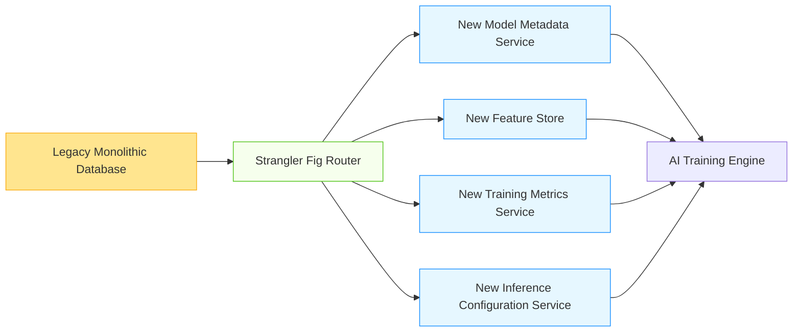

# Database Refactoring Patterns for AI/ML Systems

## Overview

Incremental refactoring of monolithic databases is essential for evolving AI/ML systems to handle increasing complexity, scale, and performance requirements. This document covers advanced refactoring patterns specifically designed for AI/ML workloads.

## Refactoring Strategy Framework

### Evolutionary Architecture Principles
- **Small, Safe Changes**: Incremental refactoring with minimal risk
- **Test-First Approach**: Comprehensive testing before and after changes
- **Feature Toggles**: Enable/disable refactored components dynamically
- **Observability First**: Instrument all refactoring steps for monitoring

### AI/ML Specific Considerations
- **Model Data Separation**: Isolate model parameters from metadata
- **Feature Store Evolution**: Refactor feature computation and storage
- **Experiment Tracking**: Separate experiment data from production data
- **Real-time Processing**: Enable streaming capabilities without disruption

## Core Refactoring Patterns

### Schema Decomposition Patterns

#### Vertical Partitioning
```sql
-- Original monolithic table
CREATE TABLE ai_workloads (
    id UUID PRIMARY KEY,
    model_name TEXT,
    model_version TEXT,
    training_data_size BIGINT,
    model_weights BYTEA,
    hyperparameters JSONB,
    training_metrics JSONB,
    inference_config JSONB,
    created_at TIMESTAMPTZ,
    updated_at TIMESTAMPTZ,
    status TEXT
);

-- After vertical partitioning
CREATE TABLE model_metadata (
    id UUID PRIMARY KEY,
    model_name TEXT,
    model_version TEXT,
    training_data_size BIGINT,
    hyperparameters JSONB,
    created_at TIMESTAMPTZ,
    updated_at TIMESTAMPTZ,
    status TEXT
);

CREATE TABLE model_parameters (
    model_id UUID PRIMARY KEY,
    model_weights BYTEA,
    FOREIGN KEY (model_id) REFERENCES model_metadata(id)
);

CREATE TABLE training_metrics (
    model_id UUID,
    metric_name TEXT,
    metric_value NUMERIC,
    timestamp TIMESTAMPTZ,
    PRIMARY KEY (model_id, metric_name, timestamp),
    FOREIGN KEY (model_id) REFERENCES model_metadata(id)
);

CREATE TABLE inference_config (
    model_id UUID PRIMARY KEY,
    config JSONB,
    FOREIGN KEY (model_id) REFERENCES model_metadata(id)
);
```

#### Horizontal Partitioning
- **Time-Based**: Partition by training date or inference timestamp
- **Tenant-Based**: For multi-tenant AI platforms
- **Model Type-Based**: Separate different model architectures
- **Data Sensitivity-Based**: Isolate sensitive vs. non-sensitive data

### Data Access Layer Refactoring

#### Repository Pattern Evolution
```python
class LegacyModelRepository:
    def __init__(self, db_connection):
        self.db = db_connection
    
    def get_model(self, model_id):
        """Monolithic data access"""
        query = """
        SELECT id, model_name, model_version, model_weights, 
               hyperparameters, training_metrics, inference_config
        FROM ai_workloads WHERE id = %s
        """
        return self.db.execute(query, [model_id])

class RefactoredModelRepository:
    def __init__(self, metadata_repo, parameters_repo, metrics_repo, config_repo):
        self.metadata_repo = metadata_repo
        self.parameters_repo = parameters_repo
        self.metrics_repo = metrics_repo
        self.config_repo = config_repo
    
    def get_model(self, model_id):
        """Composed data access with separation of concerns"""
        # Fetch metadata first (frequently accessed)
        metadata = self.metadata_repo.get(model_id)
        
        # Parallel fetch of less frequently accessed data
        futures = [
            self.parameters_repo.get(model_id),
            self.metrics_repo.get_latest(model_id),
            self.config_repo.get(model_id)
        ]
        
        results = [future.result() for future in futures]
        
        return Model(
            metadata=metadata,
            parameters=results[0],
            latest_metrics=results[1],
            config=results[2]
        )
```

#### CQRS Pattern Implementation
- **Command Side**: Optimized for write operations (training, updates)
- **Query Side**: Optimized for read operations (inference, monitoring)
- **Event Sourcing**: Capture all state changes as events

```sql
-- Command side tables (optimized for writes)
CREATE TABLE model_commands (
    id UUID PRIMARY KEY,
    model_id UUID NOT NULL,
    command_type TEXT NOT NULL,
    payload JSONB NOT NULL,
    created_at TIMESTAMPTZ DEFAULT NOW(),
    processed_at TIMESTAMPTZ
);

-- Query side materialized views (optimized for reads)
CREATE MATERIALIZED VIEW model_summary AS
SELECT 
    m.id,
    m.model_name,
    m.model_version,
    m.status,
    COALESCE(lm.metric_value, 0) as accuracy,
    COUNT(t.id) as training_runs,
    MAX(t.created_at) as last_training
FROM model_metadata m
LEFT JOIN training_metrics lm ON m.id = lm.model_id AND lm.metric_name = 'accuracy'
LEFT JOIN training_runs t ON m.id = t.model_id
GROUP BY m.id, m.model_name, m.model_version, m.status, lm.metric_value;

CREATE INDEX idx_model_summary_status ON model_summary(status);
CREATE INDEX idx_model_summary_accuracy ON model_summary(accuracy);
```

## AI/ML Specific Refactoring Patterns

### Feature Store Refactoring
- **From Monolithic to Modular**: Separate feature computation, storage, and serving
- **Online vs Offline Separation**: Different storage and access patterns
- **Versioned Features**: Support feature versioning and lineage
- **Real-time Feature Engineering**: Add streaming capabilities

```python
class FeatureStoreRefactor:
    def __init__(self):
        self.offline_store = OfflineFeatureStore()
        self.online_store = OnlineFeatureStore()
        self.feature_registry = FeatureRegistry()
    
    def refactor_feature_computation(self, feature_name, new_computation_logic):
        """Refactor feature computation with zero downtime"""
        # 1. Register new feature version
        new_version = self.feature_registry.register_feature(
            name=feature_name,
            computation_logic=new_computation_logic,
            version='v2',
            compatibility='backward'
        )
        
        # 2. Deploy new computation pipeline
        self.offline_store.deploy_computation_pipeline(
            feature_name=feature_name,
            version=new_version,
            backfill=True
        )
        
        # 3. Gradual rollout to online store
        self.online_store.rollout_feature_version(
            feature_name=feature_name,
            new_version=new_version,
            traffic_percentage=5
        )
        
        # 4. Monitor and validate
        validation_results = self._validate_feature_quality(
            feature_name, new_version, old_version
        )
        
        if validation_results['quality_threshold_met']:
            self.online_store.increase_traffic_percentage(
                feature_name, new_version, 10
            )
```

### Model Registry Refactoring
- **From Simple Table to Hierarchical Structure**: Support model families and versions
- **Metadata Enrichment**: Add comprehensive metadata for AI governance
- **Integration Points**: Standardize interfaces for ML platforms
- **Audit Trail Enhancement**: Comprehensive change tracking

## Refactoring Techniques for Large-Scale AI Systems

### Strangler Fig Pattern


### Dual-Write with Validation
- **Phase 1**: Write to both legacy and new systems
- **Phase 2**: Read from new system, validate against legacy
- **Phase 3**: Full cutover to new system
- **Phase 4**: Decommission legacy system

### Shadow Mode Testing
- **Read Shadowing**: New system processes reads but doesn't affect production
- **Validation Layer**: Compare results between old and new systems
- **Automated Alerts**: Notify on discrepancies beyond threshold

## Performance Impact Analysis

| Refactoring Pattern | Initial Overhead | Long-term Benefit | Migration Risk |
|---------------------|------------------|-------------------|----------------|
| Vertical Partitioning | 5-15% query overhead | 30-50% performance improvement | Low |
| Horizontal Partitioning | 10-20% complexity | 2-5x scalability improvement | Medium |
| CQRS Implementation | 20-30% development effort | 5-10x read performance | High |
| Microservices Split | 30-50% operational complexity | Independent scaling, resilience | High |

### Optimization Strategies
- **Caching Layers**: Add caching between refactored components
- **Connection Pooling**: Optimize database connections for new architecture
- **Query Optimization**: Rewrite queries for new schema patterns
- **Index Strategy**: Redesign indexes for new access patterns

## Real-World Refactoring Examples

### Enterprise Recommendation Engine
- **Before**: Single PostgreSQL database with 50+ tables
- **After**: 
  - PostgreSQL for metadata and transactions
  - Redis for real-time features
  - TimescaleDB for time-series metrics
  - Weaviate for vector similarity search
- **Results**:
  - 4x improvement in inference latency
  - 10x improvement in training throughput
  - 99.99% availability during migration

### Healthcare Diagnostic AI System
- **Before**: Oracle database with custom PL/SQL procedures
- **After**:
  - MongoDB for flexible patient data models
  - PostgreSQL for structured diagnostic results
  - Neo4j for medical knowledge graphs
  - TimescaleDB for clinical trial data
- **Results**:
  - 70% reduction in query complexity
  - Real-time analytics capability added
  - HIPAA compliance enhanced through data separation

## Best Practices for AI/ML Database Refactoring

1. **Start with High-Impact, Low-Risk Areas**: Begin with components that provide immediate value
2. **Build Comprehensive Test Suites**: Unit, integration, and end-to-end tests
3. **Implement Feature Flags**: Enable gradual rollout and easy rollback
4. **Monitor Continuously**: Real-time monitoring of performance and errors
5. **Document Changes Thoroughly**: Maintain architecture decision records
6. **Train Teams**: Ensure developers understand new patterns and tools
7. **Plan for Data Migration**: Include data transformation and validation
8. **Consider Operational Impact**: Update monitoring, alerting, and backup strategies

## References
- Martin Fowler: Refactoring: Improving the Design of Existing Code
- AWS Database Refactoring Best Practices
- Google Cloud Database Modernization Guide
- NIST SP 800-124: Guidelines for Database Security
- Microsoft Azure Database Migration Patterns
- MongoDB Atlas Refactoring Guide