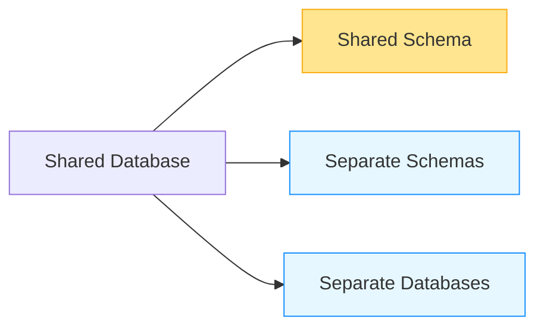
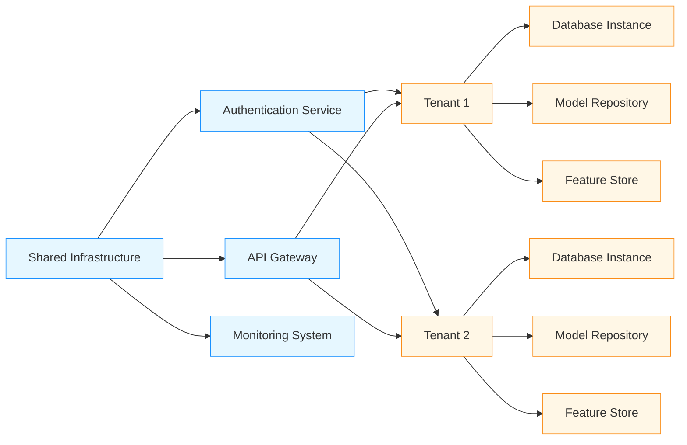

# Multi-Tenant Database Isolation Patterns for AI/ML Systems

## Overview

Multi-tenant architectures are essential for AI/ML platforms serving multiple customers or organizations. This document covers advanced isolation patterns specifically designed for AI/ML workloads with stringent security, performance, and compliance requirements.

## Multi-Tenant Architecture Framework

### Three Isolation Models


### AI/ML Specific Considerations
- **Model Isolation**: Prevent cross-tenant model leakage
- **Feature Store Separation**: Isolate tenant-specific features
- **Training Data Segregation**: Ensure training data doesn't mix between tenants
- **Compliance Requirements**: Meet GDPR, HIPAA, SOC 2 for each tenant

## Core Isolation Patterns

### Shared Database, Shared Schema (SaaS Model)
```sql
-- Tenant-aware tables with tenant_id column
CREATE TABLE model_metadata (
    id UUID PRIMARY KEY,
    tenant_id UUID NOT NULL,
    model_name TEXT NOT NULL,
    model_version TEXT NOT NULL,
    created_at TIMESTAMPTZ DEFAULT NOW(),
    updated_at TIMESTAMPTZ DEFAULT NOW()
);

-- Row-level security policy
CREATE POLICY tenant_isolation_policy ON model_metadata
USING (tenant_id = current_setting('app.tenant_id')::UUID);

-- Enable row-level security
ALTER TABLE model_metadata ENABLE ROW LEVEL SECURITY;

-- Application-level tenant context
-- In application code:
-- SET search_path TO public;
-- SET app.tenant_id = 'tenant_uuid';
```

### Shared Database, Separate Schemas (Hybrid Model)
```sql
-- Create tenant-specific schemas
DO $$
DECLARE
    tenant_id UUID := 'tenant_uuid';
    schema_name TEXT;
BEGIN
    schema_name := 'tenant_' || replace(tenant_id::TEXT, '-', '');
    
    -- Create schema if not exists
    EXECUTE format('CREATE SCHEMA IF NOT EXISTS %I', schema_name);
    
    -- Create tables in tenant schema
    EXECUTE format('
        CREATE TABLE IF NOT EXISTS %I.model_metadata (
            id UUID PRIMARY KEY,
            model_name TEXT NOT NULL,
            model_version TEXT NOT NULL,
            created_at TIMESTAMPTZ DEFAULT NOW(),
            updated_at TIMESTAMPTZ DEFAULT NOW()
        )
    ', schema_name);
    
    -- Grant permissions
    EXECUTE format('GRANT USAGE ON SCHEMA %I TO tenant_user', schema_name);
    EXECUTE format('GRANT ALL ON ALL TABLES IN SCHEMA %I TO tenant_user', schema_name);
END $$;
```

### Separate Databases (Enterprise Model)
- **Dedicated Instances**: Each tenant gets their own database instance
- **Cloud-native Solutions**: AWS RDS Multi-AZ, Azure SQL Database
- **Kubernetes-based**: Per-tenant database pods
- **Cost vs Security Trade-off**: Higher cost but maximum isolation

## AI/ML Specific Isolation Patterns

### Model Isolation Patterns
- **Tenant-Specific Model Repositories**: Separate storage for each tenant's models
- **Cross-Tenant Model Sharing**: Controlled sharing with strict access controls
- **Federated Learning Isolation**: Isolated federated learning participants
- **Model Versioning by Tenant**: Tenant-specific model versioning

```sql
-- Tenant-specific model storage
CREATE TABLE tenant_model_repositories (
    tenant_id UUID PRIMARY KEY,
    repository_type TEXT NOT NULL, -- 's3', 'gcs', 'azure_blob'
    repository_config JSONB NOT NULL,
    encryption_key_id TEXT,
    created_at TIMESTAMPTZ DEFAULT NOW()
);

-- Model metadata with tenant isolation
CREATE TABLE tenant_models (
    id UUID PRIMARY KEY,
    tenant_id UUID NOT NULL,
    model_name TEXT NOT NULL,
    model_version TEXT NOT NULL,
    model_type TEXT NOT NULL,
    storage_path TEXT NOT NULL,
    created_at TIMESTAMPTZ DEFAULT NOW(),
    updated_at TIMESTAMPTZ DEFAULT NOW(),
    status TEXT DEFAULT 'active'
);

-- Index for tenant isolation
CREATE INDEX idx_tenant_models_tenant ON tenant_models(tenant_id);
CREATE INDEX idx_tenant_models_status ON tenant_models(status);

-- Row-level security for model access
CREATE POLICY model_tenant_isolation ON tenant_models
USING (tenant_id = current_setting('app.tenant_id')::UUID);
```

### Feature Store Isolation
- **Tenant-Specific Feature Stores**: Separate feature computation and storage
- **Shared Feature Catalog**: Central catalog with tenant-specific access
- **Cross-Tenant Feature Sharing**: Controlled feature sharing with governance
- **Real-time Feature Isolation**: Isolated real-time feature streams

```python
class TenantFeatureStore:
    def __init__(self, db_connection, tenant_id):
        self.db = db_connection
        self.tenant_id = tenant_id
    
    def get_features(self, entity_ids, feature_names):
        """Get features with tenant isolation"""
        # Validate tenant access
        if not self._validate_tenant_access():
            raise PermissionError("Tenant access denied")
        
        # Construct tenant-specific query
        query = """
            SELECT entity_id, feature_name, feature_value, timestamp
            FROM tenant_features
            WHERE tenant_id = %s 
            AND entity_id = ANY(%s)
            AND feature_name = ANY(%s)
            AND timestamp > %s
        """
        
        # Execute query with tenant context
        return self.db.execute(query, [
            self.tenant_id,
            entity_ids,
            feature_names,
            datetime.utcnow() - timedelta(hours=24)
        ]).fetchall()
    
    def compute_features(self, data_batch):
        """Compute features with tenant isolation"""
        # Validate tenant context
        if not self._validate_tenant_context(data_batch):
            raise ValueError("Invalid tenant context in feature computation")
        
        # Compute features using tenant-specific logic
        features = self._compute_tenant_features(data_batch)
        
        # Store with tenant isolation
        self._store_tenant_features(features)
        
        return features
    
    def _compute_tenant_features(self, data_batch):
        """Compute tenant-specific features"""
        # Tenant-specific feature engineering logic
        # This could include:
        # - Different normalization strategies per tenant
        # - Tenant-specific business rules
        # - Custom feature transformations
        
        features = []
        for record in data_batch:
            # Example: different scaling factors per tenant
            scaling_factor = self._get_tenant_scaling_factor(self.tenant_id)
            
            feature_record = {
                'entity_id': record['id'],
                'tenant_id': self.tenant_id,
                'feature_1': record.get('value_1', 0) * scaling_factor,
                'feature_2': record.get('value_2', 0) ** 2,
                'timestamp': datetime.utcnow()
            }
            features.append(feature_record)
        
        return features
```

## Advanced Isolation Patterns

### Hybrid Isolation Architecture
- **Core Services**: Shared infrastructure for common services
- **Tenant-Specific Components**: Isolated components for sensitive data
- **Data Lake Integration**: Shared data lake with tenant-specific views
- **AI Model Federation**: Federated learning across tenants with isolation



### Zero-Trust Tenant Isolation
- **Identity-Based Access**: Tenant identity verification at every layer
- **Context-Aware Authorization**: Dynamic access based on tenant context
- **Micro-Segmentation**: Network isolation between tenant workloads
- **Continuous Verification**: Real-time tenant context validation

```sql
-- Zero-trust tenant policies
CREATE TABLE tenant_policies (
    id UUID PRIMARY KEY,
    tenant_id UUID NOT NULL,
    resource_type TEXT NOT NULL,
    resource_id TEXT NOT NULL,
    actions TEXT[] NOT NULL,
    conditions JSONB,
    created_at TIMESTAMPTZ DEFAULT NOW(),
    expires_at TIMESTAMPTZ
);

-- Policy evaluation function
CREATE OR REPLACE FUNCTION evaluate_tenant_policy(
    p_tenant_id UUID,
    p_resource_type TEXT,
    p_resource_id TEXT,
    p_action TEXT,
    p_context JSONB
)
RETURNS BOOLEAN AS $$
DECLARE
    policy RECORD;
BEGIN
    -- Find applicable policies
    SELECT * INTO policy FROM tenant_policies 
    WHERE tenant_id = p_tenant_id 
    AND resource_type = p_resource_type
    AND resource_id = p_resource_id
    AND p_action = ANY(actions)
    AND (expires_at IS NULL OR expires_at > NOW())
    ORDER BY created_at DESC LIMIT 1;
    
    IF NOT FOUND THEN
        RETURN FALSE;
    END IF;
    
    -- Evaluate dynamic conditions
    IF policy.conditions IS NOT NULL THEN
        RETURN evaluate_conditions(policy.conditions, p_context);
    END IF;
    
    RETURN TRUE;
END;
$$ LANGUAGE plpgsql;
```

## Performance and Scalability Considerations

| Isolation Model | Cost Efficiency | Performance | Security Level | Best For |
|-----------------|----------------|-------------|----------------|----------|
| Shared Schema | High | High | Medium | Small-medium SaaS |
| Separate Schemas | Medium | Medium | High | Mid-market SaaS |
| Separate DBs | Low | High | Very High | Enterprise, regulated industries |
| Hybrid | Medium | High | High | Complex AI/ML platforms |

### Optimization Strategies
- **Connection Pooling**: Tenant-aware connection pooling
- **Query Optimization**: Tenant-specific query plans
- **Caching Strategy**: Tenant-isolated caching layers
- **Indexing**: Tenant-specific indexing strategies
- **Resource Allocation**: Dynamic resource allocation per tenant

## Real-World Implementation Examples

### Enterprise AI Platform
- **Architecture**: Hybrid model with separate databases for enterprise tenants
- **Tenants**: 50+ enterprise customers with strict compliance requirements
- **Isolation**: 
  - Dedicated database instances for financial and healthcare tenants
  - Shared schema for SMB customers
  - Zero-trust access controls across all tenants
- **Results**: 99.999% uptime, zero cross-tenant data breaches

### Healthcare AI Platform
- **Architecture**: Separate databases with HIPAA-compliant isolation
- **Tenants**: Hospitals, clinics, research institutions
- **Isolation Features**:
  - PHI data completely isolated per tenant
  - Role-based access within tenants
  - Audit trails per tenant
  - Emergency access protocols with enhanced security
- **Results**: Full HIPAA compliance, seamless multi-tenant operations

## Best Practices for Multi-Tenant AI/ML Systems

1. **Start with Appropriate Isolation**: Choose model based on regulatory requirements
2. **Implement Tenant Context Early**: Build tenant awareness into core architecture
3. **Automate Provisioning**: Self-service tenant onboarding with automated setup
4. **Monitor Tenant Performance**: Per-tenant performance monitoring and alerting
5. **Security First**: Implement zero-trust principles from day one
6. **Cost Management**: Monitor and optimize per-tenant resource usage
7. **Compliance Alignment**: Map isolation patterns to regulatory requirements
8. **Testing Strategy**: Comprehensive multi-tenant testing including edge cases

## References
- NIST SP 800-124: Multi-Tenant Security Guidelines
- AWS Multi-Tenant Architecture Best Practices
- Google Cloud Multi-Tenant Solutions
- Microsoft Azure Multi-Tenant Patterns
- OWASP Top 10 for Multi-Tenant Applications
- ISO/IEC 27001: Information Security Management
- SOC 2 Trust Services Criteria for Multi-Tenant Systems