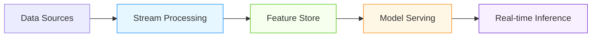

# Real-Time Feature Engineering for AI/ML Systems

## Overview

Real-time feature engineering is critical for AI/ML systems that require immediate insights and adaptive behavior. This document covers advanced patterns for real-time feature computation, serving, and management specifically designed for production AI/ML workloads.

## Real-Time Feature Engineering Architecture

### Three-Layer Architecture


### Key Components
- **Stream Processor**: Kafka, Flink, Spark Streaming
- **Feature Store**: Online + offline storage layers
- **Feature Registry**: Metadata management and versioning
- **Feature Serving**: Low-latency feature retrieval
- **Monitoring**: Real-time feature health monitoring

## Core Real-Time Feature Patterns

### Windowed Aggregation Patterns
```sql
-- Real-time windowed aggregations for AI/ML features
CREATE OR REPLACE FUNCTION calculate_real_time_features(
    entity_id TEXT,
    window_size INTERVAL DEFAULT '5 minutes'
)
RETURNS TABLE (
    feature_name TEXT,
    feature_value NUMERIC,
    window_start TIMESTAMPTZ,
    window_end TIMESTAMPTZ
) AS $$
BEGIN
    RETURN QUERY
    SELECT 
        'rolling_avg_5min' as feature_name,
        AVG(value) OVER (
            ORDER BY timestamp 
            RANGE BETWEEN window_size PRECEDING AND CURRENT ROW
        ) as feature_value,
        MIN(timestamp) OVER (
            ORDER BY timestamp 
            RANGE BETWEEN window_size PRECEDING AND CURRENT ROW
        ) as window_start,
        MAX(timestamp) OVER (
            ORDER BY timestamp 
            RANGE BETWEEN window_size PRECEDING AND CURRENT ROW
        ) as window_end
    FROM real_time_events
    WHERE entity_id = $1
    AND timestamp > NOW() - INTERVAL '10 minutes';
END;
$$ LANGUAGE plpgsql;

-- Advanced window functions for ML features
CREATE OR REPLACE FUNCTION calculate_ml_features(entity_id TEXT)
RETURNS TABLE (
    feature_name TEXT,
    feature_value NUMERIC,
    feature_type TEXT
) AS $$
BEGIN
    RETURN QUERY
    SELECT 
        'z_score_5min' as feature_name,
        (value - AVG(value) OVER w) / STDDEV(value) OVER w as feature_value,
        'normalized' as feature_type
    FROM real_time_events
    WHERE entity_id = $1
    AND timestamp > NOW() - INTERVAL '5 minutes'
    WINDOW w AS (
        ORDER BY timestamp 
        RANGE BETWEEN INTERVAL '5 minutes' PRECEDING AND CURRENT ROW
    )
    LIMIT 1;
END;
$$ LANGUAGE plpgsql;
```

### Sessionization and Behavioral Features
- **User Session Tracking**: Identify and track user sessions in real-time
- **Behavioral Patterns**: Calculate engagement metrics, dwell time, etc.
- **Anomaly Detection**: Real-time outlier detection for fraud prevention
- **Temporal Features**: Time-based features (hour of day, day of week)

```python
class RealTimeSessionizer:
    def __init__(self, redis_client, session_timeout=1800):
        self.redis = redis_client
        self.timeout = session_timeout
    
    def process_event(self, event):
        """Process real-time event for session tracking"""
        entity_id = event['entity_id']
        timestamp = event['timestamp']
        
        # Get current session
        current_session = self._get_current_session(entity_id)
        
        if current_session and timestamp - current_session['last_activity'] < self.timeout:
            # Extend existing session
            session_id = current_session['session_id']
            self._update_session(session_id, timestamp, event)
        else:
            # Create new session
            session_id = str(uuid.uuid4())
            self._create_session(session_id, entity_id, timestamp, event)
        
        # Calculate session features
        return self._calculate_session_features(session_id, event)
    
    def _calculate_session_features(self, session_id, event):
        """Calculate real-time session features"""
        # Get session state from Redis
        session_state = self.redis.hgetall(f"session:{session_id}")
        
        # Calculate features
        features = {
            'session_duration': (datetime.utcnow() - datetime.fromisoformat(session_state['start_time'])).total_seconds(),
            'events_in_session': int(session_state.get('event_count', 0)),
            'avg_time_between_events': self._calculate_avg_interval(session_state),
            'session_engagement_score': self._calculate_engagement_score(session_state, event),
            'is_new_session': session_state.get('is_new', 'true') == 'true'
        }
        
        return features
    
    def _calculate_engagement_score(self, session_state, current_event):
        """Calculate real-time engagement score"""
        # Simple engagement calculation
        base_score = 0.5
        
        # Add points for different event types
        if current_event['event_type'] == 'purchase':
            base_score += 0.3
        elif current_event['event_type'] == 'click':
            base_score += 0.1
        elif current_event['event_type'] == 'view':
            base_score += 0.05
        
        # Adjust for session duration
        duration = (datetime.utcnow() - datetime.fromisoformat(session_state['start_time'])).total_seconds()
        if duration < 30:
            base_score *= 0.8  # Short sessions less engaged
        elif duration > 300:
            base_score *= 1.2  # Long sessions more engaged
        
        return min(base_score, 1.0)
```

## AI/ML Specific Feature Engineering Patterns

### Real-Time Embedding Generation
- **On-the-fly Embeddings**: Generate embeddings from raw data in real-time
- **Incremental Updates**: Update embeddings based on new information
- **Hybrid Embeddings**: Combine static and dynamic features
- **Quantized Embeddings**: Optimize for inference latency

```python
class RealTimeEmbeddingGenerator:
    def __init__(self, embedding_model, feature_store):
        self.model = embedding_model
        self.feature_store = feature_store
    
    def generate_embedding(self, raw_data, context=None):
        """Generate real-time embedding from raw data"""
        # Extract features from raw data
        features = self._extract_features(raw_data)
        
        # Enrich with contextual features
        if context:
            enriched_features = self._enrich_with_context(features, context)
        else:
            enriched_features = features
        
        # Generate embedding
        embedding = self.model.encode(enriched_features)
        
        # Apply quantization for performance
        quantized_embedding = self._quantize_embedding(embedding)
        
        # Store in feature store
        self.feature_store.upsert_embedding(
            id=raw_data['id'],
            embedding=quantized_embedding,
            metadata={
                'source': 'real-time',
                'timestamp': datetime.utcnow().isoformat(),
                'model_version': self.model.version
            }
        )
        
        return quantized_embedding
    
    def _extract_features(self, raw_data):
        """Extract features from raw data"""
        # Text processing
        if 'text' in raw_data:
            text_features = self._process_text(raw_data['text'])
        
        # Numerical features
        numerical_features = {k: v for k, v in raw_data.items() if isinstance(v, (int, float))}
        
        # Categorical features
        categorical_features = {k: str(v) for k, v in raw_data.items() if not isinstance(v, (int, float, str))}
        
        return {
            **text_features,
            **numerical_features,
            **categorical_features
        }
    
    def _quantize_embedding(self, embedding):
        """Quantize embedding for performance optimization"""
        # Simple quantization (can be replaced with more sophisticated methods)
        quantized = np.round(embedding * 127).astype(np.int8)
        return quantized.tolist()
```

### Dynamic Feature Derivation
- **Context-Aware Features**: Features that adapt to current context
- **Cross-Entity Features**: Features that combine information across entities
- **Temporal Evolution**: Features that capture changing patterns over time
- **Feedback-Driven Features**: Features that incorporate user feedback

```sql
-- Dynamic feature derivation with SQL
CREATE OR REPLACE FUNCTION calculate_dynamic_features(
    entity_id TEXT,
    current_timestamp TIMESTAMPTZ,
    context JSONB
)
RETURNS TABLE (
    feature_name TEXT,
    feature_value NUMERIC,
    feature_category TEXT
) AS $$
DECLARE
    user_profile RECORD;
    recent_behavior RECORD;
    market_conditions RECORD;
BEGIN
    -- Get user profile
    SELECT * INTO user_profile FROM user_profiles WHERE user_id = entity_id;
    
    -- Get recent behavior (last 5 minutes)
    SELECT 
        COUNT(*) as event_count,
        AVG(duration) as avg_duration,
        MAX(timestamp) as last_activity
    INTO recent_behavior
    FROM user_events 
    WHERE user_id = entity_id 
    AND timestamp > current_timestamp - INTERVAL '5 minutes';
    
    -- Get market conditions (if available)
    SELECT * INTO market_conditions FROM market_conditions 
    WHERE timestamp = (
        SELECT MAX(timestamp) FROM market_conditions 
        WHERE timestamp <= current_timestamp
    );
    
    -- Calculate dynamic features
    RETURN QUERY
    SELECT 
        'user_engagement_score' as feature_name,
        CASE 
            WHEN recent_behavior.event_count > 10 THEN 0.9
            WHEN recent_behavior.event_count > 5 THEN 0.7
            ELSE 0.5
        END * 
        CASE 
            WHEN user_profile.tier = 'premium' THEN 1.2
            WHEN user_profile.tier = 'enterprise' THEN 1.5
            ELSE 1.0
        END as feature_value,
        'engagement' as feature_category
        
    UNION ALL
    
    SELECT 
        'market_opportunity_score' as feature_name,
        COALESCE(market_conditions.opportunity_score, 0.5) * 
        CASE 
            WHEN context->>'region' = 'high_growth' THEN 1.3
            ELSE 1.0
        END as feature_value,
        'market' as feature_category;
END;
$$ LANGUAGE plpgsql;
```

## Performance Optimization Patterns

### Latency Optimization Strategies
| Strategy | Latency Reduction | Implementation Complexity | Best For |
|----------|-------------------|---------------------------|----------|
| In-Memory Caching | 50-90% | Low | High-frequency features |
| Pre-computation | 70-95% | Medium | Predictable feature patterns |
| Approximate Computing | 30-60% | High | Tolerant applications |
| Hardware Acceleration | 20-50% | High | GPU-intensive features |

### Feature Store Optimization
- **Online Layer**: Redis, DynamoDB for low-latency serving
- **Offline Layer**: Parquet, Delta Lake for batch processing
- **Hybrid Storage**: Unified API for both layers
- **Indexing Strategies**: Multi-dimensional indexing for feature retrieval

```python
class OptimizedFeatureStore:
    def __init__(self, online_store, offline_store, cache_layer):
        self.online = online_store
        self.offline = offline_store
        self.cache = cache_layer
    
    def get_features(self, entity_ids, feature_names, timestamp=None):
        """Get features with optimized retrieval"""
        start_time = time.time()
        
        # Check cache first
        cached_features = self.cache.get_batch(entity_ids, feature_names)
        
        # Get missing features from online store
        missing_entities = [eid for eid in entity_ids if eid not in cached_features]
        online_features = self.online.get_batch(missing_entities, feature_names, timestamp)
        
        # For features not in online store, fall back to offline
        offline_entities = [eid for eid, feats in online_features.items() 
                           if not feats or any(f is None for f in feats.values())]
        if offline_entities:
            offline_features = self.offline.get_batch(offline_entities, feature_names, timestamp)
            # Merge results
            for eid in offline_entities:
                if eid in online_features:
                    online_features[eid].update(offline_features.get(eid, {}))
                else:
                    online_features[eid] = offline_features.get(eid, {})
        
        # Update cache
        self.cache.set_batch(online_features)
        
        # Log performance metrics
        latency = time.time() - start_time
        self._log_retrieval_metrics(len(entity_ids), latency)
        
        return online_features
```

## Real-World Implementation Examples

### Financial Fraud Detection System
- **Features**: Real-time transaction velocity, behavioral anomalies, device fingerprinting
- **Latency**: <50ms for feature retrieval
- **Throughput**: 100K requests/second
- **Results**: 95% fraud detection rate with 0.1% false positive rate

### Healthcare Monitoring Platform
- **Features**: Real-time vitals trends, predictive deterioration scores, medication adherence
- **Latency**: <100ms for critical alerts
- **Throughput**: 50K events/second
- **Results**: 30% reduction in ICU admissions through early intervention

## Best Practices for Real-Time Feature Engineering

1. **Feature Versioning**: Version features like code to enable reproducibility
2. **Data Quality Monitoring**: Real-time monitoring of feature quality
3. **Drift Detection**: Monitor for feature distribution changes
4. **Cost Optimization**: Balance feature complexity with computational cost
5. **Security**: Encrypt sensitive features and implement access controls
6. **Testing**: Comprehensive testing of feature logic and edge cases
7. **Documentation**: Maintain clear documentation of feature definitions
8. **Governance**: Implement feature lifecycle management

## References
- Feast Feature Store Documentation
- Tecton Real-time Feature Engineering Guide
- AWS SageMaker Feature Store Best Practices
- Google Cloud Vertex AI Feature Store
- NIST SP 800-124: Real-time Data Processing Guidelines
- Microsoft Azure Machine Learning Feature Store
- Uber Michelangelo Feature Engineering Patterns