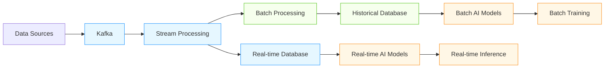

# Streaming Database Patterns for AI/ML Systems

## Overview

Real-time data processing is essential for modern AI/ML systems that require immediate insights and continuous learning. This document covers advanced streaming database patterns specifically designed for AI/ML workloads.

## Streaming Architecture Framework

### Lambda Architecture Pattern


### Kappa Architecture Pattern
- **Single Processing Engine**: Unified stream processing for all data
- **Replay Capability**: Ability to reprocess historical data
- **State Management**: Efficient state storage for windowed operations
- **Exactly-Once Processing**: Guaranteed delivery semantics

## Core Streaming Database Patterns

### Kafka + Database Integration
```sql
-- Real-time feature store with Kafka integration
CREATE TABLE real_time_features (
    feature_id UUID PRIMARY KEY,
    entity_id TEXT NOT NULL,
    feature_name TEXT NOT NULL,
    feature_value NUMERIC,
    timestamp TIMESTAMPTZ NOT NULL,
    source_system TEXT,
    processing_window INTERVAL DEFAULT '5 minutes'
);

-- Materialized view for aggregated features
CREATE MATERIALIZED VIEW feature_aggregates AS
SELECT 
    entity_id,
    feature_name,
    AVG(feature_value) as avg_value,
    STDDEV(feature_value) as stddev_value,
    COUNT(*) as count,
    MAX(timestamp) as last_updated
FROM real_time_features
WHERE timestamp > NOW() - INTERVAL '1 hour'
GROUP BY entity_id, feature_name;

-- Refresh materialized view incrementally
CREATE OR REPLACE FUNCTION refresh_feature_aggregates()
RETURNS VOID AS $$
BEGIN
    REFRESH MATERIALIZED VIEW CONCURRENTLY feature_aggregates;
END;
$$ LANGUAGE plpgsql;

-- Kafka consumer pattern for real-time ingestion
-- Using Debezium for CDC or custom Kafka consumer
CREATE OR REPLACE FUNCTION kafka_to_features()
RETURNS TRIGGER AS $$
DECLARE
    message RECORD;
BEGIN
    -- Process Kafka messages in batches
    FOR message IN SELECT * FROM kafka_messages WHERE processed = false LIMIT 1000
    LOOP
        INSERT INTO real_time_features (
            feature_id, entity_id, feature_name, feature_value, timestamp, source_system
        ) VALUES (
            gen_random_uuid(),
            message.entity_id,
            message.feature_name,
            message.feature_value,
            message.timestamp,
            message.source_system
        );
        
        UPDATE kafka_messages SET processed = true WHERE id = message.id;
    END LOOP;
    
    RETURN NEW;
END;
$$ LANGUAGE plpgsql;
```

### Time-Series Database Integration
- **TimescaleDB**: PostgreSQL extension for time-series data
- **InfluxDB**: Specialized time-series database
- **ClickHouse**: Columnar database for analytics
- **Druid**: Real-time analytics database

### Vector Database Streaming
- **Real-time Embedding Updates**: Stream embeddings to vector databases
- **Incremental Indexing**: Update vector indexes in real-time
- **Hybrid Search**: Combine real-time and historical data

```python
class RealTimeVectorProcessor:
    def __init__(self, kafka_consumer, vector_db):
        self.consumer = kafka_consumer
        self.vector_db = vector_db
    
    def process_embedding_stream(self):
        """Process real-time embedding stream"""
        for message in self.consumer:
            try:
                # Parse embedding message
                embedding_data = json.loads(message.value)
                
                # Extract key information
                entity_id = embedding_data['entity_id']
                embedding_vector = embedding_data['embedding']
                metadata = embedding_data.get('metadata', {})
                timestamp = embedding_data.get('timestamp', datetime.utcnow())
                
                # Upsert into vector database
                self.vector_db.upsert(
                    id=entity_id,
                    vector=embedding_vector,
                    metadata={
                        **metadata,
                        'timestamp': timestamp.isoformat(),
                        'source': 'real-time-stream'
                    }
                )
                
                # Log processing metrics
                self._log_processing_metrics(entity_id, timestamp)
                
            except Exception as e:
                # Handle errors with dead-letter queue
                self._send_to_dead_letter_queue(message, str(e))
                continue
    
    def _log_processing_metrics(self, entity_id, timestamp):
        """Log real-time processing metrics"""
        processing_time = (datetime.utcnow() - timestamp).total_seconds()
        
        # Store metrics for monitoring
        self.vector_db.execute("""
            INSERT INTO stream_processing_metrics (
                entity_id, processing_time, timestamp, status
            ) VALUES (%s, %s, %s, 'success')
        """, (entity_id, processing_time, timestamp))
```

## AI/ML Specific Streaming Patterns

### Real-Time Feature Engineering
- **Windowed Aggregations**: Moving averages, standard deviations
- **Sessionization**: User session tracking and analysis
- **Anomaly Detection**: Real-time outlier detection
- **Feature Derivation**: On-the-fly feature computation

```sql
-- Real-time feature engineering with window functions
CREATE OR REPLACE FUNCTION calculate_real_time_features()
RETURNS TABLE (
    entity_id TEXT,
    feature_name TEXT,
    feature_value NUMERIC,
    window_start TIMESTAMPTZ,
    window_end TIMESTAMPTZ
) AS $$
BEGIN
    RETURN QUERY
    SELECT 
        entity_id,
        'rolling_avg_5min' as feature_name,
        AVG(feature_value) OVER (
            PARTITION BY entity_id 
            ORDER BY timestamp 
            RANGE BETWEEN INTERVAL '5 minutes' PRECEDING AND CURRENT ROW
        ) as feature_value,
        MIN(timestamp) OVER (
            PARTITION BY entity_id 
            ORDER BY timestamp 
            RANGE BETWEEN INTERVAL '5 minutes' PRECEDING AND CURRENT ROW
        ) as window_start,
        MAX(timestamp) OVER (
            PARTITION BY entity_id 
            ORDER BY timestamp 
            RANGE BETWEEN INTERVAL '5 minutes' PRECEDING AND CURRENT ROW
        ) as window_end
    FROM real_time_features
    WHERE timestamp > NOW() - INTERVAL '10 minutes';
END;
$$ LANGUAGE plpgsql;
```

### Online Learning Integration
- **Real-time Model Updates**: Incremental model updates from streaming data
- **Concept Drift Detection**: Monitor for data distribution changes
- **Active Learning**: Select informative samples for labeling
- **Feedback Loops**: Incorporate user feedback in real-time

```python
class OnlineLearningStreamer:
    def __init__(self, model, feature_store, feedback_processor):
        self.model = model
        self.feature_store = feature_store
        self.feedback_processor = feedback_processor
        self.concept_drift_detector = ConceptDriftDetector()
    
    def process_real_time_data(self, data_batch):
        """Process real-time data for online learning"""
        # Extract features from streaming data
        features = self.feature_store.get_real_time_features(data_batch)
        
        # Make predictions
        predictions = self.model.predict(features)
        
        # Detect concept drift
        drift_score = self.concept_drift_detector.detect_drift(features)
        
        if drift_score > self.drift_threshold:
            # Trigger model retraining
            self._schedule_retraining()
        
        # Process feedback if available
        if hasattr(data_batch, 'feedback'):
            feedback_data = self.feedback_processor.process_feedback(data_batch.feedback)
            self.model.update(feedback_data)
        
        # Store predictions for monitoring
        self._store_predictions(predictions, data_batch)
        
        return predictions
    
    def _store_predictions(self, predictions, data_batch):
        """Store predictions for monitoring and analysis"""
        # Store in time-series database for monitoring
        self.feature_store.execute("""
            INSERT INTO real_time_predictions (
                prediction_id, entity_id, predicted_value, 
                confidence, timestamp, model_version
            ) VALUES (%s, %s, %s, %s, %s, %s)
        """, [
            (gen_uuid(), row.entity_id, pred, conf, datetime.utcnow(), self.model.version)
            for row, pred, conf in zip(data_batch, predictions, self.model.confidence_scores)
        ])
```

## Performance Optimization Patterns

### Stream Processing Optimization
| Pattern | Throughput | Latency | Use Case |
|---------|------------|---------|----------|
| Micro-batching | High | Medium (10-100ms) | Most AI/ML workloads |
| Event-at-a-time | Medium | Low (1-10ms) | Real-time inference |
| Windowed Processing | High | Medium | Aggregation and analytics |
| Stateful Processing | Medium | Medium | Sessionization, tracking |

### Database-Specific Optimizations
- **TimescaleDB**: Hypertable partitioning for time-series data
- **ClickHouse**: Columnar storage for analytical queries
- **Redis**: In-memory caching for real-time features
- **Cassandra**: Distributed storage for high-throughput streams

```sql
-- TimescaleDB hypertable optimization
CREATE TABLE sensor_readings (
    time TIMESTAMPTZ NOT NULL,
    sensor_id TEXT NOT NULL,
    value NUMERIC,
    metadata JSONB
);

SELECT create_hypertable('sensor_readings', 'time', 
                        chunk_time_interval => INTERVAL '1 hour');

-- Create continuous aggregates for real-time analytics
CREATE MATERIALIZED VIEW sensor_stats_5min
WITH (timescaledb.continuous) AS
SELECT 
    time_bucket('5 minutes', time) as bucket,
    sensor_id,
    AVG(value) as avg_value,
    STDDEV(value) as stddev_value,
    COUNT(*) as count
FROM sensor_readings
GROUP BY bucket, sensor_id;
```

## Real-World Streaming Examples

### Financial Fraud Detection System
- **Architecture**: Kafka → Flink → TimescaleDB → Redis → ML models
- **Throughput**: 100K events/second
- **Latency**: <50ms end-to-end
- **Features**: Real-time transaction scoring, behavioral anomaly detection
- **Results**: 95% fraud detection rate with 0.1% false positive rate

### Healthcare Monitoring Platform
- **Architecture**: IoT devices → Kafka → Spark → TimescaleDB → Clinical AI models
- **Throughput**: 50K events/second
- **Latency**: <100ms for critical alerts
- **Features**: Real-time patient vitals monitoring, predictive deterioration scoring
- **Results**: 30% reduction in ICU admissions through early intervention

## Best Practices for AI/ML Streaming Systems

1. **Exactly-Once Processing**: Ensure data consistency with idempotent operations
2. **Backpressure Handling**: Implement proper backpressure mechanisms
3. **State Management**: Efficient state storage for windowed operations
4. **Error Handling**: Comprehensive error handling with dead-letter queues
5. **Monitoring**: Real-time monitoring of stream health and performance
6. **Scalability**: Design for horizontal scaling of stream processors
7. **Security**: Encrypt data in transit and at rest for streaming data
8. **Cost Optimization**: Balance throughput requirements with cost constraints

## References
- Apache Kafka Documentation
- AWS Kinesis Best Practices for AI/ML
- Google Cloud Dataflow Streaming Patterns
- NIST SP 800-124: Real-time Data Processing Guidelines
- Microsoft Azure Stream Analytics Best Practices
- TimescaleDB Streaming Guide
- ClickHouse Real-time Analytics Handbook