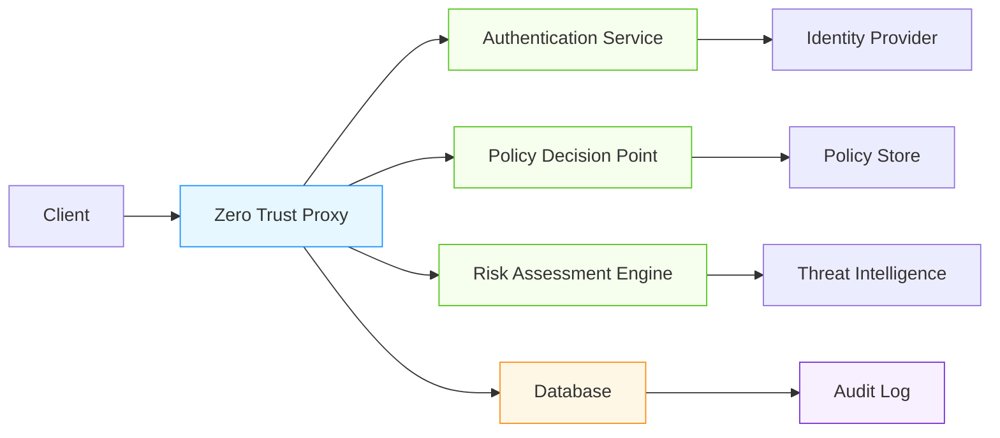

# Zero Trust Database Architecture for AI/ML Systems

## Overview

Zero Trust architecture fundamentally changes how we approach database security by eliminating implicit trust and requiring continuous verification. This document covers zero trust patterns specifically designed for AI/ML workloads.

## Core Zero Trust Principles

### Never Trust, Always Verify
- Every request must be authenticated and authorized
- Continuous validation of identity, device, and context
- Least privilege access enforcement at every layer

### Micro-Segmentation
- Isolate database components and workloads
- Network segmentation between AI training, inference, and data processing
- Service-to-service authentication for internal communications

### Continuous Monitoring and Analytics
- Real-time threat detection and response
- Behavioral analytics for anomaly detection
- Automated policy enforcement and remediation

## Zero Trust Database Architecture Patterns

### Identity-Based Access Control
```sql
-- Zero trust identity model with dynamic policies
CREATE TABLE zero_trust_policies (
    id UUID PRIMARY KEY,
    subject_type TEXT NOT NULL, -- 'user', 'service', 'device', 'api_key'
    subject_id TEXT NOT NULL,
    resource_type TEXT NOT NULL, -- 'table', 'column', 'model', 'feature'
    resource_id TEXT NOT NULL,
    actions TEXT[] NOT NULL, -- ['read', 'write', 'execute']
    conditions JSONB, -- Dynamic conditions (time, location, risk_score)
    created_at TIMESTAMPTZ DEFAULT NOW(),
    expires_at TIMESTAMPTZ
);

-- Policy evaluation function
CREATE OR REPLACE FUNCTION evaluate_zero_trust_policy(
    p_subject_type TEXT, 
    p_subject_id TEXT,
    p_resource_type TEXT,
    p_resource_id TEXT,
    p_action TEXT,
    p_context JSONB
)
RETURNS BOOLEAN AS $$
DECLARE
    policy RECORD;
    condition_result BOOLEAN;
BEGIN
    -- Find applicable policies
    SELECT * INTO policy FROM zero_trust_policies 
    WHERE subject_type = p_subject_type 
    AND subject_id = p_subject_id
    AND resource_type = p_resource_type
    AND resource_id = p_resource_id
    AND p_action = ANY(actions)
    AND (expires_at IS NULL OR expires_at > NOW())
    ORDER BY created_at DESC LIMIT 1;
    
    IF NOT FOUND THEN
        RETURN FALSE;
    END IF;
    
    -- Evaluate dynamic conditions
    IF policy.conditions IS NOT NULL THEN
        condition_result := evaluate_conditions(policy.conditions, p_context);
        IF NOT condition_result THEN
            RETURN FALSE;
        END IF;
    END IF;
    
    RETURN TRUE;
END;
$$ LANGUAGE plpgsql;
```

### Device Trust Verification
- **Hardware Attestation**: Verify device integrity using TPM or secure enclaves
- **Certificate-Based Authentication**: Mutual TLS with device certificates
- **Risk Scoring**: Dynamic risk assessment based on device posture

### Context-Aware Authorization
- **Time-Based Restrictions**: Limit access to business hours
- **Geographic Constraints**: Restrict access based on location
- **Behavioral Analysis**: Detect anomalous access patterns
- **Session Risk Scoring**: Real-time assessment of session risk

## AI/ML Specific Zero Trust Patterns

### Model Access Control
- **Model Versioning with Access Control**: Different permissions for different model versions
- **Inference Request Authentication**: Authenticate each inference request
- **Feature Store Access Policies**: Granular control over feature access

```python
class ZeroTrustModelAccess:
    def __init__(self, policy_engine, risk_analyzer):
        self.policy_engine = policy_engine
        self.risk_analyzer = risk_analyzer
    
    def authorize_inference_request(self, request):
        """Authorize inference request with zero trust principles"""
        # Extract context from request
        context = {
            'user_id': request.headers.get('X-User-ID'),
            'api_key': request.headers.get('Authorization'),
            'ip_address': request.client_ip,
            'device_fingerprint': request.headers.get('X-Device-Fingerprint'),
            'request_time': datetime.utcnow(),
            'model_id': request.model_id,
            'input_size': len(request.input_data),
            'request_rate': self._get_request_rate(request.user_id)
        }
        
        # Calculate risk score
        risk_score = self.risk_analyzer.calculate_risk(context)
        
        # Evaluate policies with risk context
        if risk_score > 0.7:
            # High risk - require additional verification
            return self._require_mfa_verification(context)
        
        # Standard authorization
        return self.policy_engine.evaluate_policy(
            subject_type='user',
            subject_id=context['user_id'],
            resource_type='model',
            resource_id=context['model_id'],
            action='infer',
            context=context
        )
```

### Training Data Access Control
- **Data Classification**: Tag data with sensitivity levels
- **Purpose-Based Access**: Restrict data access based on training purpose
- **Automated Data Masking**: Dynamic masking based on user role and context
- **Training Environment Isolation**: Separate environments for different sensitivity levels

## Implementation Architecture

### Zero Trust Database Proxy


### Key Components
1. **Authentication Service**: Multi-factor authentication, device attestation
2. **Policy Decision Point**: Real-time policy evaluation engine
3. **Risk Assessment Engine**: Behavioral analytics and threat intelligence
4. **Database Proxy**: Intercepts and validates all database requests
5. **Audit and Analytics**: Comprehensive logging and real-time monitoring

## Performance Considerations

| Zero Trust Component | Latency Impact | Throughput Impact | Optimization Strategies |
|----------------------|----------------|-------------------|-------------------------|
| Authentication       | 5-15ms         | 5-10%             | Caching, hardware acceleration |
| Policy Evaluation    | 2-10ms         | 2-5%              | Pre-compilation, indexing |
| Risk Assessment      | 10-50ms        | 10-20%            | Stream processing, approximation |
| Audit Logging        | 1-5ms          | 1-3%              | Async logging, batching |

### Optimized Patterns
- **Session Caching**: Cache authorized sessions with short TTLs (5-30 seconds)
- **Policy Pre-compilation**: Compile policies to efficient execution formats
- **Edge Authentication**: Perform initial authentication at edge locations
- **Selective Enforcement**: Apply full zero trust only to sensitive operations

## Real-World Examples

### Enterprise AI Platform
- **Multi-Tenant Zero Trust**: Each tenant has isolated zero trust policies
- **Hybrid Cloud Implementation**: Consistent policies across on-prem and cloud
- **AI-Powered Risk Assessment**: ML models predict access risk in real-time
- **Automated Remediation**: Auto-revoke access on suspicious activity

### Healthcare AI System
- **HIPAA-Compliant Zero Trust**: Enhanced controls for PHI access
- **Clinical vs Research Separation**: Different trust levels for clinical vs research data
- **Emergency Access Protocols**: Time-limited emergency access with enhanced auditing
- **Device Integrity Verification**: Medical devices must pass hardware attestation

## Trade-offs and Recommendations

| Pattern | Security Benefit | Performance Cost | Recommendation |
|---------|------------------|------------------|----------------|
| Full Zero Trust | Maximum security | High latency | Critical systems, high-value data |
| Hybrid Approach | Good security balance | Moderate impact | Most production AI/ML systems |
| Context-Aware Only | Targeted protection | Low impact | Development environments, low-risk data |
| Policy-Based Only | Basic compliance | Minimal impact | Legacy system integration |

## Best Practices

1. **Start Small**: Implement zero trust for most sensitive data first
2. **Measure Impact**: Continuously monitor performance and user experience
3. **Automate Policy Management**: Use infrastructure-as-code for policy definition
4. **Regular Testing**: Conduct red team exercises and penetration testing
5. **User Education**: Train developers on zero trust principles and patterns
6. **Incident Response**: Integrate zero trust with automated incident response

## References
- NIST SP 800-207: Zero Trust Architecture
- Cloud Security Alliance: Zero Trust Security Framework
- MITRE ATT&CK for Zero Trust Implementation
- AWS Zero Trust Security Best Practices
- Google BeyondCorp Architecture
- Microsoft Zero Trust Maturity Model