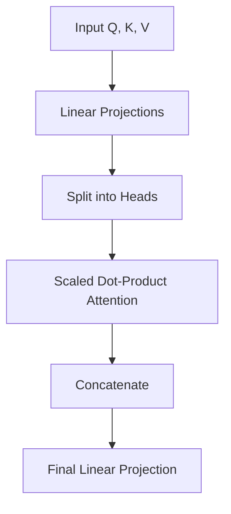

# Hands-on LLM Mastery: From Attention to Agents

Welcome to the comprehensive hands-on guide to Large Language Models (LLMs). This tutorial is designed to take you from the fundamental mathematical building blocks to building sophisticated AI agents using the `AI-Mastery-2026` codebase.

## 🎯 What You'll Learn
1.  **Attention Mechanisms**: Understanding Scaled Dot-Product and Multi-Head Attention.
2.  **Transformer Architectures**: Implementing BERT (Encoder) and GPT (Decoder) from scratch.
3.  **RAG Systems**: Building retrieval-augmented pipelines with Hybrid search.
4.  **AI Agents**: Creating reasoning agents and multi-agent coordination systems.

## 📋 Prerequisites
- Python 3.10+
- Basic understanding of NumPy and PyTorch.
- Environment setup completed (`make install`).

---

## 🧩 Module 1: The Heart of LLMs - Attention

The "Attention" mechanism allows models to focus on specific parts of the input sequence when processing data.

### 1.1 Scaled Dot-Product Attention
The fundamental equation:
$$Attention(Q, K, V) = \text{softmax}\left(\frac{QK^T}{\sqrt{d_k}}\right)V$$

**Hands-on Task:** Open `src/llm/attention.py` and run the following snippet:

```python
import numpy as np
from src.llm.attention import scaled_dot_product_attention

# Sample Q, K, V
d_k = 64
seq_len = 10
query = np.random.randn(1, seq_len, d_k)
key = np.random.randn(1, seq_len, d_k)
value = np.random.randn(1, seq_len, d_k)

output, weights = scaled_dot_product_attention(query, key, value)
print(f"Output Shape: {output.shape}")
print(f"Attention Weights Sum (should be 1): {np.sum(weights[0, 0, :])}")
```

### 1.2 Multi-Head Attention (MHA)
MHA allows the model to jointly attend to information from different representation subspaces.



---

## 🏗️ Module 2: Transformer Architectures

### 2.1 BERT (Bidirectional Encoder)
BERT uses the Transformer Encoder to understand context from both directions (left and right).

**Key Implementation:** `src/llm/transformer.py` -> `class BERT`

### 2.2 GPT (Autoregressive Decoder)
GPT uses causal masking to ensure it only attends to previous tokens, making it perfect for text generation.

**Try it out:**
```python
import numpy as np
from src.llm.transformer import GPT2

# Initialize a small GPT-2 model
gpt = GPT2(vocab_size=1000, max_seq_len=128, d_model=256, num_layers=4)

# Generate some "text" (indices)
prompt = np.random.randint(0, 1000, (1, 10))
generated = gpt.generate(prompt, max_new_tokens=5)
print(f"Original sequence: {prompt}")
print(f"Extended sequence: {generated}")
```

---

## 🔍 Module 3: Retrieval-Augmented Generation (RAG)

RAG connects LLMs to external data sources to provide accurate, up-to-date information.

### 3.1 Hybrid Retrieval
We combine **Dense** (semantic) and **Sparse** (keyword) retrieval for maximum accuracy.

```python
from src.llm.rag import create_rag_model, RetrievalStrategy, Document

# 1. Setup Data
docs = [
    Document(id="1", content="The capital of France is Paris.", metadata={"type": "geo"}),
    Document(id="2", content="The Eiffel Tower was built in 1889.", metadata={"type": "history"})
]

# 2. Initialize Hybrid RAG
rag = create_rag_model(RetrievalStrategy.HYBRID)
rag.add_documents(docs)

# 3. Query
result = rag.query("When was the Eiffel Tower constructed?")
print(f"Response: {result['response']}")
```

---

## 🤖 Module 4: Intelligent AI Agents

Agents use LLMs as a "reasoning engine" to interact with tools and solve complex tasks.

### 4.1 ReAct Pattern (Reasoning + Acting)
Our `DeliberativeAgent` in `src/llm/agents.py` implements a simplified planning loop.

```python
import asyncio
from src.llm.agents import create_simple_deliberative_agent

async def run_agent():
    agent = create_simple_deliberative_agent("master_001", "MasterBot")
    agent.state.goals = ["Navigate to Paris and analyze history"]
    
    # Simulate environment
    env_state = {"at_destination": False}
    
    action = await agent.decide()
    print(f"Agent Plan Start: {action}")

asyncio.run(run_agent())
```

---

## 🚀 Capstone Challenge
Build a "Support Bot" that uses:
1.  **RAG** to fetch documentation from `docs/`.
2.  **BERT** to classify the user's intent.
3.  **GPT** to generate a polite response.

Refer to `src/llm/support_agent.py` for a template of this integration.

---

## 📚 Further Reading
- [Attention is All You Need (Paper)](https://arxiv.org/abs/1706.03762)
- [Project Documentation Index](../README.md)
- [System Design: LLM Infrastructure](../03_system_design/README.md)

---
*Generated by AI-Mastery-2026 Tutorial Engine*
