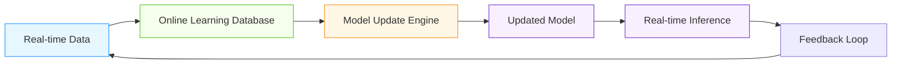

# Online Learning Databases for AI/ML Systems

## Overview

Online learning databases provide the infrastructure needed for continuous model training and adaptation in real-time AI/ML systems. This document covers advanced patterns for databases specifically designed to support online learning workloads.

## Online Learning Architecture Framework

### Three-Component Architecture


### Key Requirements
- **Low-Latency Updates**: Sub-second model updates
- **High Throughput**: Handle thousands of updates per second
- **Consistency Guarantees**: Ensure model consistency during updates
- **Version Management**: Track model versions and provenance
- **Scalability**: Horizontal scaling for growing workloads

## Core Online Learning Database Patterns

### Incremental Update Storage
```sql
-- Online learning database schema
CREATE TABLE model_parameters (
    model_id UUID NOT NULL,
    parameter_id TEXT NOT NULL,
    current_value NUMERIC,
    last_updated TIMESTAMPTZ DEFAULT NOW(),
    version BIGINT DEFAULT 1,
    PRIMARY KEY (model_id, parameter_id)
);

-- Parameter update history for reproducibility
CREATE TABLE parameter_updates (
    id UUID PRIMARY KEY,
    model_id UUID NOT NULL,
    parameter_id TEXT NOT NULL,
    old_value NUMERIC,
    new_value NUMERIC,
    update_type TEXT NOT NULL, -- 'gradient', 'direct', 'batch'
    learning_rate NUMERIC,
    timestamp TIMESTAMPTZ DEFAULT NOW(),
    source TEXT, -- 'real_time', 'batch', 'feedback'
    metadata JSONB
);

-- Indexes for efficient updates
CREATE INDEX idx_model_parameters_model ON model_parameters(model_id);
CREATE INDEX idx_parameter_updates_time ON parameter_updates(timestamp);
CREATE INDEX idx_parameter_updates_source ON parameter_updates(source);

-- Materialized view for current model state
CREATE MATERIALIZED VIEW current_model_state AS
SELECT
    model_id,
    parameter_id,
    current_value,
    version,
    last_updated
FROM model_parameters;

-- Refresh function for online updates
CREATE OR REPLACE FUNCTION refresh_current_model_state()
RETURNS VOID AS $$
BEGIN
    REFRESH MATERIALIZED VIEW CONCURRENTLY current_model_state;
END;
$$ LANGUAGE plpgsql;
```

### Stateful Processing Patterns
- **Windowed Updates**: Apply updates over time windows
- **Exponential Weighting**: Give more weight to recent updates
- **Adaptive Learning Rates**: Adjust learning rates based on performance
- **Concept Drift Detection**: Monitor for distribution changes

```python
class OnlineLearningDatabase:
    def __init__(self, db_connection, model_id):
        self.db = db_connection
        self.model_id = model_id
        self.concept_drift_detector = ConceptDriftDetector()
        self.adaptive_lr = AdaptiveLearningRate()

    def update_parameters(self, gradients, metadata=None):
        """Update model parameters with online learning"""
        start_time = time.time()

        # Detect concept drift
        drift_score = self.concept_drift_detector.detect_drift(gradients)

        # Adjust learning rate based on drift and performance
        learning_rate = self.adaptive_lr.get_rate(
            drift_score=drift_score,
            current_performance=self._get_current_performance()
        )

        # Prepare batch updates
        updates = []
        for param_id, grad in gradients.items():
            # Get current parameter value
            current_val = self._get_parameter_value(param_id)

            # Calculate new value with adaptive learning rate
            new_val = current_val - learning_rate * grad

            # Store update
            updates.append({
                'model_id': self.model_id,
                'parameter_id': param_id,
                'old_value': current_val,
                'new_value': new_val,
                'update_type': 'gradient',
                'learning_rate': learning_rate,
                'timestamp': datetime.utcnow(),
                'source': 'real_time',
                'metadata': metadata or {}
            })

        # Execute batch update with transaction
        try:
            self.db.execute("BEGIN TRANSACTION")

            # Update current parameters
            for update in updates:
                self.db.execute("""
                    UPDATE model_parameters
                    SET current_value = %s,
                        last_updated = %s,
                        version = version + 1
                    WHERE model_id = %s AND parameter_id = %s
                """, (update['new_value'], update['timestamp'],
                     update['model_id'], update['parameter_id']))

            # Insert into update history
            self.db.execute("""
                INSERT INTO parameter_updates (
                    id, model_id, parameter_id, old_value, new_value,
                    update_type, learning_rate, timestamp, source, metadata
                ) VALUES (%s, %s, %s, %s, %s, %s, %s, %s, %s, %s)
            """, [
                (str(uuid.uuid4()), update['model_id'], update['parameter_id'],
                 update['old_value'], update['new_value'], update['update_type'],
                 update['learning_rate'], update['timestamp'], update['source'],
                 json.dumps(update['metadata']))
                for update in updates
            ])

            self.db.execute("COMMIT")

            # Log performance metrics
            self._log_update_metrics(len(updates), time.time() - start_time, drift_score)

        except Exception as e:
            self.db.execute("ROLLBACK")
            raise e

    def get_current_model(self):
        """Get current model parameters"""
        return self.db.execute("""
            SELECT parameter_id, current_value, version
            FROM model_parameters
            WHERE model_id = %s
        """, [self.model_id]).fetchall()
```

## AI/ML Specific Online Learning Patterns

### Feedback-Driven Learning
- **Explicit Feedback**: User ratings, clicks, conversions
- **Implicit Feedback**: Dwell time, scroll depth, abandonment
- **Reinforcement Learning**: Reward signals from environment
- **Active Learning**: Query selection for human labeling

```sql
-- Feedback storage for online learning
CREATE TABLE feedback_events (
    id UUID PRIMARY KEY,
    model_id UUID NOT NULL,
    entity_id TEXT NOT NULL,
    feedback_type TEXT NOT NULL,
    feedback_value NUMERIC NOT NULL,
    confidence NUMERIC,
    timestamp TIMESTAMPTZ DEFAULT NOW(),
    metadata JSONB,
    processed BOOLEAN DEFAULT FALSE
);

-- Indexes for efficient feedback processing
CREATE INDEX idx_feedback_events_model ON feedback_events(model_id);
CREATE INDEX idx_feedback_events_time ON feedback_events(timestamp);
CREATE INDEX idx_feedback_events_entity ON feedback_events(entity_id);

-- Feedback processing queue
CREATE TABLE feedback_queue (
    id UUID PRIMARY KEY,
    feedback_id UUID NOT NULL,
    priority NUMERIC DEFAULT 1.0,
    created_at TIMESTAMPTZ DEFAULT NOW(),
    status TEXT DEFAULT 'pending',
    FOREIGN KEY (feedback_id) REFERENCES feedback_events(id)
);

-- Trigger for automatic queue insertion
CREATE OR REPLACE FUNCTION enqueue_feedback()
RETURNS TRIGGER AS $$
BEGIN
    INSERT INTO feedback_queue (feedback_id, priority)
    VALUES (NEW.id,
           CASE
               WHEN NEW.feedback_type = 'explicit' THEN 1.0
               WHEN NEW.feedback_type = 'implicit' THEN 0.5
               ELSE 0.3
           END);
    RETURN NEW;
END;
$$ LANGUAGE plpgsql;

CREATE TRIGGER trigger_enqueue_feedback
AFTER INSERT ON feedback_events
FOR EACH ROW EXECUTE FUNCTION enqueue_feedback();
```

### Continuous Training Patterns
- **Micro-batch Training**: Small batches for frequent updates
- **Parameter Server Architecture**: Distributed parameter updates
- **Federated Learning Integration**: Privacy-preserving updates
- **Ensemble Updates**: Update ensemble members independently

```python
class ContinuousTrainingEngine:
    def __init__(self, online_db, model_store, feedback_processor):
        self.online_db = online_db
        self.model_store = model_store
        self.feedback_processor = feedback_processor
        self.update_queue = PriorityQueue()

    def process_feedback_batch(self, batch_size=100):
        """Process feedback batch for online learning"""
        # Get highest priority feedback
        feedback_batch = self._get_high_priority_feedback(batch_size)

        if not feedback_batch:
            return []

        # Process feedback into training examples
        training_examples, metadata = self.feedback_processor.process_feedback(feedback_batch)

        # Generate gradients
        gradients = self._compute_gradients(training_examples)

        # Update model parameters
        update_result = self.online_db.update_parameters(gradients, metadata)

        # Update model store
        self.model_store.update_version(
            model_id=self.online_db.model_id,
            version=update_result['version'],
            timestamp=datetime.utcnow()
        )

        # Log results
        self._log_training_metrics(len(feedback_batch), len(gradients))

        return update_result

    def _get_high_priority_feedback(self, limit):
        """Get highest priority feedback from queue"""
        return self.online_db.execute("""
            SELECT f.*
            FROM feedback_queue q
            JOIN feedback_events f ON q.feedback_id = f.id
            WHERE q.status = 'pending'
            ORDER BY q.priority DESC, q.created_at ASC
            LIMIT %s
        """, [limit]).fetchall()

    def _compute_gradients(self, examples):
        """Compute gradients for online learning"""
        # Simple gradient computation (replace with actual ML logic)
        gradients = {}
        for example in examples:
            # Extract features and target
            features = example['features']
            target = example['target']

            # Simple linear model gradient
            prediction = sum(features.values()) * 0.1  # Simplified
            error = target - prediction

            # Compute gradients
            for feature_name, feature_value in features.items():
                grad_key = f"weight_{feature_name}"
                gradients[grad_key] = gradients.get(grad_key, 0) + error * feature_value

        return gradients
```

## Performance Optimization Patterns

### High-Throughput Update Strategies
| Strategy | Throughput | Latency | Use Case |
|----------|------------|---------|----------|
| Batch Updates | 10K-100K/sec | 10-100ms | Most online learning |
| Atomic Updates | 1K-10K/sec | 1-10ms | Low-latency requirements |
| Sharded Updates | 100K+/sec | 50-200ms | Large-scale systems |
| Memory-Optimized | 50K-500K/sec | <1ms | In-memory databases |

### Database-Specific Optimizations
- **Redis**: In-memory storage for ultra-low latency
- **Cassandra**: Distributed storage for high throughput
- **TimescaleDB**: Time-series optimized for temporal updates
- **ClickHouse**: Columnar storage for analytical updates

```sql
-- TimescaleDB optimization for online learning
CREATE TABLE parameter_updates_ts (
    time TIMESTAMPTZ NOT NULL,
    model_id UUID NOT NULL,
    parameter_id TEXT NOT NULL,
    old_value NUMERIC,
    new_value NUMERIC,
    update_type TEXT,
    learning_rate NUMERIC,
    metadata JSONB
);

SELECT create_hypertable('parameter_updates_ts', 'time',
                        chunk_time_interval => INTERVAL '1 hour');

-- Continuous aggregates for performance monitoring
CREATE MATERIALIZED VIEW parameter_update_stats_5min
WITH (timescaledb.continuous) AS
SELECT
    time_bucket('5 minutes', time) as bucket,
    model_id,
    COUNT(*) as update_count,
    AVG(learning_rate) as avg_learning_rate,
    STDDEV(learning_rate) as stddev_learning_rate
FROM parameter_updates_ts
GROUP BY bucket, model_id;
```

## Real-World Online Learning Examples

### Recommendation System
- **Architecture**: Kafka → Redis → Online Learning Engine → Model Serving
- **Throughput**: 50K updates/second
- **Latency**: <50ms for model updates
- **Features**: Real-time user feedback, implicit signals, contextual features
- **Results**: 15% improvement in click-through rate with daily updates

### Fraud Detection System
- **Architecture**: Event Stream → Cassandra → Online Learning → Real-time Scoring
- **Throughput**: 100K updates/second
- **Latency**: <100ms for critical updates
- **Features**: Transaction velocity, behavioral anomalies, device fingerprinting
- **Results**: 20% reduction in fraud losses with hourly model updates

## Best Practices for Online Learning Databases

1. **Consistency Models**: Choose appropriate consistency model (strong vs eventual)
2. **Version Control**: Implement robust versioning for models and parameters
3. **Rollback Capability**: Enable easy rollback to previous model versions
4. **Monitoring**: Real-time monitoring of learning metrics and system health
5. **Security**: Encrypt model parameters and implement access controls
6. **Cost Optimization**: Balance update frequency with computational cost
7. **Testing**: Comprehensive testing of online learning algorithms
8. **Governance**: Implement model lifecycle management and compliance

## References
- Google TensorFlow Extended (TFX) Online Learning Guide
- AWS SageMaker Real-time Inference Best Practices
- Microsoft Azure Machine Learning Online Learning
- NIST SP 800-124: Continuous Learning Systems
- Uber Michelangelo Online Learning Patterns
- Facebook FBLearner Flow Online Learning
- Apache Kafka Streams for Online Learning