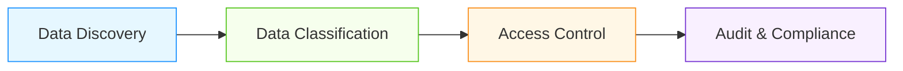

# Tenant Data Governance for AI/ML Systems

## Overview

Data governance is critical for multi-tenant AI/ML platforms to ensure compliance, security, and data quality across different tenants. This document covers comprehensive governance patterns specifically designed for tenant-specific data management.

## Tenant Data Governance Framework

### Four-Pillar Governance Model


### AI/ML Specific Considerations
- **Model Data Governance**: Govern training data, model parameters, and inference data
- **Feature Store Governance**: Manage feature definitions, versions, and lineage
- **Experiment Tracking**: Govern ML experiments and results
- **Compliance Requirements**: Meet GDPR, HIPAA, SOC 2 per tenant

## Core Governance Patterns

### Data Discovery and Cataloging
```sql
-- Tenant-aware data catalog
CREATE TABLE tenant_data_catalog (
    id UUID PRIMARY KEY,
    tenant_id UUID NOT NULL,
    dataset_name TEXT NOT NULL,
    dataset_type TEXT NOT NULL, -- 'training', 'inference', 'feature', 'model'
    schema_definition JSONB NOT NULL,
    data_classification TEXT NOT NULL, -- 'public', 'internal', 'confidential', 'restricted'
    owner_role TEXT NOT NULL,
    created_at TIMESTAMPTZ DEFAULT NOW(),
    updated_at TIMESTAMPTZ DEFAULT NOW(),
    retention_policy JSONB,
    lineage_info JSONB
);

-- Indexes for efficient catalog queries
CREATE INDEX idx_tenant_data_catalog_tenant ON tenant_data_catalog(tenant_id);
CREATE INDEX idx_tenant_data_catalog_type ON tenant_data_catalog(dataset_type);
CREATE INDEX idx_tenant_data_catalog_classification ON tenant_data_catalog(data_classification);

-- Data discovery function
CREATE OR REPLACE FUNCTION discover_tenant_data(tenant_id UUID)
RETURNS TABLE (
    dataset_name TEXT,
    dataset_type TEXT,
    classification TEXT,
    row_count BIGINT,
    last_updated TIMESTAMPTZ
) AS $$
BEGIN
    RETURN QUERY
    SELECT
        d.dataset_name,
        d.dataset_type,
        d.data_classification,
        COUNT(*) as row_count,
        MAX(e.created_at) as last_updated
    FROM tenant_data_catalog d
    LEFT JOIN LATERAL (
        SELECT created_at FROM information_schema.tables t
        WHERE t.table_name = d.dataset_name
        LIMIT 1
    ) e ON true
    WHERE d.tenant_id = $1
    GROUP BY d.dataset_name, d.dataset_type, d.data_classification;
END;
$$ LANGUAGE plpgsql;
```

### Data Classification and Sensitivity Management
- **Automated Classification**: ML-based classification of data sensitivity
- **Manual Review Workflows**: Human-in-the-loop for high-sensitivity data
- **Classification Levels**: Public, Internal, Confidential, Restricted
- **AI-Specific Classifications**: Training data, model parameters, inference results

```python
class DataClassifier:
    def __init__(self, ml_classifier, rule_engine):
        self.ml_classifier = ml_classifier
        self.rule_engine = rule_engine

    def classify_data(self, dataset_info, sample_data=None):
        """Classify dataset with hybrid approach"""
        # Apply business rules first
        rule_based_classification = self.rule_engine.evaluate_rules(dataset_info)

        if rule_based_classification == 'unknown':
            # Use ML classifier for uncertain cases
            ml_classification = self.ml_classifier.predict(dataset_info, sample_data)

            # Combine results with confidence weighting
            final_classification = self._combine_classifications(
                rule_based_classification, ml_classification
            )
        else:
            final_classification = rule_based_classification

        # Apply AI-specific rules
        if dataset_info.get('dataset_type') in ['training', 'model', 'inference']:
            final_classification = self._apply_ai_specific_rules(
                final_classification, dataset_info
            )

        return final_classification

    def _apply_ai_specific_rules(self, current_classification, dataset_info):
        """Apply AI/ML specific classification rules"""
        if dataset_info.get('contains_pii'):
            return 'restricted'
        elif dataset_info.get('dataset_type') == 'model' and dataset_info.get('contains_weights'):
            return 'confidential'
        elif dataset_info.get('dataset_type') == 'training' and dataset_info.get('sensitive_features'):
            return 'confidential'
        elif dataset_info.get('dataset_type') == 'inference' and dataset_info.get('real_time'):
            return 'internal'

        return current_classification
```

## AI/ML Specific Governance Patterns

### Model Data Governance
- **Model Lineage Tracking**: Complete traceability from data to model
- **Training Data Provenance**: Track source, preprocessing, and transformations
- **Model Version Governance**: Manage model versions with metadata
- **Bias and Fairness Governance**: Monitor and govern model fairness

```sql
-- Model governance schema
CREATE TABLE model_governance (
    model_id UUID PRIMARY KEY,
    tenant_id UUID NOT NULL,
    model_name TEXT NOT NULL,
    model_version TEXT NOT NULL,
    training_dataset_id UUID NOT NULL,
    feature_version TEXT NOT NULL,
    code_version TEXT NOT NULL,
    hyperparameters JSONB NOT NULL,
    training_environment JSONB NOT NULL,
    bias_metrics JSONB,
    fairness_metrics JSONB,
    created_at TIMESTAMPTZ DEFAULT NOW(),
    updated_at TIMESTAMPTZ DEFAULT NOW(),
    status TEXT DEFAULT 'active',
    governance_review JSONB
);

-- Indexes for governance queries
CREATE INDEX idx_model_governance_tenant ON model_governance(tenant_id);
CREATE INDEX idx_model_governance_status ON model_governance(status);
CREATE INDEX idx_model_governance_version ON model_governance(model_version);

-- Governance review tracking
CREATE TABLE governance_reviews (
    id UUID PRIMARY KEY,
    model_id UUID NOT NULL,
    reviewer_id UUID NOT NULL,
    review_date TIMESTAMPTZ DEFAULT NOW(),
    review_type TEXT NOT NULL, -- 'initial', 'quarterly', 'incident'
    findings JSONB,
    recommendations JSONB,
    approval_status TEXT DEFAULT 'pending',
    FOREIGN KEY (model_id) REFERENCES model_governance(model_id)
);
```

### Feature Store Governance
- **Feature Definition Registry**: Central registry of all features
- **Feature Versioning**: Track feature evolution and changes
- **Feature Lineage**: Trace features from raw data to consumption
- **Feature Quality Monitoring**: Monitor feature quality and drift

```python
class FeatureGovernanceManager:
    def __init__(self, db_connection, tenant_id):
        self.db = db_connection
        self.tenant_id = tenant_id

    def register_feature(self, feature_def):
        """Register feature with governance metadata"""
        # Validate feature definition
        validation_results = self._validate_feature_definition(feature_def)

        if not validation_results['valid']:
            raise ValueError(f"Feature validation failed: {validation_results['errors']}")

        # Check for naming conflicts
        if self._feature_exists(feature_def['name'], feature_def.get('version')):
            raise ValueError(f"Feature {feature_def['name']} version {feature_def.get('version')} already exists")

        # Register feature
        feature_id = str(uuid.uuid4())

        self.db.execute("""
            INSERT INTO tenant_features (
                id, tenant_id, name, description, type,
                data_type, source, computation_logic,
                version, created_by, created_at,
                status, governance_metadata
            ) VALUES (%s, %s, %s, %s, %s, %s, %s, %s, %s, %s, %s, %s, %s)
        """, [
            feature_id,
            self.tenant_id,
            feature_def['name'],
            feature_def.get('description', ''),
            feature_def.get('type', 'numeric'),
            feature_def.get('data_type', 'float'),
            feature_def.get('source', 'unknown'),
            feature_def.get('computation_logic', ''),
            feature_def.get('version', '1.0'),
            get_current_user_id(),
            datetime.utcnow(),
            'active',
            json.dumps({
                'classification': feature_def.get('classification', 'internal'),
                'sensitivity': feature_def.get('sensitivity', 'medium'),
                'retention_policy': feature_def.get('retention_policy', {}),
                'compliance_tags': feature_def.get('compliance_tags', [])
            })
        ])

        return feature_id

    def _validate_feature_definition(self, feature_def):
        """Validate feature definition against governance policies"""
        errors = []

        # Required fields
        required_fields = ['name', 'type', 'data_type']
        for field in required_fields:
            if field not in feature_def:
                errors.append(f"Missing required field: {field}")

        # Name validation
        if 'name' in feature_def:
            if len(feature_def['name']) > 64:
                errors.append("Feature name too long (max 64 characters)")
            if not re.match(r'^[a-zA-Z_][a-zA-Z0-9_]*$', feature_def['name']):
                errors.append("Feature name must start with letter or underscore and contain only alphanumeric characters and underscores")

        # Type validation
        valid_types = ['numeric', 'categorical', 'text', 'boolean', 'timestamp', 'vector']
        if 'type' in feature_def and feature_def['type'] not in valid_types:
            errors.append(f"Invalid feature type: {feature_def['type']}. Valid types: {valid_types}")

        return {
            'valid': len(errors) == 0,
            'errors': errors
        }
```

## Governance Automation Patterns

### Automated Policy Enforcement
- **Real-time Validation**: Validate data against governance policies
- **Pre-commit Checks**: Governance checks before data ingestion
- **Post-ingestion Scanning**: Automated scanning of ingested data
- **Remediation Workflows**: Automated remediation for policy violations

```sql
-- Governance policy engine
CREATE TABLE governance_policies (
    id UUID PRIMARY KEY,
    tenant_id UUID NOT NULL,
    policy_name TEXT NOT NULL,
    policy_type TEXT NOT NULL, -- 'classification', 'retention', 'access', 'quality'
    policy_rule JSONB NOT NULL,
    enabled BOOLEAN DEFAULT TRUE,
    created_at TIMESTAMPTZ DEFAULT NOW(),
    updated_at TIMESTAMPTZ DEFAULT NOW()
);

-- Policy evaluation function
CREATE OR REPLACE FUNCTION evaluate_governance_policy(
    p_tenant_id UUID,
    p_data_record JSONB,
    p_context JSONB
)
RETURNS TABLE (
    policy_id UUID,
    policy_name TEXT,
    violation BOOLEAN,
    violation_details TEXT
) AS $$
DECLARE
    policy RECORD;
    violation_details TEXT;
BEGIN
    FOR policy IN SELECT * FROM governance_policies
    WHERE tenant_id = p_tenant_id AND enabled = true
    LOOP
        -- Evaluate policy rule against data record
        violation_details := evaluate_policy_rule(policy.policy_rule, p_data_record, p_context);

        IF violation_details IS NOT NULL THEN
            RETURN QUERY SELECT
                policy.id,
                policy.policy_name,
                true as violation,
                violation_details;
        ELSE
            RETURN QUERY SELECT
                policy.id,
                policy.policy_name,
                false as violation,
                NULL as violation_details;
        END IF;
    END LOOP;
END;
$$ LANGUAGE plpgsql;

-- Example policy rule evaluation
CREATE OR REPLACE FUNCTION evaluate_policy_rule(
    rule JSONB,
    data JSONB,
    context JSONB
)
RETURNS TEXT AS $$
BEGIN
    -- Simple rule evaluation (can be extended with more complex logic)
    IF rule->>'type' = 'classification' THEN
        IF data->>'sensitivity' = 'restricted' AND context->>'user_role' != 'admin' THEN
            RETURN 'Restricted data accessed by non-admin user';
        END IF;
    END IF;

    RETURN NULL;
END;
$$ LANGUAGE plpgsql;
```

## Performance and Scalability Considerations

| Governance Pattern | Overhead | Scalability | Implementation Complexity |
|--------------------|----------|-------------|---------------------------|
| Real-time Validation | 5-15% | Good | Medium |
| Batch Scanning | 1-5% | Excellent | Low |
| Policy Engine | 10-20% | Good | High |
| Automated Remediation | 15-30% | Medium | High |

### Optimization Strategies
- **Caching Policies**: Cache governance policies for faster evaluation
- **Parallel Processing**: Process governance checks in parallel
- **Incremental Validation**: Validate only changed data
- **Sampling**: Sample data for governance checks in large datasets
- **Indexing**: Optimize indexes for governance queries

## Real-World Governance Examples

### Financial AI Platform
- **Governance Requirements**: GDPR, CCPA, FINRA compliance
- **Implementation**:
  - Automated PII detection and classification
  - Tenant-specific data retention policies
  - Real-time access control based on data sensitivity
  - Quarterly governance reviews for all models
- **Results**: Zero compliance violations, 95% reduction in manual governance effort

### Healthcare AI System
- **Governance Requirements**: HIPAA, HITECH, GDPR
- **Implementation**:
  - PHI data classification with ML-based detection
  - Role-based access with fine-grained controls
  - Audit trails for all data access and modifications
  - Automated de-identification for research data
- **Results**: Full HIPAA compliance, seamless audit readiness

## Best Practices for Tenant Data Governance

1. **Governance by Design**: Build governance into architecture from day one
2. **Automate Where Possible**: Reduce manual governance overhead
3. **Tenant-Specific Policies**: Allow customization per tenant requirements
4. **Continuous Monitoring**: Real-time governance monitoring and alerting
5. **Documentation**: Comprehensive documentation of governance policies
6. **Training**: Train teams on governance requirements and tools
7. **Testing**: Comprehensive testing of governance policies and enforcement
8. **Incident Response**: Clear procedures for governance violations

## References
- NIST SP 800-124: Data Governance Guidelines
- GDPR Article 30: Records of Processing Activities
- HIPAA Security Rule: Technical Safeguards
- SOC 2 Trust Services Criteria
- ISO/IEC 27001: Information Security Management
- AWS Data Governance Best Practices
- Google Cloud Data Governance Framework