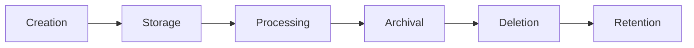

# Database Governance

Database governance establishes policies, standards, and processes for managing database assets throughout their lifecycle. For senior AI/ML engineers, understanding governance is essential for building compliant, maintainable, and trustworthy AI systems.

## Overview

Database governance ensures that database systems are managed consistently, securely, and in compliance with organizational policies and regulatory requirements. It covers data quality, lineage, ownership, and lifecycle management.

## Core Governance Areas

### Data Ownership and Stewardship
- **Data owners**: Business stakeholders responsible for data
- **Data stewards**: Technical experts managing data quality
- **Custodians**: IT teams responsible for infrastructure
- **Accountability**: Clear roles and responsibilities

### Data Quality Management
- **Accuracy**: Data correctness and validity
- **Completeness**: Required fields are populated
- **Consistency**: Uniform formats and values
- **Timeliness**: Data is current and up-to-date
- **Uniqueness**: No duplicate records

### Data Lineage and Provenance
- **End-to-end tracking**: From source to consumption
- **Transformation history**: All data transformations
- **Impact analysis**: Understand downstream impacts
- **Regulatory compliance**: Audit trails for compliance

## Governance Framework

### Data Classification
- **Public**: No sensitivity, freely available
- **Internal**: For internal use only
- **Confidential**: Sensitive business information
- **Restricted**: Highly sensitive, regulatory requirements
- **PII/PHI**: Personally identifiable or health information

### Data Lifecycle Management


- **Creation**: Data ingestion and validation
- **Storage**: Secure storage with appropriate classification
- **Processing**: Transformation and enrichment
- **Archival**: Long-term storage for historical data
- **Deletion**: Secure deletion per retention policies
- **Retention**: Legal and regulatory requirements

## Implementation Patterns

### Data Catalog
```sql
-- Data catalog schema example
CREATE TABLE data_assets (
    id UUID PRIMARY KEY,
    name VARCHAR(255) NOT NULL,
    description TEXT,
    owner VARCHAR(255),
    steward VARCHAR(255),
    classification VARCHAR(50) NOT NULL,
    created_at TIMESTAMPTZ DEFAULT NOW(),
    updated_at TIMESTAMPTZ DEFAULT NOW()
);

CREATE TABLE data_lineage (
    id UUID PRIMARY KEY,
    source_asset_id UUID REFERENCES data_assets(id),
    target_asset_id UUID REFERENCES data_assets(id),
    transformation_type VARCHAR(100),
    transformation_code TEXT,
    created_at TIMESTAMPTZ DEFAULT NOW()
);

CREATE TABLE data_quality_metrics (
    asset_id UUID REFERENCES data_assets(id),
    metric_name VARCHAR(100),
    value NUMERIC,
    timestamp TIMESTAMPTZ DEFAULT NOW(),
    threshold NUMERIC
);
```

### Data Quality Rules
```python
class DataQualityRule:
    def __init__(self, name, description, severity):
        self.name = name
        self.description = description
        self.severity = severity  # 'info', 'warning', 'error'
    
    def validate(self, data):
        raise NotImplementedError("Subclasses must implement validate")

class NotNullRule(DataQualityRule):
    def __init__(self, column):
        super().__init__(f"NOT NULL: {column}", f"Column {column} must not be null", "error")
        self.column = column
    
    def validate(self, data):
        return data[self.column].notnull().all()

class UniqueRule(DataQualityRule):
    def __init__(self, column):
        super().__init__(f"UNIQUE: {column}", f"Column {column} must be unique", "error")
        self.column = column
    
    def validate(self, data):
        return data[self.column].duplicated().sum() == 0

# Example usage
rules = [
    NotNullRule('user_id'),
    UniqueRule('email'),
    NotNullRule('created_at')
]

for rule in rules:
    if not rule.validate(df):
        print(f"Quality violation: {rule.name} - {rule.description}")
```

### Data Lineage Tracking
```sql
-- ETL job lineage tracking
CREATE TABLE etl_jobs (
    id UUID PRIMARY KEY,
    job_name VARCHAR(255),
    schedule VARCHAR(100),
    status VARCHAR(50),
    started_at TIMESTAMPTZ,
    completed_at TIMESTAMPTZ,
    error_message TEXT
);

CREATE TABLE etl_job_inputs (
    job_id UUID REFERENCES etl_jobs(id),
    source_table VARCHAR(255),
    source_query TEXT,
    row_count INT
);

CREATE TABLE etl_job_outputs (
    job_id UUID REFERENCES etl_jobs(id),
    target_table VARCHAR(255),
    row_count INT,
    bytes_written BIGINT
);

-- Query to trace data lineage
SELECT 
    j.job_name,
    i.source_table,
    o.target_table,
    j.started_at,
    j.completed_at
FROM etl_jobs j
JOIN etl_job_inputs i ON j.id = i.job_id
JOIN etl_job_outputs o ON j.id = o.job_id
WHERE o.target_table = 'analytics.users';
```

## AI/ML Specific Governance Considerations

### Model Data Governance
- **Training data provenance**: Source, collection methods, preprocessing
- **Feature lineage**: How features are derived from raw data
- **Model versioning**: Track model versions and training data
- **Bias detection**: Monitor for demographic bias in training data

### MLOps Integration
- **Experiment tracking**: Log parameters, metrics, artifacts
- **Model registry**: Central repository for model versions
- **Deployment governance**: Approval workflows for model deployment
- **Monitoring integration**: Connect data quality to model performance

### Regulatory Compliance
- **GDPR**: Right to access, right to be forgotten, data minimization
- **HIPAA**: Protected health information handling
- **CCPA**: Consumer privacy rights
- **SOX**: Financial reporting controls

## Governance Tools and Technologies

### Open Source Tools
- **Amundsen**: Data discovery and lineage
- **Marquez**: OpenLineage for data lineage
- **Great Expectations**: Data validation and testing
- **Apache Atlas**: Metadata management and governance

### Commercial Solutions
- **Collibra**: Enterprise data governance
- **Alation**: Data catalog and discovery
- **Informatica**: Data quality and governance
- **IBM InfoSphere**: Comprehensive governance platform

## Best Practices

1. **Start with critical data**: Focus governance efforts on high-value data
2. **Automate where possible**: Automated data quality checks and lineage
3. **Integrate with CI/CD**: Governance checks in development pipeline
4. **Measure and report**: Track governance metrics and improvements
5. **Cross-functional collaboration**: Involve business, legal, and technical teams
6. **Continuous improvement**: Regularly review and update governance policies

## Related Resources

- [Data Quality] - Comprehensive data quality practices
- [Data Lineage] - Detailed lineage tracking techniques
- [AI/ML Governance] - AI-specific governance considerations
- [Compliance Frameworks] - Regulatory compliance requirements