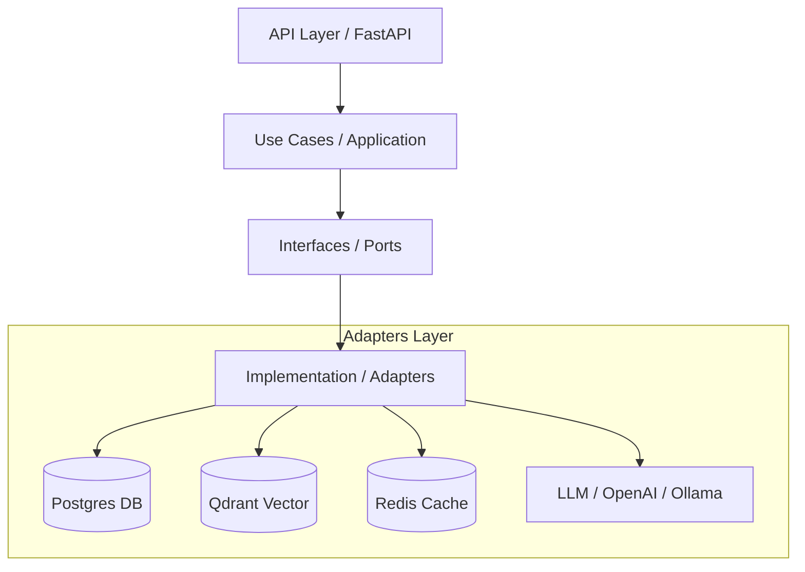
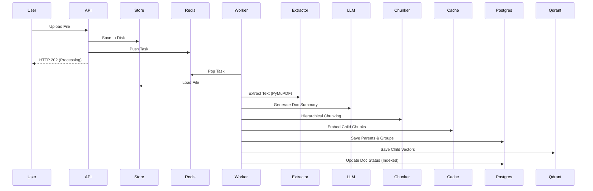
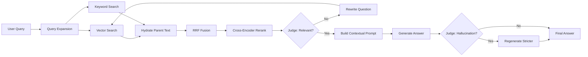
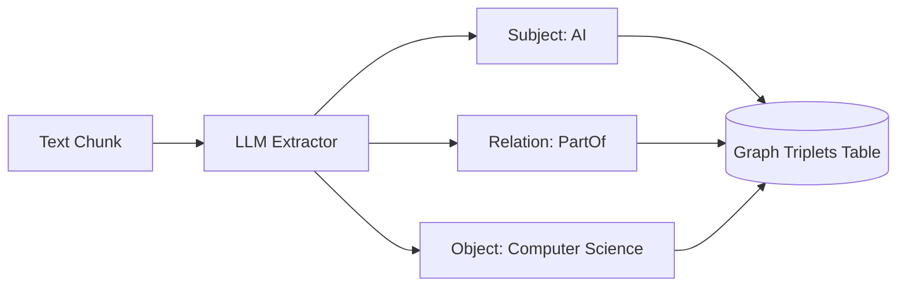

# 🖼️ Visual Guide: Data Flow & Architecture

> A visual representation of how RAG Engine Mini processes information.

---

## 🏗️ 1. Global Architecture (Clean Design)

The system is built on **Ports & Adapters**, ensuring the business logic remains "pure" and decoupled from databases or LLM providers.

---

## 📥 2. The Indexing Pipeline (Async)

Using **Celery** to prevent API blocking.

---

## 🔍 3. The Retrieval Flow (Hybrid + Self-RAG)

How we find the best answer with **Self-Correction**.

---

## 🕸️ 4. Graph Construction

Turning messy docs into structured knowledge.

---

> [!TIP]
> Use this guide alongside the [Architecture Docs](./architecture.md) to understand the high-level design patterns used in the codebase.
