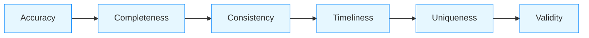

# Data Quality Validation for AI/ML Systems

## Overview

Data quality validation is critical for AI/ML systems where poor data quality directly impacts model performance, reliability, and business outcomes. This document covers comprehensive data quality validation frameworks specifically designed for production AI/ML database systems.

## Data Quality Framework

### Six-Dimensional Quality Model


### AI/ML Specific Considerations
- **Model Input Quality**: Quality of data used for training and inference
- **Feature Quality**: Quality of engineered features
- **Label Quality**: Quality of training labels and ground truth
- **Temporal Quality**: Quality of time-series data for forecasting

## Core Data Quality Validation Patterns

### Automated Data Profiling
```sql
-- Automated data profiling function
CREATE OR REPLACE FUNCTION profile_table_data(table_name TEXT)
RETURNS TABLE (
    column_name TEXT,
    data_type TEXT,
    null_count BIGINT,
    null_percentage NUMERIC,
    distinct_count BIGINT,
    min_value TEXT,
    max_value TEXT,
    avg_value NUMERIC,
    std_dev NUMERIC,
    sample_values TEXT[]
) AS $$
DECLARE
    rec RECORD;
    col_info RECORD;
    query TEXT;
BEGIN
    -- Get column information
    FOR col_info IN 
        SELECT column_name, data_type 
        FROM information_schema.columns 
        WHERE table_name = $1 AND table_schema = 'public'
    LOOP
        -- Build dynamic query for each column
        query := format('
            SELECT 
                ''%s'' as column_name,
                ''%s'' as data_type,
                COUNT(*) FILTER (WHERE %I IS NULL) as null_count,
                COUNT(*) as total_count,
                COUNT(DISTINCT %I) as distinct_count,
                MIN(%I)::TEXT as min_value,
                MAX(%I)::TEXT as max_value,
                AVG(%I)::NUMERIC as avg_value,
                STDDEV(%I)::NUMERIC as std_dev,
                ARRAY_AGG(%I ORDER BY %I LIMIT 5)::TEXT[] as sample_values
            FROM %I
        ', col_info.column_name, col_info.data_type, 
        col_info.column_name, col_info.column_name, 
        col_info.column_name, col_info.column_name,
        col_info.column_name, col_info.column_name,
        col_info.column_name, col_info.column_name,
        table_name);
        
        -- Execute dynamic query
        EXECUTE query INTO rec;
        
        -- Calculate percentages
        RETURN QUERY SELECT 
            rec.column_name,
            rec.data_type,
            rec.null_count,
            CASE WHEN rec.total_count > 0 THEN (rec.null_count * 100.0 / rec.total_count) ELSE 0 END as null_percentage,
            rec.distinct_count,
            rec.min_value,
            rec.max_value,
            rec.avg_value,
            rec.std_dev,
            rec.sample_values;
    END LOOP;
END;
$$ LANGUAGE plpgsql;

-- Example usage
SELECT * FROM profile_table_data('training_data');
```

### Data Quality Rules Engine
- **Business Rule Validation**: Domain-specific validation rules
- **Statistical Rules**: Outlier detection, distribution validation
- **Temporal Rules**: Time-series consistency, freshness checks
- **Cross-Field Rules**: Relationships between fields

```python
class DataQualityRulesEngine:
    def __init__(self, db_connection):
        self.db = db_connection
        self.rules = self._load_rules()
    
    def validate_data(self, table_name, data_batch=None):
        """Validate data against quality rules"""
        results = {
            'table': table_name,
            'timestamp': datetime.utcnow(),
            'total_records': len(data_batch) if data_batch else self._get_table_count(table_name),
            'violations': [],
            'summary': {
                'passed': 0,
                'failed': 0,
                'warning': 0
            }
        }
        
        # Apply rules to data
        for rule in self.rules:
            try:
                rule_result = self._apply_rule(rule, table_name, data_batch)
                results['violations'].append(rule_result)
                
                if rule_result['status'] == 'pass':
                    results['summary']['passed'] += 1
                elif rule_result['status'] == 'fail':
                    results['summary']['failed'] += 1
                elif rule_result['status'] == 'warn':
                    results['summary']['warning'] += 1
                    
            except Exception as e:
                results['violations'].append({
                    'rule_id': rule.get('id'),
                    'rule_name': rule.get('name'),
                    'status': 'error',
                    'message': f"Rule execution error: {e}",
                    'details': str(e)
                })
                results['summary']['failed'] += 1
        
        return results
    
    def _apply_rule(self, rule, table_name, data_batch):
        """Apply individual rule to data"""
        rule_type = rule.get('type')
        
        if rule_type == 'business':
            return self._validate_business_rule(rule, table_name, data_batch)
        elif rule_type == 'statistical':
            return self._validate_statistical_rule(rule, table_name, data_batch)
        elif rule_type == 'temporal':
            return self._validate_temporal_rule(rule, table_name, data_batch)
        elif rule_type == 'cross_field':
            return self._validate_cross_field_rule(rule, table_name, data_batch)
        else:
            raise ValueError(f"Unknown rule type: {rule_type}")
    
    def _validate_business_rule(self, rule, table_name, data_batch):
        """Validate business rule"""
        # Example: PII validation rule
        if rule['id'] == 'pii_validation':
            # Check for PII in non-PII fields
            pii_patterns = [
                r'\b\d{3}-\d{2}-\d{4}\b',  # SSN
                r'\b\d{16}\b',             # Credit card
                r'\b[A-Za-z0-9._%+-]+@[A-Za-z0-9.-]+\.[A-Z|a-z]{2,}\b'  # Email
            ]
            
            violations = []
            for record in data_batch or []:
                for field_name, field_value in record.items():
                    if field_value and isinstance(field_value, str):
                        for pattern in pii_patterns:
                            if re.search(pattern, field_value):
                                violations.append({
                                    'field': field_name,
                                    'value': field_value[:50],
                                    'pattern': pattern,
                                    'severity': 'high'
                                })
            
            return {
                'rule_id': rule['id'],
                'rule_name': rule['name'],
                'status': 'fail' if violations else 'pass',
                'violations': violations,
                'message': f"{len(violations)} PII violations found" if violations else "No PII violations"
            }
```

## AI/ML Specific Data Quality Patterns

### Training Data Quality Validation
- **Label Quality Assessment**: Validate training labels for accuracy and consistency
- **Feature Distribution Analysis**: Compare training vs validation distributions
- **Data Leakage Detection**: Detect train-test leakage
- **Bias and Fairness Analysis**: Analyze data for bias patterns

```sql
-- Training data quality validation
CREATE OR REPLACE FUNCTION validate_training_data_quality(
    training_table TEXT,
    validation_table TEXT,
    target_column TEXT
)
RETURNS TABLE (
    check_name TEXT,
    passed BOOLEAN,
    details TEXT,
    severity TEXT
) AS $$
DECLARE
    train_count BIGINT;
    val_count BIGINT;
    train_dist JSONB;
    val_dist JSONB;
    leakage_score NUMERIC;
    bias_metrics JSONB;
BEGIN
    -- Get row counts
    EXECUTE format('SELECT COUNT(*) FROM %I', training_table) INTO train_count;
    EXECUTE format('SELECT COUNT(*) FROM %I', validation_table) INTO val_count;
    
    -- Check count ratio
    IF ABS(train_count - val_count) > train_count * 0.5 THEN
        RETURN QUERY SELECT 'train_val_ratio', false, 
                     format('Training: %s, Validation: %s', train_count, val_count), 'high';
    END IF;
    
    -- Get target distribution
    EXECUTE format('SELECT json_agg(json_build_object(''value'', %I, ''count'', count(*))) FROM %I GROUP BY %I', 
                   target_column, training_table, target_column) INTO train_dist;
    EXECUTE format('SELECT json_agg(json_build_object(''value'', %I, ''count'', count(*))) FROM %I GROUP BY %I', 
                   target_column, validation_table, target_column) INTO val_dist;
    
    -- Compare distributions
    IF NOT distributions_similar(train_dist, val_dist) THEN
        RETURN QUERY SELECT 'target_distribution', false, 
                     'Training and validation target distributions differ significantly', 'medium';
    END IF;
    
    -- Check for data leakage
    leakage_score := calculate_leakage_score(training_table, validation_table);
    IF leakage_score > 0.1 THEN
        RETURN QUERY SELECT 'data_leakage', false, 
                     format('Leakage score: %.3f (threshold: 0.1)', leakage_score), 'high';
    END IF;
    
    -- Bias analysis
    bias_metrics := analyze_bias(training_table, target_column);
    IF bias_metrics->>'disparity_ratio' > '1.5' THEN
        RETURN QUERY SELECT 'bias_disparity', false, 
                     format('Disparity ratio: %s (threshold: 1.5)', bias_metrics->>'disparity_ratio'), 'medium';
    END IF;
    
    RETURN QUERY SELECT 'all_checks', true, 'All data quality checks passed', 'info';
END;
$$ LANGUAGE plpgsql;
```

### Feature Quality Validation
- **Feature Completeness**: Check for missing feature values
- **Feature Consistency**: Verify feature computation logic
- **Feature Drift Detection**: Monitor for feature distribution changes
- **Feature Correlation Analysis**: Analyze feature relationships

```python
class FeatureQualityValidator:
    def __init__(self, feature_store, monitoring_system):
        self.feature_store = feature_store
        self.monitoring = monitoring_system
    
    def validate_features(self, feature_names, time_window_hours=24):
        """Validate feature quality"""
        results = {
            'features': feature_names,
            'timestamp': datetime.utcnow(),
            'summary': {'total': 0, 'passed': 0, 'failed': 0, 'warnings': 0},
            'detailed_results': []
        }
        
        for feature_name in feature_names:
            try:
                # Get feature statistics
                stats = self._get_feature_stats(feature_name, time_window_hours)
                
                # Validate completeness
                completeness_result = self._validate_completeness(stats)
                
                # Validate consistency
                consistency_result = self._validate_consistency(feature_name, stats)
                
                # Validate drift
                drift_result = self._validate_drift(feature_name, stats)
                
                # Validate correlations
                correlation_result = self._validate_correlations(feature_name, stats)
                
                # Aggregate results
                feature_results = {
                    'feature_name': feature_name,
                    'completeness': completeness_result,
                    'consistency': consistency_result,
                    'drift': drift_result,
                    'correlation': correlation_result,
                    'overall_status': self._determine_overall_status([
                        completeness_result, consistency_result, 
                        drift_result, correlation_result
                    ])
                }
                
                results['detailed_results'].append(feature_results)
                results['summary']['total'] += 1
                
                if feature_results['overall_status'] == 'pass':
                    results['summary']['passed'] += 1
                elif feature_results['overall_status'] == 'fail':
                    results['summary']['failed'] += 1
                elif feature_results['overall_status'] == 'warn':
                    results['summary']['warnings'] += 1
                    
            except Exception as e:
                results['detailed_results'].append({
                    'feature_name': feature_name,
                    'error': str(e),
                    'overall_status': 'error'
                })
                results['summary']['failed'] += 1
        
        return results
    
    def _validate_completeness(self, stats):
        """Validate feature completeness"""
        null_rate = stats.get('null_count', 0) / stats.get('total_count', 1)
        
        if null_rate > 0.1:
            return {'status': 'fail', 'score': 1 - null_rate, 'details': f'{null_rate:.1%} null values'}
        elif null_rate > 0.01:
            return {'status': 'warn', 'score': 1 - null_rate, 'details': f'{null_rate:.1%} null values'}
        else:
            return {'status': 'pass', 'score': 1 - null_rate, 'details': f'{null_rate:.1%} null values'}
    
    def _validate_drift(self, feature_name, stats):
        """Validate feature drift"""
        # Compare current distribution with baseline
        baseline_stats = self.monitoring.get_baseline_stats(feature_name)
        
        if not baseline_stats:
            return {'status': 'info', 'score': 1.0, 'details': 'No baseline available'}
        
        # Calculate statistical distance (simplified)
        distance = self._calculate_statistical_distance(stats, baseline_stats)
        
        if distance > 0.3:
            return {'status': 'fail', 'score': 1 - distance, 'details': f'Drift score: {distance:.3f}'}
        elif distance > 0.1:
            return {'status': 'warn', 'score': 1 - distance, 'details': f'Drift score: {distance:.3f}'}
        else:
            return {'status': 'pass', 'score': 1 - distance, 'details': f'Drift score: {distance:.3f}'}
```

## Data Quality Monitoring and Alerting

### Real-Time Quality Monitoring
- **Streaming Quality Checks**: Validate data quality in real-time
- **Anomaly Detection**: Detect quality anomalies automatically
- **Threshold-Based Alerting**: Alert on quality threshold violations
- **Root Cause Analysis**: Automated root cause identification

```sql
-- Real-time data quality monitoring
CREATE TABLE data_quality_events (
    id UUID PRIMARY KEY,
    table_name TEXT NOT NULL,
    feature_name TEXT,
    check_type TEXT NOT NULL,
    status TEXT NOT NULL, -- 'pass', 'warn', 'fail', 'error'
    severity TEXT NOT NULL, -- 'low', 'medium', 'high', 'critical'
    metric_value NUMERIC,
    threshold_value NUMERIC,
    details JSONB,
    timestamp TIMESTAMPTZ DEFAULT NOW(),
    processed BOOLEAN DEFAULT FALSE
);

-- Indexes for monitoring
CREATE INDEX idx_data_quality_events_time ON data_quality_events(timestamp);
CREATE INDEX idx_data_quality_events_status ON data_quality_events(status);
CREATE INDEX idx_data_quality_events_table ON data_quality_events(table_name);

-- Quality monitoring function
CREATE OR REPLACE FUNCTION monitor_data_quality()
RETURNS VOID AS $$
DECLARE
    event RECORD;
BEGIN
    -- Check for high-severity issues
    FOR event IN 
        SELECT * FROM data_quality_events 
        WHERE status = 'fail' AND severity = 'critical' AND processed = false
    LOOP
        -- Send alert
        PERFORM send_alert(
            'CRITICAL_DATA_QUALITY_ISSUE',
            format('Critical data quality issue in %s: %s', 
                   event.table_name, event.details->>'message'),
            event.details
        );
        
        -- Mark as processed
        UPDATE data_quality_events 
        SET processed = true 
        WHERE id = event.id;
    END LOOP;
    
    -- Check for medium-severity issues
    FOR event IN 
        SELECT * FROM data_quality_events 
        WHERE status = 'warn' AND severity = 'high' AND processed = false
    LOOP
        -- Send notification
        PERFORM send_notification(
            'HIGH_SEVERITY_QUALITY_WARNING',
            format('High severity quality warning in %s', event.table_name),
            event.details
        );
        
        UPDATE data_quality_events 
        SET processed = true 
        WHERE id = event.id;
    END LOOP;
END;
$$ LANGUAGE plpgsql;

-- Scheduled job for quality monitoring
-- CREATE EXTENSION pg_cron;
-- SELECT cron.schedule('*/5 * * * *', $$SELECT monitor_data_quality()$$);
```

## Real-World Data Quality Examples

### Financial AI Platform
- **Quality Challenges**: High-volume transaction data, strict regulatory requirements
- **Validation Strategy**:
  - Real-time PII detection and masking
  - Statistical validation of financial metrics
  - Cross-system consistency checks
  - Regulatory compliance validation
- **Results**: 99.99% data quality, zero regulatory violations

### Healthcare Diagnostic AI System
- **Quality Challenges**: Sensitive medical data, clinical accuracy requirements
- **Validation Strategy**:
  - Clinical expert validation of label quality
  - Temporal consistency checks for patient records
  - HIPAA-compliant data quality validation
  - Real-time anomaly detection for data quality
- **Results**: 95%+ clinical accuracy, full HIPAA compliance

## Best Practices for Data Quality Validation

1. **Define Quality Metrics Early**: Establish quality metrics during design phase
2. **Automate Validation**: Integrate validation into data pipelines
3. **Use Realistic Test Data**: Test with production-like data distributions
4. **Monitor Continuously**: Real-time monitoring of data quality
5. **Implement Alerting**: Proactive alerting on quality issues
6. **Focus on Impact**: Prioritize validation based on business impact
7. **Document Quality Standards**: Clear documentation of quality requirements
8. **Regular Review**: Periodic review and updating of quality rules

## References
- NIST SP 800-124: Data Quality Guidelines
- AWS Data Quality Best Practices
- Google Cloud Data Quality Framework
- Microsoft Azure Data Quality Services
- Great Expectations Documentation
- Deequ: Data Quality Framework for Spark
- Data Quality: The Field Guide by Bill Inmon