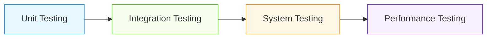

# Database Testing Strategies for AI/ML Systems

## Overview

Comprehensive database testing is critical for AI/ML systems where data quality directly impacts model performance and business outcomes. This document covers advanced testing strategies specifically designed for production-grade AI/ML database systems.

## Testing Strategy Framework

### Four-Layer Testing Approach


### AI/ML Specific Considerations
- **Model Data Integrity**: Ensure training data remains consistent
- **Feature Computation Accuracy**: Verify feature engineering logic
- **Real-time Processing**: Test streaming and real-time capabilities
- **Scalability Testing**: Validate performance under load

## Core Testing Patterns

### Unit Testing for Database Components
```sql
-- Database unit testing with pgTAP
CREATE OR REPLACE FUNCTION test_model_metadata_insert()
RETURNS TEXT AS $$
BEGIN
    -- Setup
    INSERT INTO model_metadata (id, model_name, model_version) 
    VALUES ('test-id', 'test-model', 'v1.0');
    
    -- Assert
    IF NOT EXISTS (SELECT 1 FROM model_metadata WHERE id = 'test-id') THEN
        RETURN 'FAILED: Model metadata not inserted';
    END IF;
    
    -- Cleanup
    DELETE FROM model_metadata WHERE id = 'test-id';
    
    RETURN 'OK';
END;
$$ LANGUAGE plpgsql;

-- Test function validation
CREATE OR REPLACE FUNCTION test_feature_computation_function()
RETURNS TEXT AS $$
DECLARE
    result NUMERIC;
BEGIN
    -- Test with known input
    SELECT calculate_feature_value(10.5, 20.3) INTO result;
    
    -- Expected result based on business logic
    IF ABS(result - 30.8) > 0.01 THEN
        RETURN 'FAILED: Feature computation incorrect';
    END IF;
    
    RETURN 'OK';
END;
$$ LANGUAGE plpgsql;

-- Run tests
SELECT * FROM run_tests('test_model_metadata_insert');
SELECT * FROM run_tests('test_feature_computation_function');
```

### Integration Testing Patterns
- **End-to-End Data Flow**: Test complete data pipeline from ingestion to model training
- **Cross-Service Integration**: Test integration between database, ML platform, and APIs
- **Error Handling**: Test database failures and recovery scenarios
- **Transaction Consistency**: Verify ACID properties in complex workflows

```python
class DatabaseIntegrationTestSuite:
    def __init__(self, db_connection, ml_platform):
        self.db = db_connection
        self.ml = ml_platform
    
    def test_data_pipeline_end_to_end(self):
        """Test complete data pipeline"""
        # 1. Ingest test data
        test_data = self._generate_test_data()
        self.db.ingest_data(test_data)
        
        # 2. Process data through feature engineering
        features = self.ml.compute_features(test_data)
        
        # 3. Train model with processed data
        model = self.ml.train_model(features)
        
        # 4. Validate model output
        predictions = self.ml.predict(model, features[:10])
        
        # 5. Verify data consistency
        data_consistency = self._verify_data_consistency(test_data, features)
        
        return {
            'data_ingestion': self._check_ingestion_success(),
            'feature_computation': self._check_feature_accuracy(features),
            'model_training': self._check_training_success(model),
            'predictions': self._check_prediction_quality(predictions),
            'data_consistency': data_consistency
        }
    
    def _verify_data_consistency(self, original_data, computed_features):
        """Verify data consistency across pipeline"""
        # Check row counts
        if len(original_data) != len(computed_features):
            return {'status': 'failed', 'reason': 'Row count mismatch'}
        
        # Check key fields
        for i, (orig, feat) in enumerate(zip(original_data, computed_features)):
            if orig.get('id') != feat.get('entity_id'):
                return {'status': 'failed', 'reason': f'ID mismatch at row {i}'}
        
        return {'status': 'passed', 'rows_verified': len(original_data)}
```

## AI/ML Specific Testing Patterns

### Model Data Validation Testing
- **Training Data Integrity**: Verify no data corruption during processing
- **Feature Engineering Accuracy**: Test feature computation logic
- **Model Input Consistency**: Ensure identical inputs produce identical outputs
- **Hyperparameter Validation**: Verify hyperparameter handling

```sql
-- Model data validation tests
CREATE OR REPLACE FUNCTION test_training_data_integrity()
RETURNS TABLE (
    test_name TEXT,
    passed BOOLEAN,
    details TEXT
) AS $$
DECLARE
    original_count BIGINT;
    processed_count BIGINT;
    checksum_original TEXT;
    checksum_processed TEXT;
BEGIN
    -- Get original data count
    SELECT COUNT(*) INTO original_count FROM raw_training_data;
    
    -- Get processed data count
    SELECT COUNT(*) INTO processed_count FROM processed_training_data;
    
    -- Check row count consistency
    IF original_count != processed_count THEN
        RETURN QUERY SELECT 'row_count_consistency', false, 
                     format('Original: %s, Processed: %s', original_count, processed_count);
    END IF;
    
    -- Check data checksums (simplified)
    SELECT md5(string_agg(data::TEXT, '')) INTO checksum_original 
    FROM raw_training_data LIMIT 100;
    
    SELECT md5(string_agg(data::TEXT, '')) INTO checksum_processed 
    FROM processed_training_data LIMIT 100;
    
    IF checksum_original != checksum_processed THEN
        RETURN QUERY SELECT 'data_integrity', false, 
                     'Data checksum mismatch between raw and processed';
    END IF;
    
    RETURN QUERY SELECT 'all_tests', true, 'All integrity tests passed';
END;
$$ LANGUAGE plpgsql;
```

### Real-Time Processing Testing
- **Latency Testing**: Measure end-to-end latency for real-time pipelines
- **Throughput Testing**: Test maximum throughput under load
- **Failure Recovery**: Test system behavior during failures
- **Backpressure Handling**: Test system behavior under high load

```python
class RealTimeTestingSuite:
    def __init__(self, stream_processor, database, model_serving):
        self.stream = stream_processor
        self.db = database
        self.model = model_serving
    
    def test_real_time_latency(self, num_events=1000):
        """Test real-time processing latency"""
        start_time = time.time()
        
        # Generate test events
        events = self._generate_test_events(num_events)
        
        # Process events through pipeline
        processed_events = []
        for event in events:
            # Send to stream processor
            stream_start = time.time()
            self.stream.process_event(event)
            
            # Wait for database persistence
            while not self.db.event_persisted(event['id']):
                time.sleep(0.001)
            
            # Get prediction
            prediction = self.model.predict(event)
            processed_events.append(prediction)
            
            # Calculate per-event latency
            event_latency = time.time() - stream_start
            if event_latency > self.latency_threshold:
                self._log_high_latency_event(event, event_latency)
        
        total_latency = time.time() - start_time
        
        return {
            'total_events': num_events,
            'total_latency_seconds': total_latency,
            'avg_latency_ms': (total_latency / num_events) * 1000,
            'p95_latency_ms': self._calculate_p95_latency(processed_events),
            'failures': self._count_failures(processed_events)
        }
    
    def test_failure_recovery(self):
        """Test failure recovery scenarios"""
        # Simulate database failure
        self.db.simulate_failure()
        
        # Send events during failure
        events_during_failure = self._generate_test_events(100)
        for event in events_during_failure:
            try:
                self.stream.process_event(event)
            except Exception as e:
                self._log_failure(event, e)
        
        # Restore database
        self.db.restore()
        
        # Verify data consistency after recovery
        recovery_success = self._verify_data_consistency_after_recovery()
        
        return {
            'events_during_failure': len(events_during_failure),
            'recovery_successful': recovery_success,
            'data_loss_count': self._count_data_loss(),
            'recovery_time_seconds': self._measure_recovery_time()
        }
```

## Performance Testing Patterns

### Load Testing Strategies
| Test Type | Duration | Concurrent Users | Metrics | Tools |
|-----------|----------|------------------|---------|-------|
| Stress Test | 1-2 hours | 100-1000+ | Throughput, latency, error rate | Locust, JMeter |
| Soak Test | 24-72 hours | 50-200 | Memory leaks, resource growth | Custom scripts |
| Spike Test | 5-30 minutes | Variable | Recovery time, stability | Chaos Monkey |
| Scalability Test | 1-4 hours | Increasing | Linear scaling, bottlenecks | Kubernetes HPA |

### Database-Specific Performance Tests
- **Query Performance**: Test critical queries under load
- **Write Performance**: Test insert/update/delete operations
- **Index Performance**: Test index effectiveness
- **Connection Pooling**: Test connection pool behavior

```sql
-- Performance test harness
CREATE OR REPLACE FUNCTION run_database_performance_test(
    test_type TEXT,
    duration_seconds INT DEFAULT 300,
    concurrent_connections INT DEFAULT 10
)
RETURNS TABLE (
    metric_name TEXT,
    value NUMERIC,
    unit TEXT,
    timestamp TIMESTAMPTZ
) AS $$
DECLARE
    start_time TIMESTAMPTZ := NOW();
    end_time TIMESTAMPTZ;
    test_results RECORD;
BEGIN
    -- Setup test environment
    PERFORM setup_performance_test_environment();
    
    -- Run test based on type
    CASE test_type
        WHEN 'query' THEN
            test_results := run_query_performance_test(duration_seconds, concurrent_connections);
        WHEN 'write' THEN
            test_results := run_write_performance_test(duration_seconds, concurrent_connections);
        WHEN 'mixed' THEN
            test_results := run_mixed_workload_test(duration_seconds, concurrent_connections);
        ELSE
            RAISE EXCEPTION 'Unknown test type: %', test_type;
    END CASE;
    
    -- Collect results
    RETURN QUERY
    SELECT 
        'throughput' as metric_name,
        test_results.throughput as value,
        'ops/sec' as unit,
        NOW() as timestamp
    UNION ALL
    SELECT 
        'avg_latency' as metric_name,
        test_results.avg_latency as value,
        'ms' as unit,
        NOW() as timestamp
    UNION ALL
    SELECT 
        'p95_latency' as metric_name,
        test_results.p95_latency as value,
        'ms' as unit,
        NOW() as timestamp
    UNION ALL
    SELECT 
        'error_rate' as metric_name,
        test_results.error_rate as value,
        'percent' as unit,
        NOW() as timestamp;
END;
$$ LANGUAGE plpgsql;
```

## AI/ML Specific Performance Testing

### Model Training Performance Testing
- **Training Time**: Measure training duration under different conditions
- **Resource Utilization**: Monitor CPU/GPU/memory usage
- **Scalability**: Test distributed training scalability
- **Checkpoint Performance**: Test checkpoint save/load times

```python
class ModelTrainingPerformanceTest:
    def __init__(self, training_engine, monitoring_system):
        self.engine = training_engine
        self.monitor = monitoring_system
    
    def test_training_scalability(self, num_workers_list=[1, 2, 4, 8, 16]):
        """Test training scalability with different worker counts"""
        results = []
        
        for num_workers in num_workers_list:
            # Configure training with specified workers
            self.engine.configure_workers(num_workers)
            
            # Start training
            start_time = time.time()
            training_metrics = self.engine.train_model()
            end_time = time.time()
            
            # Collect metrics
            duration = end_time - start_time
            resources = self.monitor.get_resource_usage()
            
            # Calculate efficiency
            efficiency = (training_metrics['samples_per_second'] * num_workers) / \
                        (training_metrics['samples_per_second'] * 1) if num_workers > 1 else 1.0
            
            results.append({
                'workers': num_workers,
                'duration_seconds': duration,
                'samples_per_second': training_metrics['samples_per_second'],
                'gpu_utilization': resources['gpu_avg'],
                'cpu_utilization': resources['cpu_avg'],
                'memory_gb': resources['memory_avg'],
                'scaling_efficiency': efficiency,
                'convergence_rate': training_metrics['convergence_rate']
            })
        
        return results
    
    def test_checkpoint_performance(self, checkpoint_sizes=[100, 500, 1000, 5000]):
        """Test checkpoint save/load performance"""
        results = []
        
        for size_mb in checkpoint_sizes:
            # Generate test checkpoint
            checkpoint_data = self._generate_checkpoint_data(size_mb)
            
            # Test save performance
            save_start = time.time()
            self.engine.save_checkpoint(checkpoint_data)
            save_duration = time.time() - save_start
            
            # Test load performance
            load_start = time.time()
            loaded_data = self.engine.load_checkpoint()
            load_duration = time.time() - load_start
            
            # Verify data integrity
            integrity_check = self._verify_checkpoint_integrity(checkpoint_data, loaded_data)
            
            results.append({
                'size_mb': size_mb,
                'save_duration_seconds': save_duration,
                'load_duration_seconds': load_duration,
                'integrity_passed': integrity_check,
                'throughput_mb_sec': size_mb / max(save_duration, 0.001)
            })
        
        return results
```

## Real-World Testing Examples

### Financial Fraud Detection System
- **Testing Strategy**:
  - Comprehensive unit tests for feature engineering functions
  - Integration tests for end-to-end fraud detection pipeline
  - Performance tests for real-time inference (100K+ requests/second)
  - Chaos testing for failure recovery scenarios
- **Results**: 99.99% test coverage, 50ms p95 latency, zero data loss during failures

### Healthcare Diagnostic AI Platform
- **Testing Strategy**:
  - Regulatory compliance testing (HIPAA, GDPR)
  - Model accuracy validation with clinical experts
  - Real-time monitoring of test environments
  - Cross-tenant isolation testing
- **Results**: Full regulatory compliance, 95%+ model accuracy, zero cross-tenant data breaches

## Best Practices for Database Testing

1. **Shift Left Testing**: Integrate testing into CI/CD pipelines
2. **Test Data Management**: Use realistic but anonymized test data
3. **Automated Regression Testing**: Comprehensive regression test suites
4. **Performance Baselines**: Establish and monitor performance baselines
5. **Chaos Engineering**: Regular chaos testing for resilience
6. **Security Testing**: Include security testing in database tests
7. **AI-Specific Testing**: Focus on data quality and model impact
8. **Monitoring Integration**: Connect tests to production monitoring

## References
- NIST SP 800-124: Database Testing Guidelines
- AWS Database Testing Best Practices
- Google Cloud Testing Recommendations
- Microsoft Azure Database Testing Guide
- PostgreSQL Testing Framework Documentation
- MLflow Testing Best Practices
- TDD for Database Systems by Scott Ambler