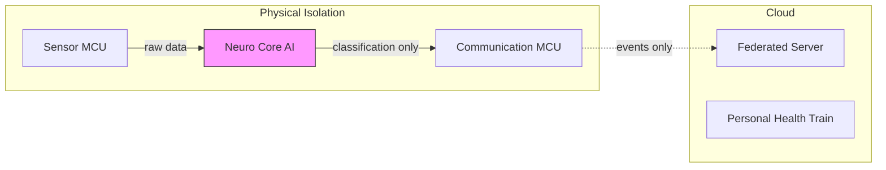

# Case Study 09: Medical IoMT Edge AI

## Overview

Privacy-first Edge AI for **medical devices** with hardware isolation, federated learning, and HIPAA/GDPR compliance.

---

## Architecture: Neuro Core Pattern



**Key**: Raw data physically **cannot** reach communication module.

---

## Business Case: Privacy as Feature

| Challenge | Edge AI Solution |
|-----------|------------------|
| HIPAA compliance | Data never leaves device |
| Latency (falls/cardiac) | <100ms local response |
| Bandwidth (wearables) | 68% data reduction |
| Model improvement | Federated learning |

---

## Key Components

### 1. MedicalDevice with Hardware Isolation

```python
class MedicalDevice:
    """Hardware isolation ensures raw data stays on device."""
    
    def process_sensor_data(self, sensor_data):
        # Neuro Core processes locally
        event_type, confidence = self.neuro_core.classify(sensor_data)
        
        # Only clinical events transmitted, NEVER raw data
        if event_type != NORMAL:
            return ClinicalEvent(event_type, confidence)
```

### 2. Differential Privacy

```python
class DifferentialPrivacy:
    """ε-δ differential privacy guarantees."""
    
    def gaussian_mechanism(self, vector, sensitivity):
        # σ = sensitivity × sqrt(2 × ln(1.25/δ)) / ε
        sigma = sensitivity * np.sqrt(2 * np.log(1.25 / self.delta)) / self.epsilon
        return vector + np.random.normal(0, sigma, vector.shape)
```

### 3. Federated Learning Client

```python
class FederatedLearningClient:
    """Train on local data, share only gradients."""
    
    def train_local(self, epochs=5, apply_dp=True):
        # 1. Train on local data
        # 2. Clip per-example gradients
        # 3. Add Gaussian noise (DP)
        # 4. Return gradient update (not data)
```

### 4. Personal Health Train

```python
class PersonalHealthTrainFramework:
    """Algorithm travels to data, not data to algorithm."""
    
    # Stations: Data repositories (hospitals)
    # Trains: Algorithms in containers
    # Tracks: Secure communication channels
    
    def execute_train(self, train_id, station_id):
        # Train goes to station, executes, returns results only
```

---

## Privacy Guarantees

| Mechanism | Guarantee | Parameter |
|-----------|-----------|-----------|
| Differential Privacy | ε-DP | ε < 1.0 |
| Gradient Clipping | Bounded sensitivity | max_norm = 1.0 |
| Secure Aggregation | No single point can see gradients | Shamir sharing |
| Hardware Isolation | Physical separation | Neuro Core |

---

## KPIs

| Metric | Target | Notes |
|--------|--------|-------|
| Sensitivity (Recall) | >95% | Critical for safety |
| Specificity | >90% | Avoid alert fatigue |
| Data Reduction | >60% | Edge filtering |
| Privacy Budget (ε) | <1.0 | Differential privacy |

---

## Clinical Event Types

```python
class ClinicalEventType(Enum):
    FALL_DETECTED = "fall_detected"
    ARRHYTHMIA = "arrhythmia"
    HYPOGLYCEMIA = "hypoglycemia"
    APNEA = "apnea"
    SEIZURE = "seizure"
    NORMAL = "normal"
```

---

## Implementation

See [medical_edge.py](file:///k:/learning/technical/ai-ml/AI-Mastery-2026/src/production/medical_edge.py):
- `MedicalDevice` - Hardware isolation pattern
- `NeuroCoreProcessor` - k-NN/NN for low-power MCU
- `FederatedLearningClient` - DP-FedAvg
- `DifferentialPrivacy` - Laplace/Gaussian mechanisms
- `PersonalHealthTrainFramework` - Algorithm mobility

---

## Key Lessons

1. **Privacy by design** - Hardware isolation is strongest guarantee
2. **Federated learning scales** - 1000s of devices, no central data
3. **Differential privacy is measurable** - Track ε budget
4. **Simple models work** - k-NN runs on MCU, is interpretable

---

## References

- Intrinsics Imaging "Neuro Core" Architecture
- Personal Health Train Framework
- [medical_edge.py](file:///k:/learning/technical/ai-ml/AI-Mastery-2026/src/production/medical_edge.py)
