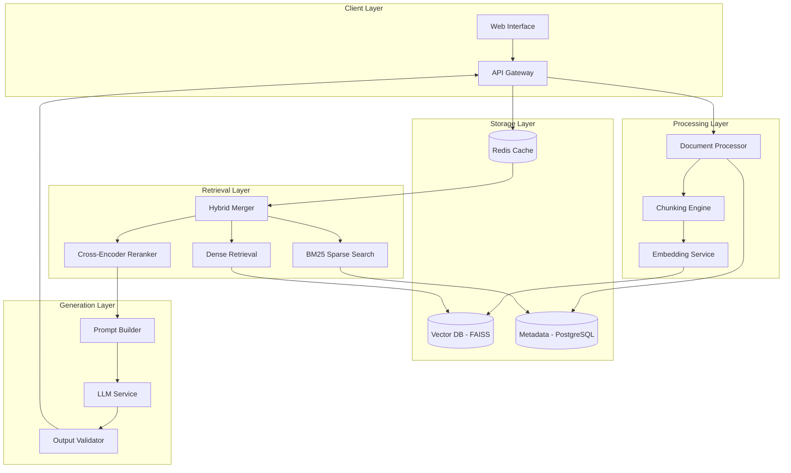

# Legal Document RAG System - Architecture

## Overview

Production-grade Retrieval-Augmented Generation system for legal document analysis, designed with the White-Box approach.

## System Architecture

## Key Components

### 1. Document Processing
- **Input**: PDF, DOCX, TXT legal documents
- **Output**: Structured chunks with metadata
- **Features**: Citation extraction, section detection, cross-reference linking

### 2. Hybrid Search
- **Dense**: Sentence transformers for semantic similarity
- **Sparse**: BM25 for keyword matching (important for legal terms)
- **Fusion**: Reciprocal Rank Fusion (RRF) or learned weights

### 3. Reranking
- Cross-encoder model for precision
- Legal domain fine-tuning consideration

### 4. Generation
- Citation-aware prompting
- Confidence scoring
- Hallucination detection

## Performance Targets

| Metric | Target |
|--------|--------|
| Retrieval Latency | < 100ms |
| End-to-End Latency | < 2s |
| Recall@10 | > 85% |
| Answer Accuracy | > 90% |

## Production Considerations

- Rate limiting and auth
- Audit logging for compliance
- PII detection
- Document versioning
