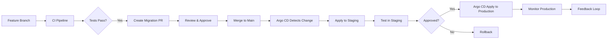

# Database CI/CD and GitOps for AI/ML Systems

## Executive Summary

This comprehensive tutorial provides step-by-step guidance for implementing CI/CD and GitOps practices for database systems in AI/ML environments. Designed for senior AI/ML engineers and DevOps specialists, this guide covers modern database deployment patterns from basic to advanced.

**Key Features**:
- Complete CI/CD pipeline for database changes
- GitOps implementation with Argo CD
- Database migration strategies
- Automated testing for database changes
- Integration with AI/ML development workflows

## CI/CD Pipeline Architecture

### Modern Database CI/CD Pipeline
```
Code Commit → CI Pipeline → Database Migration → 
         ↓                             ↓
   Test Environment ← Approval Gate ← Production Deployment
         ↓                             ↓
   Monitoring & Feedback ← Rollback Capability
```

### Pipeline Stages
1. **Code Analysis**: Static analysis and linting
2. **Unit Testing**: Database schema and query tests
3. **Integration Testing**: End-to-end database integration tests
4. **Performance Testing**: Load and stress testing
5. **Security Scanning**: Vulnerability scanning
6. **Approval Gate**: Manual approval for production
7. **Deployment**: Automated deployment to target environment
8. **Verification**: Post-deployment validation
9. **Monitoring**: Real-time monitoring and alerting

## Step-by-Step CI/CD Implementation

### 1. Database Schema Management

**Migration Tool Selection**:
- **Alembic** (Python): Best for Python-based AI/ML applications
- **Flyway** (Java): Best for Java-based systems
- **Liquibase** (Multi-language): Best for polyglot environments
- **DBT** (SQL): Best for data transformation and analytics

**Alembic Configuration for AI/ML Projects**:
```python
# alembic/env.py
from logging.config import fileConfig
from sqlalchemy import engine_from_config
from sqlalchemy import pool
from app.database import Base
import os

# this is the Alembic Config object
config = context.config

# Interpret the config file for Python logging
fileConfig(config.config_file_name)

# add your model's MetaData object here
target_metadata = Base.metadata

def run_migrations_offline():
    """Run migrations in 'offline' mode."""
    url = config.get_main_option("sqlalchemy.url")
    context.configure(
        url=url,
        target_metadata=target_metadata,
        literal_binds=True,
        dialect_opts={"paramstyle": "named"},
    )

    with context.begin_transaction():
        context.run_migrations()

def run_migrations_online():
    """Run migrations in 'online' mode."""
    connectable = engine_from_config(
        config.get_section(config.config_ini_section),
        prefix="sqlalchemy.",
        poolclass=pool.NullPool,
    )

    with connectable.connect() as connection:
        context.configure(
            connection=connection, target_metadata=target_metadata
        )

        with context.begin_transaction():
            context.run_migrations()
```

### 2. CI Pipeline Configuration

**GitHub Actions CI Pipeline**:
```yaml
# .github/workflows/database-ci.yml
name: Database CI
on:
  pull_request:
    branches: [main]
  push:
    branches: [develop]

jobs:
  ci:
    runs-on: ubuntu-latest
    steps:
    - uses: actions/checkout@v3
    
    - name: Setup Python
      uses: actions/setup-python@v4
      with:
        python-version: '3.10'
    
    - name: Install dependencies
      run: |
        pip install -r requirements.txt
        pip install alembic pytest pytest-cov
    
    - name: Run static analysis
      run: |
        pylint app/database/
        mypy app/database/
    
    - name: Run unit tests
      run: |
        pytest tests/database/ --cov=app.database --cov-report=xml
    
    - name: Run migration tests
      run: |
        # Test migrations on SQLite first
        alembic upgrade head
        python scripts/test_migrations.py
        
        # Test on PostgreSQL (if available)
        if [ "$POSTGRES_URL" ]; then
          alembic upgrade head
          python scripts/test_migrations.py --db postgresql
        fi
    
    - name: Run performance tests
      run: |
        python scripts/performance_test.py
    
    - name: Security scan
      run: |
        bandit -r app/database/
        semgrep --config auto .
    
    - name: Build Docker image
      run: |
        docker build -t ai-db-migration:latest .
    
    - name: Upload artifacts
      uses: actions/upload-artifact@v3
      with:
        name: db-artifacts
        path: |
          coverage.xml
          migration-test-results.json
```

### 3. GitOps Implementation with Argo CD

**Argo CD Application Definition**:
```yaml
# apps/database/app.yaml
apiVersion: argoproj.io/v1alpha1
kind: Application
metadata:
  name: ai-database
  namespace: argocd
spec:
  project: default
  source:
    repoURL: https://github.com/ai-mastery/AI-Mastery-2026.git
    targetRevision: HEAD
    path: k8s/database
    helm:
      valueFiles:
        - values-production.yaml
  destination:
    server: https://kubernetes.default.svc
    namespace: ai-production
  syncPolicy:
    automated:
      prune: true
      selfHeal: true
    syncOptions:
      - CreateNamespace=true
      - ApplyOutOfSyncOnly=true
  ignoreDifferences:
    - group: apps
      kind: Deployment
      jsonPointers:
        - /spec/replicas
    - group: ""
      kind: Service
      jsonPointers:
        - /spec/clusterIP
```

**Database GitOps Workflow**:


### 4. Database Migration Strategies

**Zero-Downtime Migration Pattern**:
```python
class ZeroDowntimeMigration:
    def __init__(self, db_engine):
        self.engine = db_engine
        self.connection = db_engine.connect()
    
    def execute_migration(self, migration_plan):
        """
        Execute zero-downtime migration following the pattern:
        1. Add new columns/tables (backward compatible)
        2. Update application to write to both old and new
        3. Backfill data
        4. Update application to read from new
        5. Remove old columns/tables
        """
        
        # Stage 1: Add new schema elements
        self._add_new_schema_elements(migration_plan['new_elements'])
        
        # Stage 2: Deploy application update (separate step)
        # This requires coordination with application deployment
        
        # Stage 3: Backfill data
        if migration_plan.get('backfill_queries'):
            self._execute_backfill_queries(migration_plan['backfill_queries'])
        
        # Stage 4: Deploy application update to read from new schema
        # This requires coordination with application deployment
        
        # Stage 5: Clean up old schema
        if migration_plan.get('cleanup_queries'):
            self._execute_cleanup_queries(migration_plan['cleanup_queries'])
    
    def _add_new_schema_elements(self, elements):
        """Add new columns, tables, indexes"""
        for element in elements:
            if element['type'] == 'column':
                self.connection.execute(f"""
                    ALTER TABLE {element['table']} 
                    ADD COLUMN IF NOT EXISTS {element['name']} {element['type']}
                    {element.get('default', '')}
                """)
            elif element['type'] == 'table':
                self.connection.execute(element['ddl'])
    
    def _execute_backfill_queries(self, queries):
        """Execute backfill queries"""
        for query in queries:
            self.connection.execute(query)
    
    def _execute_cleanup_queries(self, queries):
        """Execute cleanup queries"""
        for query in queries:
            self.connection.execute(query)
```

## AI/ML-Specific CI/CD Considerations

### Model Parameter Deployment
```yaml
# k8s/model-deployment.yaml
apiVersion: apps/v1
kind: Deployment
metadata:
  name: ai-model-server
spec:
  replicas: 3
  selector:
    matchLabels:
      app: ai-model
  template:
    metadata:
      labels:
        app: ai-model
    spec:
      containers:
      - name: model-server
        image: ai-model-server:{{ .Values.model.version }}
        env:
        - name: MODEL_PATH
          value: /models/{{ .Values.model.name }}-{{ .Values.model.version }}
        - name: DATABASE_URL
          valueFrom:
            secretKeyRef:
              name: db-secrets
              key: url
        volumeMounts:
        - name: models
          mountPath: /models
      volumes:
      - name: models
        persistentVolumeClaim:
          claimName: model-pvc
```

### Feature Store CI/CD
```python
# scripts/feature_store_ci.py
import boto3
import json
from datetime import datetime

class FeatureStoreCIPipeline:
    def __init__(self):
        self.s3 = boto3.client('s3')
        self.codebuild = boto3.client('codebuild')
    
    def validate_feature_definition(self, feature_def):
        """Validate feature definition against schema"""
        required_fields = ['name', 'description', 'type', 'source']
        missing = [field for field in required_fields if field not in feature_def]
        if missing:
            raise ValueError(f"Missing required fields: {missing}")
        
        # Validate type
        valid_types = ['int', 'float', 'string', 'boolean', 'array', 'object']
        if feature_def['type'] not in valid_types:
            raise ValueError(f"Invalid type: {feature_def['type']}")
    
    def test_feature_computation(self, feature_def, test_data):
        """Test feature computation logic"""
        try:
            # Execute feature computation
            result = self._compute_feature(feature_def, test_data)
            
            # Validate result
            if result is None:
                raise ValueError("Feature computation returned None")
                
            return True
        except Exception as e:
            print(f"Feature computation failed: {e}")
            return False
    
    def deploy_feature_to_production(self, feature_def, version):
        """Deploy feature to production feature store"""
        # Create S3 path
        s3_path = f"s3://feature-store-prod/features/{feature_def['name']}/{version}/definition.json"
        
        # Upload feature definition
        self.s3.put_object(
            Bucket='feature-store-prod',
            Key=f"features/{feature_def['name']}/{version}/definition.json",
            Body=json.dumps(feature_def),
            ContentType='application/json'
        )
        
        # Update feature registry
        self._update_feature_registry(feature_def, version)
        
        return f"Feature {feature_def['name']} v{version} deployed"
```

## Security and Compliance in CI/CD

### Secure CI/CD Practices
```yaml
# .github/workflows/secure-db-deploy.yml
name: Secure Database Deployment
on:
  workflow_dispatch:
  pull_request:
    branches: [main]

jobs:
  secure-deploy:
    runs-on: ubuntu-latest
    permissions:
      contents: read
      id-token: write  # For OIDC authentication
      security-events: write  # For GitHub Advanced Security
    
    steps:
    - uses: actions/checkout@v3
    
    - name: Setup AWS credentials
      uses: aws-actions/configure-aws-credentials@v2
      with:
        role-to-assume: arn:aws:iam::123456789012:role/github-actions-role
        aws-region: us-west-2
    
    - name: Scan for secrets
      uses: gitguardian/ggshield-action@v1
      with:
        api-key: ${{ secrets.GITGUARDIAN_API_KEY }}
    
    - name: Run SAST
      uses: github/codeql-action/init@v2
      with:
        languages: python
    
    - name: Perform codeql analysis
      uses: github/codeql-action/analyze@v2
    
    - name: Validate infrastructure as code
      run: |
        tfsec .
        checkov -d .
    
    - name: Deploy with security checks
      run: |
        # Only proceed if all security checks pass
        echo "All security checks passed, proceeding with deployment"
        helm upgrade --install ai-db-stack ./charts/database \
          --namespace ai-production \
          --values charts/database/values-secure.yaml
```

## Monitoring and Observability for CI/CD

### CI/CD Metrics Dashboard
| Metric | Description | Target | Alert Threshold |
|--------|-------------|--------|-----------------|
| CI Pipeline Success Rate | % of successful CI runs | > 95% | < 90% |
| Deployment Frequency | Deployments per day | 5+ | < 1/day |
| Lead Time for Changes | Time from commit to production | < 1 hour | > 4 hours |
| Change Failure Rate | % of deployments causing incidents | < 10% | > 20% |
| MTTR | Mean time to recovery | < 30 minutes | > 2 hours |
| Migration Success Rate | % of successful database migrations | > 99% | < 95% |

### Automated Rollback Strategy
```python
class AutomatedRollback:
    def __init__(self, monitoring_client, deployment_client):
        self.monitoring_client = monitoring_client
        self.deployment_client = deployment_client
    
    def monitor_deployment(self, deployment_id):
        """Monitor deployment for failures"""
        start_time = time.time()
        
        while time.time() - start_time < 300:  # 5 minute timeout
            # Check health metrics
            health = self.monitoring_client.get_health(deployment_id)
            
            if health['status'] == 'DEGRADED' or health['status'] == 'FAILED':
                self._trigger_rollback(deployment_id, health)
                return False
            
            # Check error rates
            errors = self.monitoring_client.get_error_rate(deployment_id)
            if errors > 0.1:  # > 10% error rate
                self._trigger_rollback(deployment_id, {'reason': 'High error rate'})
                return False
            
            time.sleep(30)  # Check every 30 seconds
        
        return True
    
    def _trigger_rollback(self, deployment_id, reason):
        """Trigger automated rollback"""
        print(f"Rolling back deployment {deployment_id} due to: {reason}")
        
        # Get previous stable version
        previous_version = self.deployment_client.get_previous_version(deployment_id)
        
        # Rollback deployment
        self.deployment_client.rollback(deployment_id, previous_version)
        
        # Notify team
        self._notify_team(deployment_id, reason, previous_version)
        
        # Log incident
        self._log_incident(deployment_id, reason, previous_version)
```

## Best Practices and Lessons Learned

### Key Success Factors
1. **Start with small changes**: Begin with simple migrations before complex ones
2. **Automate testing**: Comprehensive testing prevents production issues
3. **Implement canary deployments**: Gradual rollout reduces risk
4. **Monitor everything**: Visibility enables quick detection and resolution
5. **Document procedures**: Clear runbooks save time during incidents
6. **Integrate security**: Security as code and CI/CD integration
7. **Educate teams**: CI/CD awareness for all developers
8. **Iterate quickly**: Start simple and add complexity gradually

### Common Pitfalls to Avoid
1. **Manual deployments**: Don't deploy manually in production
2. **Skipping testing**: Test migrations thoroughly in staging
3. **Poor rollback planning**: Always have a working rollback plan
4. **Ignoring observability**: Can't fix what you can't see
5. **Underestimating complexity**: Database changes can be complex
6. **Forgetting about AI/ML**: Traditional CI/CD doesn't cover ML workflows
7. **Not planning for scale**: Design for growth from day one
8. **Ignoring compliance requirements**: Different regulations have different requirements

## Next Steps and Future Improvements

### Short-term (0-3 months)
- Implement automated canary deployments for database changes
- Add chaos engineering for resilience testing
- Enhance monitoring with AI-powered anomaly detection
- Build CI/CD runbook library

### Medium-term (3-6 months)
- Implement GitOps with Argo CD for database deployments
- Add multi-environment promotion workflows
- Develop automated compliance verification
- Create cross-cloud CI/CD templates

### Long-term (6-12 months)
- Build autonomous CI/CD system
- Implement AI-powered deployment optimization
- Develop industry-specific CI/CD templates
- Create CI/CD certification standards

## Conclusion

This database CI/CD and GitOps guide provides a comprehensive framework for implementing modern database deployment practices in AI/ML environments. The key success factors are starting with small changes, automating everything, and maintaining comprehensive monitoring and observability.

The patterns and lessons learned here can be applied to various domains beyond fintech, making this guide valuable for any organization implementing CI/CD for their database infrastructure.