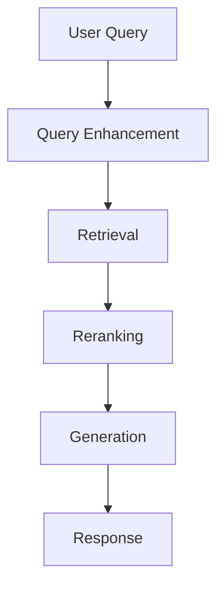

# 📖 DOCUMENTATION ARCHITECTURE

**AI-Mastery-2026: Complete Documentation System**

| Document Info | Details |
|---------------|---------|
| **Version** | 1.0 |
| **Date** | March 31, 2026 |
| **Status** | Documentation Specification |

---

## 📋 EXECUTIVE SUMMARY

### Documentation Philosophy

AI-Mastery-2026 uses the **Diátaxis Framework** - a research-based approach that separates documentation by audience need:

```
┌─────────────────────────────────────────────────────────────┐
│                    DIÁTAXIS FRAMEWORK                        │
├─────────────────────────────────────────────────────────────┤
│                                                              │
│              acquisition                                   application
│                   │                                              │
│                   │                                              │
│    TUTORIALS ─────┼────────────── HOW-TO GUIDES                 │
│    (Learning)     │              (Doing)                         │
│                   │                                              │
│  ─────────────────┼───────────────  goal-oriented               │
│    study           │              │                               │
│    oriented        │              │                               │
│                   │                                              │
│    EXPLANATION ───┼────────────── REFERENCE                     │
│    (Understanding)│              (Knowing)                       │
│                   │                                              │
│              theory                                  practice    │
│                                                              │
└─────────────────────────────────────────────────────────────┘
```

### Documentation Types

| Type | Purpose | Key Question | Example |
|------|---------|--------------|---------|
| **Tutorials** | Learning | "How do I learn X?" | "Build Your First Neural Network" |
| **How-to** | Doing | "How do I accomplish X?" | "How to Fine-tune an LLM" |
| **Reference** | Knowing | "What does X do?" | API documentation |
| **Explanation** | Understanding | "Why does X work?" | "Understanding Attention Mechanisms" |

---

## 📚 DOCUMENTATION STRUCTURE

### Complete Documentation Tree

```
docs/
│
├── README.md                                 # Documentation hub
│   ├── Audience Gateways                     # "I am a..." section
│   ├── Quick Links                           # Most popular docs
│   └── Search                                # Search bar
│
├── tutorials/                                # LEARNING-ORIENTED
│   ├── README.md
│   ├── getting-started/
│   │   ├── quickstart.md
│   │   ├── installation.md
│   │   └── first-project.md
│   ├── beginner/
│   │   ├── your-first-neural-network.md
│   │   └── training-lstm-text-generator.md
│   ├── intermediate/
│   │   ├── building-rag-system.md
│   │   └── fine-tuning-llm.md
│   └── advanced/
│       ├── multi-agent-systems.md
│       └── production-deployment.md
│
├── how-to/                                   # GOAL-ORIENTED
│   ├── README.md
│   ├── data-preparation/
│   │   ├── how-to-prepare-dataset.md
│   │   └── how-to-handle-imbalanced-data.md
│   ├── model-training/
│   │   ├── how-to-train-transformer.md
│   │   └── how-to-finetune-with-lora.md
│   ├── deployment/
│   │   ├── how-to-deploy-with-docker.md
│   │   └── how-to-setup-monitoring.md
│   └── troubleshooting/
│       ├── how-to-debug-slow-inference.md
│       └── how-to-fix-vanishing-gradients.md
│
├── reference/                                # INFORMATION-ORIENTED
│   ├── README.md
│   ├── api-reference/
│   │   ├── src.core.math.md
│   │   ├── src.ml.classical.md
│   │   ├── src.llm.architecture.md
│   │   └── src.rag.pipeline.md
│   ├── configuration/
│   │   ├── environment-variables.md
│   │   └── config-files.md
│   └── cli-reference/
│       ├── commands.md
│       └── examples.md
│
├── explanation/                              # UNDERSTANDING-ORIENTED
│   ├── README.md
│   ├── concepts/
│   │   ├── attention-mechanism.md
│   │   ├── transformer-architecture.md
│   │   └── rag-systems.md
│   ├── comparisons/
│   │   ├── pytorch-vs-tensorflow.md
│   │   └── rag-vs-finetuning.md
│   └── deep-dives/
│       ├── backpropagation-math.md
│       └── transformer-attention-derivation.md
│
├── architecture/                             # ARCHITECTURE DECISIONS
│   ├── README.md
│   ├── decisions/                            # ADRs
│   │   ├── ADR-001-monorepo-structure.md
│   │   ├── ADR-002-python-first.md
│   │   └── ADR-003-diátaxis-framework.md
│   ├── diagrams/
│   └── ultimate-improvement/                 # Current initiative
│       └── [12 deliverable files]
│
└── curriculum/                               # CURRICULUM REFERENCE
    ├── README.md
    ├── learning-paths/
    ├── tracks/
    └── assessments/
```

---

## 🎯 AUDIENCE-SPECIFIC DOCUMENTATION

### Audience Gateways

The documentation hub provides clear pathways for different audiences:

```markdown
# Welcome to AI-Mastery-2026 Documentation

**Choose your path:**

## 🎓 I'm a Student

- [Learning Roadmap](../curriculum/learning-paths/README.md)
- [Getting Started](../tutorials/getting-started/quickstart.md)
- [Module Catalog](../curriculum/learning-paths/README.md)
- [Assessment Guide](../curriculum/assessments/README.md)

## 👨‍💻 I'm a Developer

- [API Reference](./reference/api-reference/README.md)
- [Code Architecture](./architecture/CODE_ARCHITECTURE.md)
- [Contributing Guide](../CONTRIBUTING.md)
- [Development Setup](./how-to/setup-development-environment.md)

## 🎓 I'm an Instructor

- [Teaching Guide](./explanation/teaching-philosophy.md)
- [Course Integration](./how-to/integrate-into-course.md)
- [Student Progress Tracking](./reference/progress-tracking.md)
- [Assessment Rubrics](../curriculum/assessments/rubrics/README.md)

## 💼 I'm a Hiring Manager

- [Skill Verification](../industry/skill-verification/README.md)
- [Candidate Assessment](../industry/hiring-partners/assessment-guide.md)
- [Job Role Mapping](../industry/career-services/role-mapping.md)
- [Partnership Program](../industry/hiring-partners/README.md)
```

---

## 📝 DOCUMENT TEMPLATES

### Tutorial Template

```markdown
# [Tutorial Title]

**Learning Goal**: [What students will learn]

**Prerequisites**: [Required knowledge]

**Time Required**: [X minutes/hours]

**What You'll Build**: [Description of final outcome]

---

## Overview

[Brief introduction - 2-3 paragraphs]

## Step 1: [First Step]

[Detailed instructions with code examples]

```python
# Code example
def example():
    pass
```

**Checkpoint**: [What should work at this point]

## Step 2: [Next Step]

[Continue with steps...]

## Complete Example

[Full working code]

## What You Learned

[Bullet points of key takeaways]

## Next Steps

[Related tutorials or modules]

## Troubleshooting

### Common Issue 1

**Problem**: [Description]

**Solution**: [Fix]

### Common Issue 2

...
```

### How-to Guide Template

```markdown
# How to [Accomplish Specific Task]

**Goal**: [What you want to achieve]

**Prerequisites**: [What you need before starting]

---

## When to Use This

[Explain when this guide is appropriate]

## Steps

### 1. [First Action]

[Detailed instructions]

### 2. [Next Action]

[Continue...]

## Complete Example

[Working example]

## Troubleshooting

| Problem | Solution |
|---------|----------|
| [Issue] | [Fix] |

## Related Guides

- [Link to related how-to]
- [Link to reference docs]
```

### API Reference Template

```markdown
# Module Name

**Source**: [`src/path/to/module.py`](link)

---

## Overview

[Brief description of module purpose]

## Classes

### ClassName

```python
class ClassName(BaseClass):
    """Class docstring."""
```

#### Parameters

| Parameter | Type | Default | Description |
|-----------|------|---------|-------------|
| `param1` | `type` | `required` | Description |

#### Methods

##### method_name

```python
def method_name(self, arg: type) -> return_type:
    """Method docstring."""
```

**Parameters:**

**Returns:**

**Raises:**

**Example:**

```python
obj = ClassName()
result = obj.method_name()
```

## Functions

### function_name

```python
def function_name(arg: type) -> return_type:
    """Function docstring."""
```

**Parameters:**

**Returns:**

**Raises:**

**Example:**

## See Also

- [Related module](link)
- [Tutorial](link)
- [How-to guide](link)
```

---

## 🔗 CROSS-REFERENCING SYSTEM

### Link Types

```markdown
### Internal Links

**Relative links within docs:**
- [Tutorial](../tutorials/building-rag-system.md)
- [API Reference](./reference/api-reference/src.rag.pipeline.md)

**Absolute links from root:**
- [Contributing](/CONTRIBUTING.md)
- [Curriculum](/curriculum/README.md)

### External Links

**Papers:**
- [Attention Is All You Need](https://arxiv.org/abs/1706.03762)

**Documentation:**
- [PyTorch Documentation](https://pytorch.org/docs/stable/)

**Tools:**
- [Hugging Face](https://huggingface.co/)

### Code Links

**Link to source code:**
- [`src/rag/pipeline/standard.py`](../../src/rag/pipeline/standard.py)

**Link to specific line:**
- [`attention.py:45`](../../src/llm/architecture/attention.py#L45)
```

### Cross-Reference Guidelines

**✅ DO cross-reference when:**
- Connecting theory to implementation
- Linking prerequisites
- Providing additional context
- Showing related content

**❌ DON'T cross-reference when:**
- Content should be moved instead
- Creating circular dependencies
- Linking to unstable content

---

## 🔍 SEARCH OPTIMIZATION

### Document Metadata

```markdown
---
title: "Building RAG Systems"
description: "Learn to build Retrieval-Augmented Generation systems from scratch"
keywords: ["RAG", "retrieval", "generation", "LLM", "embeddings"]
category: "tutorial"
level: "intermediate"
last_updated: "2026-03-31"
author: "AI Engineering Tech Lead"
---
```

### Search-Friendly Structure

```markdown
# Clear, Descriptive Titles

## Use Question-Based Headings
- "How does attention work?"
- "What is RAG?"

## Include Keywords Naturally
- Use terms students search for
- Include synonyms and variations

## Add Summary Sections
- Quick reference at top
- Key takeaways at bottom
```

---

## 📊 VISUAL DESIGN STANDARDS

### Diagram Guidelines

**Use Mermaid for flowcharts:**



**Use ASCII for simple diagrams:**

```
┌─────────────┐    ┌─────────────┐    ┌─────────────┐
│   Query     │ -> │  Retrieval  │ -> │  Generation │
└─────────────┘    └─────────────┘    └─────────────┘
```

### Screenshot Guidelines

- **Format**: PNG for diagrams, WebP for photos
- **Size**: Max 1920px width
- **Compression**: Optimized for web
- **Alt text**: Descriptive for accessibility

---

## 🌐 I18N (INTERNATIONALIZATION)

### Translation Workflow

```
1. Source content (English)
        ↓
2. Extract translatable strings
        ↓
3. Community translation (crowdsourced)
        ↓
4. Review by native speakers
        ↓
5. Integration and testing
        ↓
6. Published translation
```

### i18n-Ready Structure

```
docs/
├── en/           # English (source)
│   ├── tutorials/
│   └── reference/
├── es/           # Spanish
│   ├── tutorials/
│   └── reference/
├── zh/           # Chinese
│   ├── tutorials/
│   └── reference/
└── ar/           # Arabic
    ├── tutorials/
    └── reference/
```

### Translation Guidelines

- **Never translate**: Code, commands, file paths
- **Always translate**: Explanations, instructions
- **Cultural adaptation**: Examples, analogies

---

## 📝 DOCUMENT HISTORY

| Version | Date | Author | Changes |
|---------|------|--------|---------|
| 1.0 | March 31, 2026 | AI Engineering Tech Lead | Initial documentation architecture |

---

## 🔗 RELATED DOCUMENTS

This document is part of the **Ultimate Repository Improvement** series:

1. ✅ [ULTIMATE_REPOSITORY_VISION.md](./ULTIMATE_REPOSITORY_VISION.md)
2. ✅ [DEFINITIVE_DIRECTORY_STRUCTURE.md](./DEFINITIVE_DIRECTORY_STRUCTURE.md)
3. ✅ [CURRICULUM_ARCHITECTURE.md](./CURRICULUM_ARCHITECTURE.md)
4. ✅ [CODE_ARCHITECTURE.md](./CODE_ARCHITECTURE.md)
5. ✅ **DOCUMENTATION_ARCHITECTURE.md** (this document)
6. 📋 [STUDENT_JOURNEY_DESIGN.md](./STUDENT_JOURNEY_DESIGN.md)
7. 👥 [CONTRIBUTOR_ECOSYSTEM.md](./CONTRIBUTOR_ECOSYSTEM.md)
8. 🏢 [INDUSTRY_INTEGRATION_HUB.md](./INDUSTRY_INTEGRATION_HUB.md)
9. ⚡ [SCALABILITY_AND_PERFORMANCE.md](./SCALABILITY_AND_PERFORMANCE.md)
10. 🔄 [MIGRATION_MASTERPLAN.md](./MIGRATION_MASTERPLAN.md)
11. 📖 [QUICK_REFERENCE_COMPENDIUM.md](./QUICK_REFERENCE_COMPENDIUM.md)
12. 📅 [IMPLEMENTATION_ROADMAP_2026.md](./IMPLEMENTATION_ROADMAP_2026.md)

---

<div align="center">

**📖 Documentation architecture defined. Creating remaining deliverables...**

</div>
