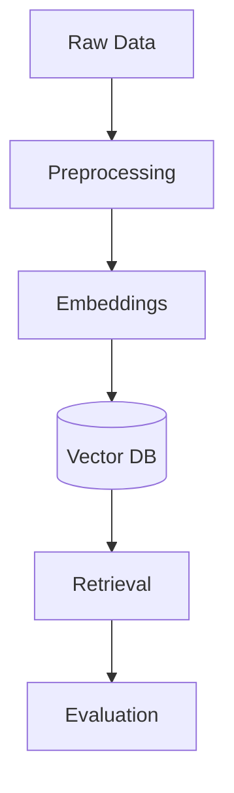

# ðŸ—ï¸ Architecture Diagrams

## RAG Pipeline Flow

```mermaid
flowchart LR
    A[Query] --> B[Embedding]
    B --> C[Vector DB]
    C --> D[Retrieval]
    D --> E[Reranker]
    E --> F[LLM]
    F --> G[Response]
```

## Data Flow

```mermaid
flowchart TD
    Raw[Raw Data] --> Proc[Preprocessing]
    Proc --> Emb[Embeddings]
    Emb --> VDB[(Vector DB)]
    VDB --> Ret[Retrieval]
    Ret --> Eval[Evaluation]
```
