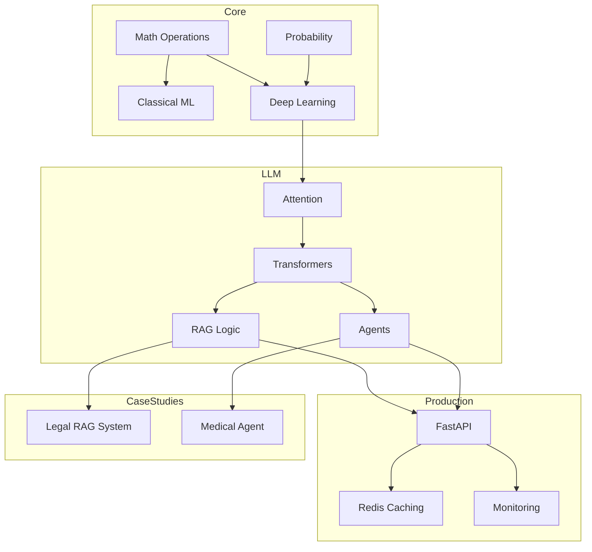
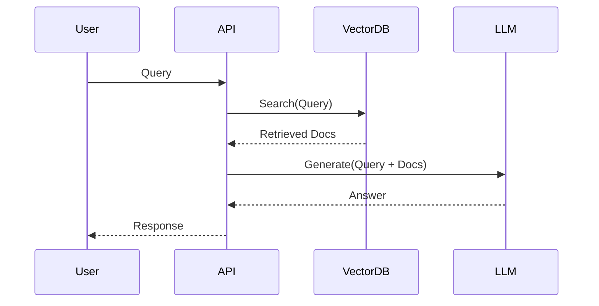

# System Architecture Diagrams

## 1. AI Engineer Toolkit Overview

High-level view of how the modules interact.

```mermaid
graph TD
    subgraph Core
        Math[Math Operations] --> ML[Classical ML]
        Math --> DL[Deep Learning]
        Prob[Probability] --> DL
    end
    
    subgraph LLM
        DL --> Attn[Attention]
        Attn --> Trans[Transformers]
        Trans --> Agents[Agents]
        Trans --> RAG[RAG Logic]
    end
    
    subgraph Production
        RAG --> API[FastAPI]
        Agents --> API
        API --> Cache[Redis Caching]
        API --> Mon[Monitoring]
    end
    
    subgraph CaseStudies
        RAG --> Legal[Legal RAG System]
        Agents --> Medical[Medical Agent]
    end
```

## 2. RAG Pipeline Flow

```mermaid
sequenceDiagram
    participant U as User
    participant A as API
    participant V as VectorDB
    participant L as LLM
    
    U->>A: Query
    A->>V: Search(Query)
    V-->>A: Retrieved Docs
    A->>L: Generate(Query + Docs)
    L-->>A: Answer
    A-->>U: Response
```
