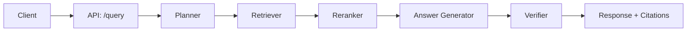
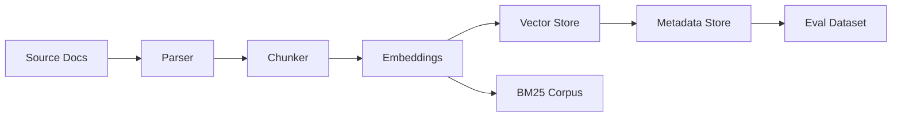
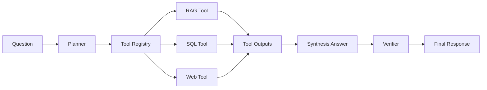

# Architecture

## Goals
- Low-latency retrieval and generation with explicit citations.
- Multi-model routing by task (QA, summarization, extraction).
- Multi-tenant isolation and governance controls.
- Scale ingestion and indexing independently of online query.
- Observability: traceability, cost attribution, and evaluation hooks.

## High-level components
1) Ingestion pipeline
   - Sources: docs, tickets, PDFs, code repos, wikis, databases.
   - Steps: parsing -> cleaning -> structured chunking -> embedding -> indexing.
2) Retrieval stack
   - Hybrid retrieval: BM25 + vector search fused with RRF.
   - Optional query rewriting for better recall.
   - Reranking: cross-encoder or LLM reranker.
   - Filtering: tenant, ACL, recency, domain.
3) Answering stack
   - Prompt assembly with retrieved context.
   - Strict fallback when verification fails.
   - Provider selection: cost/latency/quality policies.
   - Citation formatting and hallucination checks.
4) Agentic RAG
   - Planner -> tools -> verifier loop.
   - Tools: RAG, SQL, web, calculators, internal APIs.
5) Evaluation and feedback
   - Offline datasets + online feedback signals.
   - Regression detection and A/B testing.

## Data flow (online)
Client -> API (query) -> planner -> retriever -> reranker -> answer -> verifier -> response

## Data flow (offline)
Source -> parser -> chunker -> embeddings -> vector store -> metadata store -> eval dataset

## Agentic RAG flow

## Scaling patterns
- Separate ingestion workers from query service.
- Use async tasks for IO (vector DB, model calls).
- Cache embeddings and retrieval results by content hash.
- Shard vector indexes by tenant or domain.

## Failure modes and mitigations
- Provider outage: automatic failover to backup model.
- Vector store latency: fall back to BM25 and cached answers.
- Cost spikes: enforce per-tenant budgets and rate limits.
