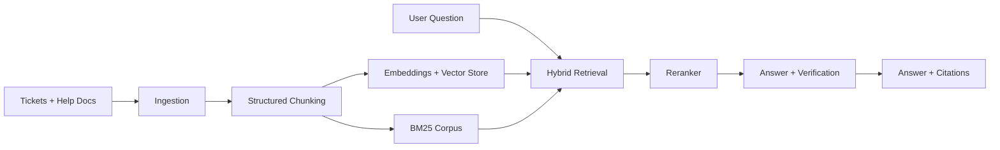
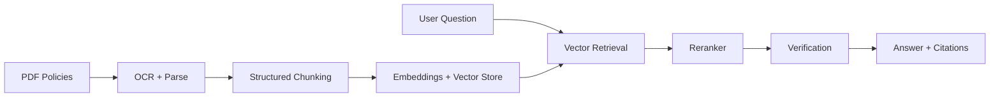
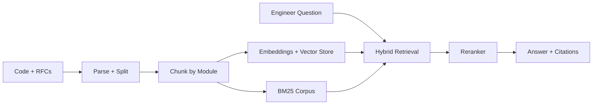
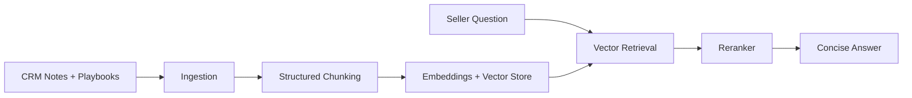
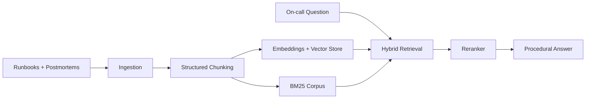
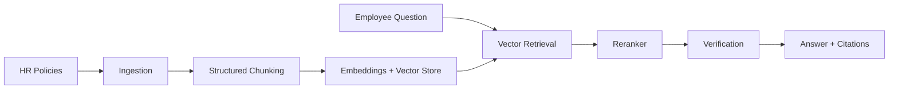

# Real-Case Projects (Full Examples)

This document provides complete, production-style case studies that map directly to the
Week 5 backend RAG pipeline. Each case includes goals, data sources, pipelines, configs,
evaluation, and operational considerations.

## 1) Customer Support RAG (Multi-Tenant SaaS)
**Goal:** Respond to support tickets with citations from tenant-specific docs.

### Data sources
- Zendesk/Intercom tickets
- Help center docs (HTML/PDF)
- Product release notes

### Pipeline
1) Ingest tickets nightly per tenant.
2) Chunk by section + ticket resolution.
3) Embed and index with `tenant_id` + `plan_tier` filters.
4) Online query uses `tenant_id` filter, reranker on top 50, and strict citations.

### Mermaid flow


### Suggested config
```yaml
chunking:
  mode: "structured"
  max_tokens: 350
  overlap: 40
retrieval:
  top_k: 20
  fusion:
    use_rrf: true
reranker:
  enabled: true
  top_k: 8
verification:
  enabled: true
```

### API flow
- `POST /ingest` with `{tenant_id, source_type: "web", uri}`
- `POST /query` with `{tenant_id, question, top_k: 8, mode: "rag"}`

### Example output
Answer includes citations:
- chunk_id, doc_id, snippet, score.

### Cost/latency tuning
| Setting | Quality impact | Latency impact | Recommendation |
| --- | --- | --- | --- |
| retrieval.top_k | higher recall | higher | 15-25 |
| reranker.top_k | higher precision | medium | 6-10 |
| answer.max_context_words | more context | higher | 800-1200 |

### Evaluation
- Use an offline dataset of resolved tickets to measure answer accuracy.
- Track citation coverage % and "no-answer" rate for ambiguous questions.

### Operational notes
- Always set `tenant_id` to enforce data isolation.
- Re-index after major help-center updates.


## 2) Compliance & Legal RAG
**Goal:** Verified answers with a verifier agent. Every claim must be cited.

### Data sources
- Policies, contracts, regulatory PDFs
- Internal memos and audits

### Pipeline
1) OCR and parse PDFs.
2) Chunk by section headers.
3) Rerank with a legal domain model.
4) Verifier checks citations and rejects unsupported claims.

### Mermaid flow


### Agentic pattern
- Planner chooses: RAG -> verifier
- Verifier forces re-query if missing citations

### Suggested config
```yaml
chunking:
  mode: "structured"
  max_tokens: 300
  overlap: 60
retrieval:
  top_k: 25
reranker:
  enabled: true
  top_k: 6
answer:
  max_context_words: 900
verification:
  enabled: true
```

### Cost/latency tuning
| Setting | Quality impact | Latency impact | Recommendation |
| --- | --- | --- | --- |
| reranker.top_k | higher precision | medium | 4-6 |
| verification.enabled | much safer | higher | true |
| answer.max_context_words | tighter grounding | lower | 700-900 |

### Evaluation
- Use a panel of legal SMEs to validate a small gold set.
- Monitor hallucination rate; target near-zero.

### Operational notes
- Consider PDF-to-markdown conversion before chunking.
- Keep strict verification on by default.


## 3) Engineering Knowledge Base (Code-Aware)
**Goal:** Answer engineering questions referencing code and RFCs.

### Data sources
- Git repos, ADRs, RFCs, API docs

### Pipeline
1) Parse repo and separate code vs prose.
2) Chunk code by function/module.
3) Use hybrid retrieval (BM25 + vector).
4) Rerank for exact API usage.

### Mermaid flow


### Agentic extensions
- Tool: SQL for build metrics
- Tool: RAG for docs
- Tool: Web for external RFCs (optional)

### Suggested config
```yaml
chunking:
  mode: "structured"
  max_tokens: 450
  overlap: 30
retrieval:
  top_k: 30
  fusion:
    use_rrf: true
reranker:
  enabled: true
  top_k: 10
query_rewrite:
  enabled: true
```

### Cost/latency tuning
| Setting | Quality impact | Latency impact | Recommendation |
| --- | --- | --- | --- |
| query_rewrite.enabled | better recall | higher | true |
| retrieval.top_k | higher recall | higher | 20-30 |
| reranker.top_k | better precision | medium | 8-12 |

### Evaluation
- Track exact-match correctness for API signatures.
- Use developer feedback from IDE integration.

### Operational notes
- Re-index after large refactors or major version bumps.
- Store file paths in metadata for clickable citations.


## 4) Sales Enablement RAG (CRM + Playbooks)
**Goal:** Provide sellers with answer snippets and next steps during calls.

### Data sources
- CRM notes (opportunities, accounts)
- Sales playbooks and enablement docs
- Product one-pagers and FAQs

### Pipeline
1) Ingest CRM notes daily with account metadata.
2) Chunk playbooks by section and use structured mode.
3) Retrieve using account ID + segment filters.
4) Answer with concise, action-focused responses.

### Mermaid flow


### Suggested config
```yaml
retrieval:
  top_k: 16
reranker:
  enabled: true
  top_k: 5
answer:
  max_context_words: 700
```

### Cost/latency tuning
| Setting | Quality impact | Latency impact | Recommendation |
| --- | --- | --- | --- |
| answer.max_context_words | clearer answers | lower | 500-800 |
| reranker.top_k | better focus | medium | 4-6 |

### Evaluation
- Measure seller satisfaction and outcome-based conversions.

### Operational notes
- Enforce strict tenant/account access filters.
- Prefer shorter context to keep answers crisp.


## 5) Incident Response RAG (On-Call)
**Goal:** Fast, reliable answers under time pressure.

### Data sources
- Runbooks, postmortems, operational alerts
- Service ownership mappings

### Pipeline
1) Ingest runbooks and postmortems weekly.
2) Chunk by section + command blocks.
3) Hybrid retrieval with high recall.
4) Generate short, procedural answers.

### Mermaid flow


### Suggested config
```yaml
retrieval:
  top_k: 20
reranker:
  enabled: true
  top_k: 6
answer:
  max_context_words: 600
verification:
  enabled: true
```

### Cost/latency tuning
| Setting | Quality impact | Latency impact | Recommendation |
| --- | --- | --- | --- |
| retrieval.top_k | higher recall | higher | 18-25 |
| reranker.top_k | better precision | medium | 6-8 |
| answer.max_context_words | short answers | lower | 500-700 |

### Evaluation
- Time-to-resolution improvement.
- Rate of correct first-response actions.

### Operational notes
- Keep answers concise and command-oriented.
- Stream answers if supported by the API layer.


## 6) HR Policy RAG (Internal)
**Goal:** Answer policy questions with exact citations.

### Data sources
- HR handbook and policy updates
- Benefits documents and FAQs

### Pipeline
1) Ingest policy docs monthly or per update.
2) Chunk by section headers with overlap.
3) Enable verification to reduce hallucinations.

### Mermaid flow


### Suggested config
```yaml
chunking:
  mode: "structured"
  max_tokens: 300
  overlap: 50
retrieval:
  top_k: 15
reranker:
  enabled: true
  top_k: 6
verification:
  enabled: true
```

### Cost/latency tuning
| Setting | Quality impact | Latency impact | Recommendation |
| --- | --- | --- | --- |
| verification.enabled | safer answers | higher | true |
| answer.max_context_words | avoid rambling | lower | 700-900 |

### Evaluation
- Track citation coverage % and policy accuracy.

### Operational notes
- Include effective dates in metadata.
- Favor strict verification for compliance-sensitive policy answers.


## Summary mapping to the codebase

- Ingestion: `pipelines/offline_index.py` + `rag/ingestion.py`
- Chunking: `rag/chunking.py`
- Retrieval: `rag/retriever.py` with optional RRF fusion
- Reranking: `rag/reranker.py`
- Answering + verification: `pipelines/online_query.py` + `rag/answer.py`
