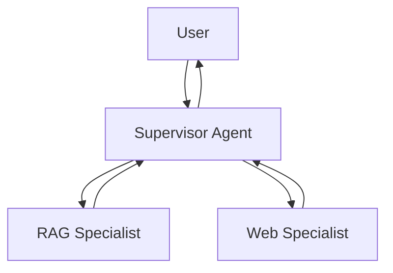

# 🐝 Multi-Agent Swarms: Orchestrating Intelligence

## 🚀 Beyond the Monolithic Agent

As AI systems grow, a single agent often becomes "confused" by a massive context window or too many tools. **Multi-Agent Swarms** solve this by breaking intelligence into specialized roles.

### Why Swarms?
1.  **Specialization**: A "Researcher" agent is better at RAG than a "Reviewer" agent.
2.  **Modular Logic**: Easier to test and debug individual agent behaviors.
3.  **Scalability**: Agents can work in parallel or in hierarchical chains.

---

## 🏗️ Orchestration Patterns

### 1. Hierarchical (Supervisor)
A **Supervisor Agent** acts as the project manager. It analyzes the user request and delegates sub-tasks to specialized workers.

### 2. Collaborative (The Hand-off)
Agents pass the "baton" to each other based on state transitions.
- **Example**: Researcher -> Reviewer -> Finalizer.

---

## 🤖 Roles in an Elite RAG Swarm

In a production-grade system, your swarm might consist of:

| Role | Responsibility | Tools |
|------|----------------|-------|
| **The Router** | Classifies intent and picks the first agent. | Semantic Router |
| **The Librarian** | Deep-dives into the Vector Database. | Qdrant, BM25 |
| **The Fact-Checker** | Validates answers against the retrieved context. | Hallucination Grader |
| **The Stylist** | Formats the final answer for the user's specific persona. | Custom Prompts |

---

## 📡 Communication Protocols

Agents communicate via **Structured State**:
- **Shared Context**: A global blackboard where agents read/write.
- **Explicit Messaging**: Agents "calling" each other with specific inputs.

---

## 🏆 Summary for the Ultimate Architect

Multi-Agent design is not just about prompt engineering; it's about **System Engineering**. You are building a digital "Organization" where LLMs represent the workforce.

---

## 📚 Advanced Reading
- OpenAI: "Swarms: Collaborative Agentic Frameworks"
- AutoGen (Microsoft): "Multi-Agent Conversation Framework"
- CrewAI / LangGraph: "State-based Agent Orchestration"
